# Chapter 5: Cleaning and Resolving Data Issues

**Chapter 5 of 12 | Part II: Profiling, Cleaning, and Transforming Data**  
**Competency: C3.1, C3.2, C3.7, C3.9 | PL-300: Clean**

---

<!-- NANO BANANA PRO PROMPT: "A warm digital watercolor illustration of a commercial kitchen prep station in Miami. On one side, ingredients are scattered and unlabeled — bags of rice, unmarked spice jars, vegetables in disarray. On the other side, the same ingredients are cleaned, organized, and clearly labeled in glass containers. A young Latina woman in a chef's apron stands in the middle, mid-action, organizing with confidence. Miami color palette: coral, turquoise, warm gold. Soft morning light through a window showing palm trees. Sense of transformation and order emerging from chaos." Style: Digital watercolor, Miami color palette (coral, turquoise, warm gold), warm and inviting -->

---

## 🔭 View Compass — Where Are We Working?

This entire chapter takes place in the **Power Query Editor** (the separate window with the green ribbon and the Applied Steps pane on the right side). You opened this window for the first time in Chapter 4. If you are not already in the Power Query Editor, here is how to get there:

**Home tab** (in the main Power BI Desktop window) → **Transform Data** button → The Power Query Editor opens as a separate window.

| View | What You See | What You Do Here | This Chapter? |
|------|-------------|-------------------|---------------|
| Report View | Canvas with visuals | Build reports | No |
| Table View | Data rows in a grid | Inspect data values | No |
| Model View | Table boxes with relationship lines | Manage relationships | No |
| DAX Query View | Code editor for testing DAX | Test DAX measures | No |
| **Power Query Editor** | **Separate window, green ribbon, steps pane, data preview** | **Clean, transform, and load data** | **YES — all chapter** |

> **WHERE AM I?** You should see a green ribbon at the top of the screen, a Queries pane on the left listing your five Sabor Miami tables, and an **Applied Steps** pane on the right. If you see a dark-themed ribbon or a blank canvas, you are in the main Power BI window — click **Transform Data** on the Home tab to open the Power Query Editor.

---

## Why It Matters

*Section 5.0 of 5.5*

Sofia stares at the Data Quality Snapshot she built in Chapter 4. Ten issues. Null tips. Misspelled truck names. Category chaos in the menu items. Dollar signs stuck to prices. She texts Marcus: "I found all the problems. Now I have to fix them one by one?" Marcus replies: "Think of it like prepping the kitchen before a big catering gig. You wouldn't start cooking with dirty equipment and unlabeled ingredients. Clean the station first, then cook." Sofia looks at her Applied Steps pane — empty, waiting. "Okay," she says. "Let's clean."

Here is the truth about data in the real world: it arrives messy. Every single time. Sales systems record "Cash" one week and "CASH" the next. Someone types "Kendal" instead of "Kendall." A dollar sign gets embedded in a price column that should contain numbers. None of this is unusual, and none of it means something went wrong. It means humans entered the data, and humans are wonderfully inconsistent.

The problem is that Power BI is not forgiving the way Excel can be. In Excel, you might have "Entrée" and "entree" in the same column and your PivotTable would show them as two separate rows — annoying, but you could mentally combine them. In Power BI, those two values are two different categories. Your charts will be wrong. Your totals will be off. And you will not always notice.

That is why data cleaning exists. In Chapter 4, you were the building inspector — you walked through the data and documented every issue. Now you are the renovation crew. Same data, same issues, but this time you have tools: **Replace Values**, **Proper Case**, **Trim**, and data type conversions. Each fix is specific. Each fix is recorded as an **Applied Step** (a line in the Applied Steps pane on the right side of the Power Query Editor that logs every action you take). And when Sabor Miami gets new sales data next month, Power Query will replay your entire cleaning process automatically.

By the end of this chapter, you will have a fully cleaned Sabor Miami dataset — every null resolved, every inconsistency fixed, every column named clearly — ready for transformation in Chapter 6.

---

## Concept Breakdown

*Section 5.0.1 of 5.5 — Read this section BEFORE opening Power BI. Build the mental model first.*

Data cleaning in Power Query comes down to five categories of problems, each with its own set of tools. Before we open the application, let us understand what each problem looks like and how we think about fixing it.

### The Five Types of Data Problems

**1. Missing Data (Nulls)**

A **null** (the absence of any value in a cell — not zero, not a blank space, but truly empty) can mean different things depending on context. In the Sabor Miami Sales table, a null in the Tip column probably means the customer did not leave a tip. In the Employees table, a null phone number means the employee did not provide one. Same technical issue — different business meaning, different fix.

Think of it like the empty seat at a family dinner table. An empty chair could mean the person is not coming tonight (remove the plate — **Remove Rows**), the person always sits here but forgot their plate (set it to their usual — **Replace Values**), or the seat belongs to whoever sat there last (copy from above — **Fill Down**). Each interpretation calls for a different action.

**2. Inconsistent Text**

Text data is case-sensitive and space-sensitive in Power Query. "Cash," "CASH," and "cash " (with a trailing space) are three different values to Power BI. Think of it like conference name tags: if three people write "MARIA GARCIA," "maria garcia," and "Maria Garcia ," a computer treats them as three different attendees. **Proper Case** (a text formatting tool that capitalizes the first letter of each word and lowercases the rest), **Trim** (a tool that removes invisible leading and trailing spaces), and **Replace Values** (a tool that swaps one specific value for another across an entire column) fix these mismatches.

**Cross-tool bridge:** In Excel, you would use Find & Replace (Ctrl+H) to fix these. Power Query has **Replace Values**, which does the same thing — but every replacement is recorded as an Applied Step, so the fix replays automatically on new data. In SQL, this is similar to an UPDATE...SET...WHERE statement, but done visually.

**3. Non-Standard Values**

Sometimes the data is technically correct but not standardized. Payment methods might be recorded as "Cash," "CASH," "cash," "CC," and "Credit Card." All valid, but inconsistent. **Replace Values** is your label maker here — one pass through the column, and every jar in the pantry gets the same style of label.

**4. Data Type Errors**

Power Query is strict about data types. A **data type** (the kind of value Power Query expects in a column, such as Text, Whole Number, Decimal Number, Currency, or Date) must match the actual content. If a Price column contains "$8.50," Power Query reads that as text because of the dollar sign. You cannot sum text. The fix requires two steps in a specific order: remove the non-numeric characters first, then change the data type. Getting the order wrong causes errors — and that is one of the most common mistakes students encounter in this chapter.

**Cross-tool bridge:** In Excel, you might format a column as Currency and it works because Excel is forgiving about mixed content. Power Query is strict — it needs clean data before it accepts a type change.

**5. Poor Naming**

Column names like `Truck_ID` or `EmpFN` are fine for databases, but Power BI reports are built for humans. When you create visuals and write DAX formulas later in this course, you will type these names constantly. Clear names like "Truck ID" and "Employee First Name" save time and reduce errors. Think of it as the difference between street signs ("Calle Ocho") and GPS coordinates ("25.7652° N, 80.2199° W") — both point to the same place, but one is built for people.

**Figure 5.1: The Cleaning Decision Tree** — Every data quality issue from your Chapter 4 profiling report maps to one of four fix categories. After all fixes, you finalize with clear naming conventions.

Now that you have the mental model, let us open Power Query and start fixing.

---

## Hands-On Walkthrough

*The walkthrough covers three demonstrations, progressing from basic to applied. Your instructor will lead these — follow along on your own screen.*

> **WHERE AM I?** Make sure you are in the **Power Query Editor** (the separate window with the green ribbon). You should see your five Sabor Miami queries listed in the Queries pane on the left: Sales, Menu Items, Trucks, Employees, and Events (your query names may still have the original file names — that is fine, we will rename them in Section 5.5). If you do not see the Power Query Editor, go to the **Home tab** in the main Power BI window and click **Transform Data**.

---

### Section 5.1: Resolving Nulls — Remove, Replace, or Fill Down?

*Section 5.1 of 5.5*

In this section, you will learn how to handle missing values in the Sabor Miami dataset using three strategies: removing rows, replacing values, and filling down.

---

**Sofia's Tip Dilemma**

Sofia pulls up the Sales table in Power Query and scrolls to the Tip column. Some rows show amounts: $2.00, $3.50, $5.00. Others are blank — the word "null" sits where a number should be. "Does null mean they didn't tip?" she asks Prof. Reyes. "Or does it mean we didn't record it?" Prof. Reyes nods. "That's the right question, and it matters. If null means 'no tip,' you should replace it with zero. If null means 'we don't know,' you might keep it as null so your averages stay honest." Sofia thinks about the food trucks. Customers paying cash don't always get asked about tips. "It's 'no tip,'" she decides. "Replace with zero." She right-clicks the column header, selects Replace Values, types "null" in the first box and "0" in the second. One click. The nulls vanish. Her Applied Steps pane shows a new line: "Replaced Value." She smiles. That felt good.

---
*Technical Connection:* Resolving null values requires a business decision, not a technical one. "Replace with 0" and "keep as null" produce different results in calculations. Always ask: what does this blank MEAN in the real world?

---

<!-- NANO BANANA PRO PROMPT: "A cozy family dinner table in a Miami home with an empty chair. Three visual zones: Zone 1 shows the empty plate being removed (caption concept: 'Remove Row'). Zone 2 shows someone placing a full plate at the empty seat (caption concept: 'Replace Value'). Zone 3 shows someone sliding food from the plate above down to the empty spot (caption concept: 'Fill Down'). Warm indoor lighting, Cuban-style table setting with colorful tablecloth. Illustrated in digital watercolor style, coral and turquoise tones." -->

---

  <strong style="color: #1A5276;">💡 WHY ARE WE DOING THIS?</strong> 
  Null values in the Tip column will cause problems when you calculate averages and totals later in this course. If Power BI encounters nulls when summing, it skips them — which means your "Average Tip" calculation would only count transactions where tips were recorded, making the average look higher than it actually is. Replacing nulls with 0 gives an honest picture: some customers tipped, some did not.

Now let us do what Sofia did. Follow these steps on your own screen.

  <strong style="color: #1E8449;">✅ DO THIS — Replace Null Tips with Zero</strong>  

  <strong>Step 1.</strong> Click the <strong>Sales</strong> query in the Queries pane (the list of tables on the left side of the Power Query Editor).  

  <strong>Step 2.</strong> Click the <strong>Tip</strong> column header to select the entire column. The column should highlight.  

  <strong>Step 3.</strong> Right-click the <strong>Tip</strong> column header. A context menu appears.  

  <strong>Step 4.</strong> Select <strong>Replace Values...</strong> from the context menu. A dialog box opens with two fields: "Value to Find" and "Replace With."  

    

  <strong>Step 5.</strong> Leave the <strong>"Value to Find"</strong> field empty (this matches null values). Type <strong>0</strong> in the <strong>"Replace With"</strong> field. Click <strong>OK</strong>.

  <strong style="color: #922B21;">🛑 STOP AND CHECK</strong> 
  Look at two things: 
  1. <strong>The Tip column:</strong> Scroll through the data. You should see numbers where nulls used to be. Every former null should now show <strong>0</strong>. 
  2. <strong>The Applied Steps pane</strong> (right side of the screen): A new step called <strong>"Replaced Value"</strong> should appear at the bottom of the list.  
  If you see these, you are on track. If the nulls are still there, try the step again — make sure you left the "Value to Find" field <strong>completely empty</strong> (do not type the word "null").

  <strong style="color: #7D6608;">⚠️ COMMON MISTAKE</strong> 
  If you type the word "null" in the "Value to Find" field, Power Query looks for the literal text string "null" — not actual empty cells. Leave the field <strong>completely blank</strong> to match true null values. If you used the right-click menu on the column header (as in Step 3), Power Query handles this correctly for you.

**What about the Employees table?** The Employees table also has null values — some employees did not provide a phone number. In this case, null is appropriate. A missing phone number does not mean the phone number is zero — it means the information was not provided. We leave these nulls in place. Not every null needs to be fixed.

**Micro-checkpoint:** Can you explain, in one sentence, why we replaced null tips with 0 but did NOT replace null phone numbers?

Now that we have handled missing data, let us move to the next type of problem: text that does not match when it should.

---

### Section 5.2: Fixing Inconsistencies — Typos, Case Mismatches, and Extra Spaces

*Section 5.2 of 5.5*

In this section, you will learn how to standardize text data using Replace Values, Proper Case, and Trim.

---

**The Case of the Three Entrées**

Marcus is profiling the Menu Items table when he notices something odd in the Category column. Column Distribution shows what should be a handful of categories — but there are too many bars. He clicks into the column and spots the problem: "Entrée," "Entree," and "entree." Three versions of the same word. "In the military, if three people spell the same thing three different ways on a requisition form, you get the wrong supplies," he tells his study group. "Same thing here — Power BI thinks these are three different categories." He uses Replace Values to standardize "Entree" and "entree" to "Entrée," then applies Proper Case to the entire column as a safety net. The column distribution bars collapse from many to a clean handful. "Now THAT looks right."

---
*Technical Connection:* Text inconsistencies like case mismatches and variant spellings cause Power BI to treat identical values as different categories. Replace Values + text formatting functions (Proper Case, Trim) are your primary tools for standardizing text data.

---

  <strong style="color: #1E8449;">✅ DO THIS — Fix Category Inconsistencies in Menu Items</strong>  

  <strong>Step 1.</strong> Click the <strong>Menu Items</strong> query in the Queries pane (left side).  

  <strong>Step 2.</strong> Click the <strong>Category</strong> column header to select it.  

  <strong>Step 3.</strong> Right-click the <strong>Category</strong> column header → Select <strong>Replace Values...</strong>  

  <strong>Step 4.</strong> In the Replace Values dialog: Type <strong>Entree</strong> in "Value to Find." Type <strong>Entrée</strong> in "Replace With." Click <strong>OK</strong>.  

  <strong>Step 5.</strong> Repeat Step 3–4 for the lowercase variant: Type <strong>entree</strong> in "Value to Find." Type <strong>Entrée</strong> in "Replace With." Click <strong>OK</strong>.

  <strong style="color: #922B21;">🛑 STOP AND CHECK</strong> 
  Turn on <strong>Column Distribution</strong> if it is not already visible (View tab → Data Preview section → check <strong>Column Distribution</strong>). The Category column should now show fewer distinct values than before. All variants of "Entrée" should have merged into one bar. Your Applied Steps pane should show two new "Replaced Value" steps.

Now let us apply **Proper Case** to the Employee name columns. Proper Case capitalizes the first letter of each word and lowercases everything else — turning "MARIA GARCIA" and "maria garcia" into "Maria Garcia."

  <strong style="color: #1E8449;">✅ DO THIS — Apply Proper Case to Employee Names</strong>  

  <strong>Step 1.</strong> Click the <strong>Employees</strong> query in the Queries pane.  

  <strong>Step 2.</strong> Click the <strong>First_Name</strong> column header to select it.  

    

  <strong>Step 3.</strong> Click the <strong>Transform</strong> tab in the ribbon (the green ribbon at the top of the Power Query Editor). In the <strong>Text Column</strong> section, click <strong>Format</strong> → Select <strong>Capitalize Each Word</strong>.  

  <strong>Step 4.</strong> Repeat Steps 2–3 for the <strong>Last_Name</strong> column.

  <strong style="color: #922B21;">🛑 STOP AND CHECK</strong> 
  Scroll through the First_Name and Last_Name columns. Every name should now be in consistent format: first letter capitalized, rest lowercase (e.g., "Maria," "Carlos," "Sofia"). No more ALL CAPS or all lowercase names.

  <strong style="color: #7D6608;">⚠️ COMMON MISTAKE</strong> 
  Proper Case capitalizes the first letter of <strong>every word</strong>. This works perfectly for names ("maria garcia" → "Maria Garcia"), but it can cause problems with acronyms or codes. For example, "ID" becomes "Id" and "CASH" becomes "Cash." Apply Proper Case only to name columns. For columns with codes or abbreviations, use Replace Values instead to target specific fixes.

Next, let us handle invisible problems: trailing spaces.

  <strong style="color: #1E8449;">✅ DO THIS — Trim Trailing Spaces</strong>  

  <strong>Step 1.</strong> While still in the <strong>Employees</strong> query, click the <strong>First_Name</strong> column header.  

  <strong>Step 2.</strong> Click the <strong>Transform</strong> tab → In the <strong>Text Column</strong> section, click <strong>Format</strong> → Select <strong>Trim</strong>.  

  <strong>Step 3.</strong> Repeat for <strong>Last_Name</strong> and any other text column you suspect has trailing spaces.

  <strong style="color: #1A5276;">💡 WHY ARE WE DOING THIS?</strong> 
  Trailing spaces are invisible. "Sofia" and "Sofia " look identical on screen, but Power BI treats them as two different values. Trim removes these hidden spaces so that matching works correctly when you build relationships and write DAX measures later in this course.

Finally, fix the typo in the Trucks table: "Kendal" should be "Kendall."

  <strong style="color: #1E8449;">✅ DO THIS — Fix the Truck Name Typo</strong>  

  <strong>Step 1.</strong> Click the <strong>Trucks</strong> query in the Queries pane.  

  <strong>Step 2.</strong> Right-click the column that contains "Kendal" (this may be <strong>Truck_Name</strong> or <strong>Home_Location</strong>, depending on where the typo appears in your dataset). Select <strong>Replace Values...</strong>  

  <strong>Step 3.</strong> Type <strong>Kendal</strong> in "Value to Find." Type <strong>Kendall</strong> in "Replace With." Click <strong>OK</strong>.

  <strong style="color: #922B21;">🛑 STOP AND CHECK</strong> 
  Use Column Profile (click the column, then look at the statistics below the data preview) to verify the distinct count. The typo should be gone — "Kendal" no longer appears as a separate value.

**Micro-checkpoint:** What is the difference between Replace Values and Proper Case? When would you use one versus the other?

That covers inconsistencies. Next, let us look at how Replace Values can standardize non-standard text into clean categories.

---

### Section 5.3: Replacing Values with User-Friendly Alternatives

*Section 5.3 of 5.5*

In this section, you will learn how to use Replace Values to standardize codes and labels across your dataset.

The concept here is the same tool you already used in Section 5.2, but applied for a different purpose. Instead of fixing errors, you are standardizing choices. If the Sales table records payment methods as "Cash," "CASH," "cash," "CC," and "Credit Card," you want one consistent term for each payment type.

  <strong style="color: #1E8449;">✅ DO THIS — Standardize Payment Methods</strong>  

  <strong>Step 1.</strong> Click the <strong>Sales</strong> query in the Queries pane.  

  <strong>Step 2.</strong> Click the payment method column header (the column that contains values like "Cash," "CASH," "cash").  

  <strong>Step 3.</strong> Right-click → <strong>Replace Values...</strong> Replace <strong>CASH</strong> with <strong>Cash</strong>. Click OK.  

  <strong>Step 4.</strong> Repeat: Replace <strong>cash</strong> with <strong>Cash</strong>. Click OK.  

  <strong>Step 5.</strong> If your dataset has credit card variants (e.g., "CC" and "Credit Card"), standardize them to one value: Replace <strong>CC</strong> with <strong>Credit Card</strong>.

  <strong style="color: #922B21;">🛑 STOP AND CHECK</strong> 
  Turn on Column Distribution for the payment method column. You should see clean, distinct bars — one for each unique payment type, with no duplicates caused by casing differences.

**Micro-checkpoint:** If your dataset had a Truck Status column with values "Active," "ACTIVE," and "active," what would you do to clean it?

---

  <strong style="color: #6C3483;">💜 TAKE A BREATH</strong> 
  You have resolved nulls, fixed text inconsistencies across three tables, and standardized values. That is real, professional-level data cleaning. Stretch your hands. Look away from your screen for 30 seconds. The next section introduces data type errors — a different kind of challenge that requires thinking about the <strong>order</strong> of your steps. Take a moment before we continue.

---

### Section 5.4: Resolving Data Import Errors

*Section 5.4 of 5.5*

In this section, you will learn how to resolve data type errors by cleaning text characters before converting column types.

This section is where most students need to read through it twice, and that is completely normal. The concept is not complicated, but the order of operations is critical — and getting it backwards produces an error that can feel alarming if you are not expecting it. We are going to walk through the error deliberately so you know exactly what it looks like and how to fix it.

---

**The Dollar Sign That Broke Everything**

Abuela Carmen is watching Sofia work on the Menu Items table. The Price column reads "$8.50," "$12.00," "$6.75." Carmen says, "Those look fine to me, mija." Sofia explains: "They LOOK fine, Abuela, but Power BI thinks these are words, not numbers. See that 'ABC' icon next to the column name? That means Text. I need it to say '1.2' for Decimal Number." Sofia changes the data type — and the entire column turns to "Error." Red everywhere. Carmen gasps. Sofia smiles. "I knew that would happen. Watch." She clicks Undo (Ctrl+Z), which removes the last Applied Step. The data comes back. This time, she removes the dollar signs FIRST using Replace Values ("$" → nothing), THEN changes the data type. The numbers appear perfectly. Carmen raises an eyebrow: "You broke it on purpose?" Sofia grins: "I broke it so you could see why the ORDER matters."

---
*Technical Connection:* Data type conversions fail when the data contains non-numeric characters like currency symbols. The rule: clean the text first, THEN change the type. Order of operations matters in Power Query, and the Applied Steps pane lets you undo and reorder when you get it wrong.

---

  <strong style="color: #1A5276;">💡 WHY ARE WE DOING THIS?</strong> 
  The Price column in Menu Items contains dollar signs ($8.50, $12.00). Because of the "$" character, Power Query reads the entire column as Text — not as numbers. You cannot sum, average, or calculate with Text values. We need to remove the "$" first, then tell Power Query this column contains Decimal Numbers. The order matters.

**First, let us see what happens when you do it in the wrong order (your instructor will demonstrate this):**

  <strong style="color: #1E8449;">✅ DO THIS — The Deliberate Error (Watch and Learn)</strong>  

  <strong>Step 1.</strong> Click the <strong>Menu Items</strong> query in the Queries pane.  

  <strong>Step 2.</strong> Look at the <strong>Price</strong> column header. Notice the small icon next to the column name — it shows <strong>"ABC"</strong>, which means this column is currently the <strong>Text</strong> data type.  

    

  <strong>Step 3.</strong> Click the <strong>"ABC"</strong> icon next to the Price column name. A dropdown of data types appears. Select <strong>Decimal Number</strong>.  

  <strong>Step 4.</strong> Watch what happens: the entire Price column fills with the word <strong>"Error."</strong> This is expected. Power BI tried to convert "$8.50" into a number, but it could not because of the dollar sign.

  <strong style="color: #7D6608;">⚠️ COMMON MISTAKE</strong> 
  <strong>If you change the data type BEFORE removing the dollar sign, you will get errors.</strong> This is the single most common mistake in this chapter. The error message you see ("DataFormat.Error: We couldn't convert to Number") is telling you that Power Query found a character it does not recognize as a number. The fix: undo the type change, remove the "$" first, then convert.  
  <strong>Remember the rule: clean the text first, then change the type.</strong>

  <strong style="color: #1E8449;">✅ DO THIS — Undo and Fix It the Right Way</strong>  

  <strong>Step 1.</strong> Press <strong>Ctrl+Z</strong> to undo the type change. Alternatively, click the <strong>X</strong> next to the last step in the Applied Steps pane ("Changed Type") to delete it. The Price column returns to its original text values ($8.50, $12.00, etc.).  

  <strong>Step 2.</strong> Right-click the <strong>Price</strong> column header → Select <strong>Replace Values...</strong>  

  <strong>Step 3.</strong> In the dialog: Type <strong>$</strong> in "Value to Find." Leave <strong>"Replace With" empty</strong> (this deletes the dollar sign). Click <strong>OK</strong>.  

  <strong>Step 4.</strong> Now change the data type: Click the <strong>"ABC"</strong> icon next to the Price column name → Select <strong>Decimal Number</strong>.

  <strong style="color: #922B21;">🛑 STOP AND CHECK</strong> 
  The Price column should now show clean numbers without dollar signs: 8.50, 12.00, 6.75. The data type icon next to the column name should show <strong>"1.2"</strong> (Decimal Number), not "ABC" (Text). Your Applied Steps pane should show two new steps: "Replaced Value" followed by "Changed Type."  
  <strong>If you still see errors:</strong> Delete the last two Applied Steps (click the X next to each), and start from Step 2 again. Make sure you remove the "$" BEFORE changing the data type.

**Micro-checkpoint:** In your own words, why does the order matter when fixing the Price column? What happens if you reverse steps 2 and 4?

Now that every data quality issue from your Chapter 4 profiling report has been addressed, there is one more finishing step: making your columns and queries readable for humans.

---

### Section 5.5: Naming Conventions — Making Columns and Queries Self-Documenting

*Section 5.5 of 5.5*

In this section, you will learn how to rename columns and queries using consistent, human-readable naming conventions.

<!-- NANO BANANA PRO PROMPT: "Split-panel digital watercolor illustration. Left panel: a messy restaurant kitchen whiteboard with handwritten, inconsistent text — some ALL CAPS, some lowercase, misspellings, dollar signs mixed with numbers, smudged labels. Right panel: the same whiteboard, rewritten cleanly — consistent capitalization, corrected spellings, clean numbers, professional labels. Both panels in Miami coral and turquoise palette. A sense of relief and clarity on the right side." -->

Naming is not cosmetic. When you build visuals in Part III and write DAX formulas in Part IV, you will type column names and query names constantly. `Sales[Truck ID]` is easier to read — and less prone to typos — than `SaborMiami_Sales_2024[Truck_ID]`.

**The convention for this course:**
- Use **spaces** instead of underscores: "Truck ID" not "Truck_ID"
- **No abbreviations**: "Employee First Name" not "EmpFN"
- **Descriptive names**: "Transaction Amount" tells you more than "Amt"
- For queries: use the table's role in the model — "Sales," "Menu Items," "Trucks" — not the original file name

  <strong style="color: #1E8449;">✅ DO THIS — Rename Columns and Queries</strong>  

  <strong>Step 1.</strong> Click the <strong>Sales</strong> query. Double-click the <strong>Truck_ID</strong> column header. The header becomes editable. Type <strong>Truck ID</strong> (with a space). Press <strong>Enter</strong>.  

  <strong>Step 2.</strong> Repeat for other columns that use underscores or abbreviations: <strong>Employee_ID → Employee ID</strong>, <strong>Menu_Item_ID → Menu Item ID</strong>, <strong>Transaction_ID → Transaction ID</strong>.  

  <strong>Step 3.</strong> In the <strong>Queries pane</strong> (left side), right-click the query name (which might still be the original file name like "SaborMiami_Sales_2024"). Select <strong>Rename</strong>. Type <strong>Sales</strong>. Press <strong>Enter</strong>.  

  <strong>Step 4.</strong> Repeat for all five queries: <strong>Menu Items</strong>, <strong>Trucks</strong>, <strong>Employees</strong>, <strong>Events</strong>.

  <strong style="color: #922B21;">🛑 STOP AND CHECK</strong> 
  Your Queries pane should now list five queries with clean names: <strong>Sales, Menu Items, Trucks, Employees, Events</strong>. When you click each query, the column headers should use spaces instead of underscores and should be written in clear, descriptive terms.

---

<!-- NANO BANANA PRO PROMPT: "A timeline illustration showing recipe cards pinned to a string with clothespins, stretching across a kitchen wall. Each card has a cleaning step written on it: 'Replaced Nulls,' 'Fixed Case,' 'Removed $,' 'Changed Type,' 'Renamed Columns.' The string stretches from left (raw ingredients, messy) to right (plated dish, clean). Digital watercolor, warm Miami kitchen setting, coral and gold tones." -->

---

## Practice Exercise: Clean the Full Sabor Miami Dataset

*This is your independent lab. Use the walkthrough above as a reference, but complete these steps on your own.*

  <strong style="color: #16a085; font-size: 1.1em;">🚀 LAUNCH PAD</strong>  
  <strong>What you are building:</strong> A fully cleaned version of the Sabor Miami dataset 
  <strong>Tool:</strong> Power BI Desktop → Power Query Editor 
  <strong>File to open:</strong> Your .pbix file with all 5 Sabor Miami tables (from Chapters 2–3) 
  <strong>Data source:</strong> All 5 Sabor Miami files 
  <strong>Time estimate:</strong> 25–35 minutes 
  <strong>Number of steps:</strong> 16 across 4 phases 
  <strong>What "done" looks like:</strong> All 5 tables cleaned with no errors, consistent text, correct data types, and clear names 
  <strong>Start here →</strong> Open your .pbix file and click Transform Data on the Home tab

---

### Phase 1 of 4: Setup

**Step 1.** Open your Sabor Miami .pbix file in Power BI Desktop.

**Step 2.** Click **Transform Data** on the Home tab to open the Power Query Editor.

**Step 3.** Verify you see all 5 queries in the Queries pane: Sales, Menu Items (or original file names), Trucks, Employees, Events.

  <strong style="color: #922B21;">🛑 STOP AND CHECK</strong> 
  You should be in the Power Query Editor (green ribbon, Queries pane on left, Applied Steps pane on right). All 5 queries should be visible. If any query is missing, go back to the main Power BI window and use Get Data to reconnect the missing file.

---

### Phase 2 of 4: Explore

**Step 1.** Click through each of the 5 queries. For each one, turn on **Column Quality** (View tab → Data Preview section → Column Quality) and note which columns show errors or empty values.

**Step 2.** Pull out the Data Quality Snapshot you built in Chapter 4 (your profiling report). This is your checklist for what needs to be fixed.

---

### Phase 3 of 4: Build (The Cleaning)

Work through each table using the techniques from the walkthrough. Here is a suggested order:

**Step 1.** **Sales table:** Replace null Tip values with 0. Standardize payment method values to consistent casing.

**Step 2.** **Menu Items table:** Replace category variants ("Entree" and "entree") with "Entrée." Remove "$" from the Price column, then change the data type to Decimal Number.

  <strong style="color: #922B21;">🛑 STOP AND CHECK</strong> 
  After cleaning Menu Items: the Price column should show the "1.2" (Decimal Number) icon — not "ABC" (Text). Column Quality should show 100% Valid for the Price column. If you see errors, remember the rule: remove the "$" FIRST, then change the data type.

**Step 3.** **Employees table:** Apply Proper Case to First_Name and Last_Name. Trim trailing spaces on all text columns. Leave null phone numbers as null (this is intentional — not every employee provided a phone number).

**Step 4.** **Trucks table:** Fix "Kendal" → "Kendall" using Replace Values. Standardize any status values to consistent casing.

**Step 5.** **All tables:** Rename columns to use spaces instead of underscores. Rename queries in the Queries pane to clean names (Sales, Menu Items, Trucks, Employees, Events).

---

### Phase 4 of 4: Verify

**Step 1.** Click through each of the 5 queries. Turn on Column Quality for each. You should see **100% Valid** on most columns (some intentional nulls in Employees are expected).

**Step 2.** Check the Applied Steps pane for each query. Each table should show between 3–8 cleaning steps, depending on how many issues that table had.

**Step 3.** Verify Column Distribution for key columns: the Category column in Menu Items should show the expected number of distinct categories (no duplicates from casing). The payment method column in Sales should show clean, distinct values.

  <strong style="color: #922B21;">🛑 STOP AND CHECK — What Success Looks Like</strong> 

    

  Your screen should match this image. All Column Quality bars should be green (100% Valid) or close to it. Query names should be clean. Applied Steps should reflect the cleaning work you did.

---

## Checkpoint Quiz

*5 questions covering Chapter 5 only. No tricks. Choose the best answer for each.*

---

**Question 1:** A column in the Sales table has null values. In one scenario, null means "the customer declined to answer." In another scenario, null means "the value is zero." Which scenario should use Replace Values to fill nulls with 0?

**A)** The scenario where null means "the customer declined to answer"  
**B)** The scenario where null means "the value is zero"  
**C)** Both scenarios should replace with 0  

**Answer:** B. When null means "the value is zero" (like a tip that was not given), replacing with 0 is accurate. When null means "the customer declined to answer" (like a phone number), keeping the null preserves the truth — we do not know the value, and replacing it with 0 would be misleading.

---

**Question 2:** You profile the Category column in Menu Items and see 7 distinct values, but you expected only 4 categories. What is the most likely cause?

**A)** Some rows are missing data  
**B)** The same category is spelled or capitalized differently in different rows  
**C)** The column has the wrong data type  

**Answer:** B. Text inconsistencies like "Entrée," "Entree," and "entree" cause Power BI to treat each variant as a separate category, inflating the distinct count.

---

**Question 3:** You apply Proper Case to a column containing these three values: "ID," "CASH," and "miami." What does each value become?

**A)** "ID" → "Id", "CASH" → "Cash", "miami" → "Miami"  
**B)** "ID" → "ID", "CASH" → "Cash", "miami" → "Miami"  
**C)** "ID" → "Id", "CASH" → "CASH", "miami" → "Miami"  

**Answer:** A. Proper Case capitalizes the first letter of each word and lowercases everything else. This means "ID" becomes "Id" (which may not be desired for acronyms) and "CASH" becomes "Cash." Use Proper Case for name columns, and use Replace Values for columns with acronyms or codes.

---

**Question 4:** Put these steps in the correct order for fixing the Price column that contains "$8.50":

**A)** Change data type to Decimal Number → Replace "$" with nothing → Profile the column  
**B)** Replace "$" with nothing → Change data type to Decimal Number → Profile the column  
**C)** Profile the column → Change data type to Decimal Number → Replace "$" with nothing  

**Answer:** B. Always clean the text first (remove the "$"), then change the data type. If you change the type before removing the dollar sign, Power Query cannot convert "$8.50" to a number and fills the column with errors.

---

**Question 5:** After cleaning, your Applied Steps pane shows 8 steps. You realize step 3 was incorrect. What can you do?

**A)** Start over from the beginning — there is no way to fix a single step  
**B)** Click the X next to step 3 to delete it, then recreate it correctly  
**C)** You must undo all steps back to step 3 and redo everything from there  

**Answer:** B. The Applied Steps pane lets you delete any individual step by clicking the X next to it. If later steps depend on the deleted step, Power Query will warn you. You can also click on a previous step to see the data at that point in the process, then make corrections.

---

**Question 6:** Match each cleaning tool to its primary purpose:

| Tool | Purpose |
|------|---------|
| 1. Replace Values | A. Removes invisible leading and trailing spaces |
| 2. Fill Down | B. Swaps one specific value for another across a column |
| 3. Trim | C. Copies the value from the cell above into empty cells below |
| 4. Proper Case | D. Capitalizes the first letter of each word |
| 5. Remove Rows | E. Deletes rows that meet a condition |

**Answer:** 1→B, 2→C, 3→A, 4→D, 5→E.

---

**Question 7:** Why is "Truck ID" a better column name than "Truck_ID" or "TID" in Power BI?

**A)** Power BI does not allow underscores in column names  
**B)** Spaces make names easier to read in reports and DAX formulas, and full words are clearer than abbreviations  
**C)** Shorter names always perform better in Power BI  

**Answer:** B. Power BI does allow underscores, so A is incorrect. Column names appear in reports, in the Fields pane, and in DAX formulas. Clear, readable names with spaces reduce confusion and errors for anyone who works with the file — including your future self.

---

**Confidence Check:** How confident do you feel about cleaning data in Power Query?

☐ **Very confident** — I could clean a new dataset on my own  
☐ **Somewhat confident** — I understand the concepts but would need to reference the steps  
☐ **Need to review** — I want to go through the walkthrough again before moving on  

---

## Reflection Prompt

Think about a time you had to organize something messy — a closet, a computer desktop, a filing system, a recipe collection. What rules did you create to keep it organized? How do those rules compare to the naming conventions and cleaning strategies you used in this chapter?

*This is ungraded. The purpose is to connect what you learned to your own experience.*

---

## Chapter 5 Glossary

| Term | Definition |
|------|-----------|
| **Null** | The absence of any value in a cell. Not the same as zero, a blank space, or empty text. |
| **Replace Values** | A Power Query tool that swaps one specific value for another across an entire column. Similar to Find & Replace in Excel. |
| **Fill Down** | A Power Query tool that copies the value from the cell above into empty cells below it. Useful when data is grouped with labels only in the first row. |
| **Remove Rows** | A Power Query action that deletes rows meeting a specified condition (e.g., rows where a column is null). |
| **Trim** | A Power Query text function that removes invisible leading and trailing spaces from text values. |
| **Clean** | A Power Query text function that removes non-printable characters from text values. |
| **Proper Case** | A Power Query text formatting option that capitalizes the first letter of each word and lowercases the rest. Also called "Capitalize Each Word" in the ribbon. |
| **Data type** | The kind of value Power Query expects in a column. Common types include Text (ABC icon), Whole Number (123 icon), Decimal Number (1.2 icon), Currency, and Date. |
| **Text** | A data type for letters, words, and mixed characters. Values stored as Text cannot be summed or averaged. |
| **Whole Number** | A data type for integers — numbers without decimal places. |
| **Decimal Number** | A data type for numbers with decimal places (e.g., 8.50, 12.75). |
| **Currency** | A data type for monetary values, fixed to a specific number of decimal places. |
| **Date** | A data type for calendar dates. Power Query can recognize many date formats. |
| **Naming convention** | A consistent rule for how you name columns and queries. In this course: use spaces, avoid abbreviations, be descriptive. |

---

## Concept Map

```mermaid
graph LR
    Raw["Raw Data<br/>(from Ch 2–3)"] --> Profile["Profiled Data<br/>(Ch 4: found issues)"]
    Profile --> Clean["Cleaned Data<br/>(Ch 5: fixed issues)"]
    Clean --> Transform["Ready for Ch 6:<br/>Transform"]

    subgraph "Chapter 5 Cleaning Tools"
        RV["Replace Values"]
        FD["Fill Down"]
        RR["Remove Rows"]
        PC["Proper Case"]
        TR["Trim"]
        DT["Data Type Change"]
        RN["Rename"]
    end

    Profile -.-> RV
    Profile -.-> FD
    Profile -.-> RR
    Profile -.-> PC
    Profile -.-> TR
    Profile -.-> DT
    Clean -.-> RN
```

**Figure 5.6: Chapter 5 Concept Map** — Data cleaning tools connect profiling (Chapter 4) to transformation (Chapter 6). Every tool generates an Applied Step that Power Query records and replays.

---

## Bridge to Chapter 6

Your data is now clean — nulls resolved, text standardized, types corrected, names readable. But clean is not the same as useful. In Chapter 6, you will learn to **transform** this data: splitting columns apart, merging them together, creating new calculated columns, and reshaping entire tables with Group By, Pivot, and Unpivot. If Chapter 5 was fixing what was wrong, Chapter 6 is building what is needed.

Here is a preview of what is coming: in SQL, you used `GROUP BY` to aggregate rows. Power Query has a **Group By** button that does the same thing — visually. You are going to love it.

---

> *Chapter 5 of 12 complete. Next: Chapter 6 — Transforming Text and Numerical Data.*
