# Chapter 6: Transforming Text and Numerical Data

**Chapter 6 of 12 | Part II: Profiling, Cleaning, and Transforming Data**  
**Competency:** C3.4, C3.5 | **PL-300 Domain:** Prepare the Data — Transform  
**Sabor Miami Data:** Employee names, Sales amounts, Events data  
**Estimated Reading Time:** 15–20 minutes

---


---

## 🧭 View Compass — Where Are We Working?

You are still in the **Power Query Editor** (the separate window with the green ribbon and the Applied Steps pane on the right). If you do not see the Power Query Editor, go to the **Home tab** in the main Power BI Desktop window and click **Transform Data**.

| View | What You See | Are We Here? |
|------|-------------|-------------|
| Report View | Canvas with visuals | No |
| Table View | Spreadsheet-like grid | No |
| Model View | Table boxes with relationship lines | No |
| DAX Query View | Code editor | No |
| **Power Query Editor** | **Separate window, green ribbon, Applied Steps pane** | **✅ YES — You are here** |

All of the work in this chapter happens inside the Power Query Editor. You will not leave this window until the Practice Exercise is complete.

---

## Why It Matters

*Section 6.0 of 6.6*

Marcus works part-time at the Port of Miami while finishing his degree at MDC. Every Monday morning, his supervisor asks the same question: "How many containers did each crane process last week?"

Marcus has been answering this by hand. He opens the weekly spreadsheet, filters by crane number, counts the rows, writes the total on a sticky note, clears the filter, moves to the next crane, and repeats. The whole thing takes about two hours. By the time he finishes, he has missed half the morning.

One day in class, Prof. Reyes shows a feature in Power Query called **Group By**. Marcus watches as thousands of individual rows collapse into a clean summary table — total containers per crane — in about ten seconds. His jaw drops. "Wait. That is the whole Monday report."

But Prof. Reyes pushes further. "What if your supervisor also wants the average container weight per crane?" Marcus adds a second aggregation to the same Group By operation. Another ten seconds. "And what if they want it broken down by shift?" He adds a second grouping column. Ten more seconds.

What used to consume two hours every week now takes thirty seconds. And the best part: the steps are recorded in the **Applied Steps** pane, so next Monday, Marcus can refresh the data and the report rebuilds itself.

That is the power of transformation. In Chapter 5, you fixed what was wrong with your data — null values, typos, inconsistent formatting. In this chapter, you learn to reshape what is already correct into the structure you actually need. Transformation is not about fixing problems. It is about making data answer the questions people ask.

---

## Concept Breakdown

*Section 6.1 of 6.6*

Before we open Power Query, let us build a mental map of the three categories of transformation you will learn in this chapter.

```mermaid
graph TD
    cleaned[Cleaned Data from Chapter 5] --> text[Text Transformations]
    cleaned --> num[Numerical Transformations]
    cleaned --> reshape[Reshaping Transformations]
    
    text --> split[Split Column]
    text --> merge[Merge Columns]
    text --> extract[Extract]
    
    num --> custom[Custom Column]
    num --> round[Rounding]
    num --> groupby[Group By]
    
    reshape --> pivot[Pivot: Rows → Columns]
    reshape --> unpivot[Unpivot: Columns → Rows]
    
    style cleaned fill:#D5F5E3,stroke:#27AE60
    style text fill:#D6EAF8,stroke:#2E86C1
    style num fill:#D6EAF8,stroke:#2E86C1
    style reshape fill:#D6EAF8,stroke:#2E86C1
```



**Figure 6.1: Three categories of transformation** — Text transformations change the content of text columns. Numerical transformations calculate new values or summarize existing ones. Reshaping transformations change the structure of the table itself.

### Text Transformations: Taking Apart and Putting Together

Think about a mailing address. When you write a letter to your abuela, you put everything on one line: "1250 NW 7th Street, Miami, FL 33125." But when you fill out an online form, they want each piece separately: Street, City, State, Zip. The information is identical — the shape is different.

**Split Column** breaks one column into two or more columns using a **delimiter** (a character that marks where to cut, like a comma or a space). **Merge Columns** does the reverse — it takes two or more columns and presses them together into one, with a separator you choose (a comma, a space, a dash).

Think of it like making a Cuban sandwich. The bread, pork, ham, Swiss cheese, pickles, and mustard exist as separate ingredients. Press them together on the plancha, and you have one sandwich. Split it in half, and you have two pieces of the same sandwich. The ingredients are the same either way — but the form changes depending on what you need.

**Extract** is a more targeted operation: instead of splitting a whole column, you pull out a specific piece — the first 3 characters, the last 4 digits, or everything before a certain character.

### Numerical Transformations: Calculating and Summarizing

A **Custom Column** lets you create a new column by writing a formula that combines values from existing columns. If you have an `Amount` column and a `Tip` column, you can create a `Total_With_Tip` column that adds them together. The formula bar inside the Custom Column dialog is where you type this calculation.

**Group By** is the most powerful numerical transformation in this chapter, and it has a direct connection to something you have already learned. In your database course (Course 2), you wrote SQL queries using `GROUP BY` to summarize data:

```sql
SELECT Truck_ID, SUM(Amount) AS Total_Sales
FROM Sales
GROUP BY Truck_ID;
```

Power Query's **Group By** button does the same thing — visually. Instead of writing SQL, you select the column to group on, choose an **aggregation function** (sum, average, count, minimum, maximum), and Power Query produces the summary. Same logic, different interface.

Picture a parking lot next to one of the Sabor Miami trucks on a busy Saturday. Fifty cars are parked in no particular order. If someone asks "How many cars of each color?", you would walk through the lot once and tally: 15 white, 10 black, 8 silver, 7 red, 5 blue, 5 other. You went from 50 individual items to 6 summary rows. That is Group By.

### Reshaping Transformations: Rotating the Table

Sometimes the problem is not the content of your data — it is the orientation. **Pivot** takes values from rows and turns them into column headers. **Unpivot** does the reverse — it takes column headers and turns them into row values.

Here is the clearest way to think about it. Imagine you have a stack of index cards — one card per sale, each labeled with a month (January, February, March). If you spread them out on a table with one pile per month, you have pivoted: the months moved from labels on individual cards to column positions on the table. The data went from tall (many rows) to wide (many columns).

Now sweep all the piles back into one stack. That is unpivot: wide back to tall.

**When would you need this?** When someone gives you a spreadsheet designed for humans to read — months as column headers, departments as row headers, values in the cells. That layout looks great in a printed report. But Power BI's data model needs data in tall format: one column for "Month," one column for "Value," and many rows. Unpivot converts the human-readable layout into the model-ready layout.

> **Micro-checkpoint:** Before moving on, can you name the three categories of transformation? What is one example from each? If you can answer that, you have the mental map for this chapter.

Now that we have the concepts in place, let us open Power Query and put them to work. The next section walks through text transformations on the Sabor Miami Employee data.

---

## Hands-On Walkthrough

### Section 6.2: Text Transformations — Split, Merge, and Extract

*Section 6.2 of 6.6*

In this section, you will learn how to split a column into pieces, merge columns back together in a new format, and extract specific characters from a column.

**WHERE AM I?** You should be in the **Power Query Editor** with the Sabor Miami dataset loaded. In the **Queries pane** on the left side of the Power Query Editor, click the **Employees** query to select it. You should see employee data in the preview area.

#### Splitting a Column

Let us say the Employees table has a `Full_Name` column that contains first and last names combined (like "Maria Santos"). We need to split this into separate `First_Name` and `Last_Name` columns.

<div style="background-color: #D5F5E3; border-left: 5px solid #27AE60; padding: 15px; margin: 15px 0; border-radius: 4px;">
<strong style="color: #1E8449;">✅ DO THIS</strong><br>

**Step 1:** Click the **Full_Name** column header in the data preview to select it.

**Step 2:** Click the **Split Column** button.
- **See It:** Look at the ribbon at the top of the Power Query Editor.
- **Name It:** This is the **Split Column** button.
- **Find It:** It is in the **Transform tab**, in the **Text Column** section (toward the right side of the ribbon).
- **Do It:** Click **Split Column**, then select **By Delimiter** from the dropdown menu.

**Step 3:** In the Split Column by Delimiter dialog:
- Select **Space** from the delimiter dropdown (or type a space character).
- Select **At each occurrence of the delimiter** if you want to handle middle names, or **At the left-most delimiter** to split only at the first space.
- Click **OK**.

</div>

<div style="background-color: #FADBD8; border-left: 5px solid #E74C3C; padding: 15px; margin: 15px 0; border-radius: 4px;">
<strong style="color: #922B21;">🛑 STOP AND CHECK</strong><br>
Look at your data preview. The <code>Full_Name</code> column should be gone. In its place, you should see two new columns: <code>Full_Name.1</code> and <code>Full_Name.2</code>. The first contains first names, the second contains last names. Also check the <strong>Applied Steps</strong> pane on the right — a new step called "Split Column by Delimiter" should appear.
</div>

Now rename these columns using the naming conventions from Chapter 5. Right-click **Full_Name.1**, select **Rename**, and type **First_Name**. Repeat for **Full_Name.2**, renaming it to **Last_Name**.


**Figure 6.2: The Split Column by Delimiter dialog** — Select the delimiter character and choose where to split.

#### Merging Columns

Now let us create a new column that combines the names back together — but in a different format. We want a `Display_Name` column formatted as "Last, First" (for example, "Santos, Maria").

<div style="background-color: #D5F5E3; border-left: 5px solid #27AE60; padding: 15px; margin: 15px 0; border-radius: 4px;">
<strong style="color: #1E8449;">✅ DO THIS</strong><br>

**Step 1:** Select both the **Last_Name** and **First_Name** columns. Click **Last_Name** first, then hold **Ctrl** and click **First_Name**.

**Step 2:** Click the **Merge Columns** button.
- **See It:** Look at the ribbon at the top of the Power Query Editor.
- **Name It:** This is the **Merge Columns** button.
- **Find It:** It is in the **Transform tab**, in the **Text Column** section (near the Split Column button you used a moment ago).
- **Do It:** Click **Merge Columns**.

**Step 3:** In the Merge Columns dialog:
- Select **Custom** from the Separator dropdown.
- Type a comma followed by a space: **, ** (comma-space).
- In the **New column name** field, type **Display_Name**.
- Click **OK**.

</div>

<div style="background-color: #FADBD8; border-left: 5px solid #E74C3C; padding: 15px; margin: 15px 0; border-radius: 4px;">
<strong style="color: #922B21;">🛑 STOP AND CHECK</strong><br>
You should see a new column called <code>Display_Name</code> with values like "Santos, Maria". Note that <strong>Merge Columns replaces the selected columns</strong> — the original <code>Last_Name</code> and <code>First_Name</code> columns may be removed. If you need to keep the originals, use <strong>Add Column tab → Merge Columns</strong> instead of <strong>Transform tab → Merge Columns</strong>.
</div>

<div style="background-color: #D6EAF8; border-left: 5px solid #2E86C1; padding: 15px; margin: 15px 0; border-radius: 4px;">
<strong style="color: #1A5276;">💡 WHY ARE WE DOING THIS?</strong><br>
The <strong>Transform tab</strong> and the <strong>Add Column tab</strong> often have the same buttons — but they behave differently. The Transform tab <em>changes</em> existing columns. The Add Column tab <em>creates new</em> columns while keeping the originals. This is an important distinction you will use throughout Power Query work.
</div>

#### Extracting Characters

Let us pull the first 3 characters from the `Truck_ID` column to create a prefix column. This gives us a quick way to identify which truck series an ID belongs to.

<div style="background-color: #D5F5E3; border-left: 5px solid #27AE60; padding: 15px; margin: 15px 0; border-radius: 4px;">
<strong style="color: #1E8449;">✅ DO THIS</strong><br>

**Step 1:** Click the **Truck_ID** column header to select it.

**Step 2:** Navigate to the **Add Column tab** (not the Transform tab — we want to keep the original Truck_ID).

**Step 3:** Click **Extract** in the **From Text** section of the ribbon, then select **First Characters**.

**Step 4:** In the dialog, type **3** for the number of characters. Click **OK**.

</div>

<div style="background-color: #FADBD8; border-left: 5px solid #E74C3C; padding: 15px; margin: 15px 0; border-radius: 4px;">
<strong style="color: #922B21;">🛑 STOP AND CHECK</strong><br>
A new column should appear (likely named "First Characters") containing the first 3 characters of each Truck_ID. Rename this column to <strong>Truck_Prefix</strong>. Your original Truck_ID column should still be intact.
</div>

---

**Sofia and the Split**

Sofia is updating the Sabor Miami employee records before the Calle Ocho festival. She needs last names sorted alphabetically for the health department inspection list, and first names only for the name badges.

"Why does it matter how the name is stored?" Abuela Carmen asks, watching from the kitchen counter. "A name is a name, mija."

Sofia pulls up the Employees table. "Right now, the names are all in one column — 'Maria Santos,' 'Jorge Delgado,' 'Daniela Cruz.' But the health department wants them sorted by last name. And for the badges, I only need first names. Same information, two different arrangements."

Abuela Carmen considers this. "Like my recipes. I file them by ingredient when I am shopping — chicken, pork, fish. But when I am cooking for a party, I file them by occasion — Christmas, birthday, quinceañera. Same cards, different order."

"Exactly," Sofia says. She clicks Split Column, selects the space delimiter, and watches the single column become two. Then she merges them back in "Last, First" format for the health department list. Two transformations, two different outputs, same underlying data.

---
*Technical Connection*: Split Column separates one column into multiple columns using a delimiter. Merge Columns combines multiple columns into one with a chosen separator. The same data can serve different purposes depending on its shape — and Power Query lets you reshape without losing information.

---

> **Micro-checkpoint:** You have now used Split, Merge, and Extract. How many new steps appeared in your Applied Steps pane from these three operations? (Check — it should be at least 3, possibly more if you renamed columns.)

Now that you can reshape text, let us move to a different kind of transformation. In the next sections, you will work with numbers — creating calculated columns, evaluating data types, and summarizing data with Group By.

---

### Section 6.3: Evaluating and Changing Column Data Types

*Section 6.3 of 6.6*

In this section, you will learn how to evaluate whether your columns have the correct **data type** (the kind of value Power Query expects in a column — such as Text, Whole Number, Decimal Number, Currency, or Date) and how to change data types when needed.

Before you create calculated columns or group numerical data, you need to confirm that your number columns are actually stored as numbers. A column that looks like numbers but is stored as Text will not allow mathematical operations.

<div style="background-color: #D5F5E3; border-left: 5px solid #27AE60; padding: 15px; margin: 15px 0; border-radius: 4px;">
<strong style="color: #1E8449;">✅ DO THIS</strong><br>

**Step 1:** In the Queries pane on the left, click the **Sales** query to switch to the Sales table.

**Step 2:** Look at the icon to the left of each column header. This icon shows the current data type:
- **ABC** = Text
- **1.2** = Decimal Number
- **123** = Whole Number
- **$** = Currency (Fixed Decimal)
- **📅** = Date

**Step 3:** Check the **Amount** column. If it shows "ABC" (Text), you need to change it. Click the data type icon to the left of the column header (the "ABC" icon), and select **Currency** from the dropdown.

</div>

<div style="background-color: #FEF9E7; border-left: 5px solid #F1C40F; padding: 15px; margin: 15px 0; border-radius: 4px;">
<strong style="color: #7D6608;">⚠️ COMMON MISTAKE</strong><br>
If you change a column's data type and some values turn into <strong>Error</strong>, that means some values in the column cannot be converted. For example, if a Price column still contains dollar signs ("$12.50"), Power Query cannot convert "$12.50" to a number. The fix: <strong>remove the non-numeric characters first</strong> (using Replace Values from Chapter 5), <strong>then</strong> change the data type. Always clean text before converting types.
</div>

Here is a reference for the data types you will use most often in the Sabor Miami dataset:

| Column | Expected Data Type | Why |
|--------|-------------------|-----|
| Amount, Tip, Price | Currency (Fixed Decimal) | Money values — always use Currency for financial data |
| Transaction_ID, Employee_ID, Menu_Item_ID | Text | IDs are labels, not numbers you calculate with |
| Date, Event_Date | Date | Enables date-based filtering and time intelligence later |
| Quantity, Count values | Whole Number | No decimals needed for counting |

<div style="background-color: #D6EAF8; border-left: 5px solid #2E86C1; padding: 15px; margin: 15px 0; border-radius: 4px;">
<strong style="color: #1A5276;">💡 WHY ARE WE DOING THIS?</strong><br>
Data types matter because they control what you can <em>do</em> with a column. You cannot sum a Text column. You cannot sort a Date column chronologically if it is stored as Text. Setting the correct data type now prevents errors in every chapter that follows.
</div>

> **Micro-checkpoint:** Look at your Sales table. What data type is the Truck_ID column? Should it be Text or Whole Number? (Answer: Text — Truck_ID is a label used for identification, not a number you would add or average.)

With your data types confirmed, you are ready to create calculated columns. The next section shows you how to build new columns from existing ones.

---

### Section 6.4: Numerical Transformations — Custom Columns and Rounding

*Section 6.4 of 6.6*

In this section, you will learn how to create a **Custom Column** (a new column whose values are calculated from existing columns using a formula you write) and how to round numerical values.

#### Creating a Custom Column

Let us add a column to the Sales table that calculates the total amount including the tip: `Amount + Tip`.

<div style="background-color: #D5F5E3; border-left: 5px solid #27AE60; padding: 15px; margin: 15px 0; border-radius: 4px;">
<strong style="color: #1E8449;">✅ DO THIS</strong><br>

**Step 1:** Make sure you are viewing the **Sales** query in the Power Query Editor.

**Step 2:** Click the **Add Column** tab on the ribbon.

**Step 3:** Click the **Custom Column** button.
- **See It:** Look at the ribbon in the Add Column tab.
- **Name It:** This is the **Custom Column** button.
- **Find It:** It is in the **Add Column tab**, in the **General** section (left side of the ribbon).
- **Do It:** Click **Custom Column**.

**Step 4:** In the Custom Column dialog:
- In the **New column name** field, type **Total_With_Tip**.
- In the **Custom column formula** field, type: `[Amount] + [Tip]`
- Notice: column names in Power Query formulas are wrapped in square brackets.
- Click **OK**.

</div>


 
**Figure 6.3: The Custom Column dialog** — Type the formula using square brackets around column names. The "Available columns" list on the right lets you double-click a column name to insert it.

<div style="background-color: #FADBD8; border-left: 5px solid #E74C3C; padding: 15px; margin: 15px 0; border-radius: 4px;">
<strong style="color: #922B21;">🛑 STOP AND CHECK</strong><br>
Scroll to the right side of your Sales table. You should see a new column called <code>Total_With_Tip</code>. Check a few rows manually: if Amount is 12.50 and Tip is 2.00, Total_With_Tip should be 14.50. If you see <strong>Error</strong> in any rows, check that both Amount and Tip have numerical data types (Currency or Decimal Number), not Text.
</div>

<div style="background-color: #FEF9E7; border-left: 5px solid #F1C40F; padding: 15px; margin: 15px 0; border-radius: 4px;">
<strong style="color: #7D6608;">⚠️ COMMON MISTAKE</strong><br>
If your formula returns <strong>Error</strong>, the most common cause is that one of the columns (Amount or Tip) has null values. Recall from Chapter 5 that null tips were handled — if you replaced null tips with 0, the formula will work. If null tips were kept as null, then <code>[Amount] + null</code> returns null. To handle this, use: <code>[Amount] + (if [Tip] = null then 0 else [Tip])</code>
</div>

#### Rounding Values

If your `Total_With_Tip` column shows values with many decimal places (like 14.503333), you can round them.

<div style="background-color: #D5F5E3; border-left: 5px solid #27AE60; padding: 15px; margin: 15px 0; border-radius: 4px;">
<strong style="color: #1E8449;">✅ DO THIS</strong><br>

**Step 1:** Click the **Total_With_Tip** column header to select it.

**Step 2:** Go to the **Transform tab** on the ribbon.

**Step 3:** Click **Rounding** in the **Number Column** section, then select **Round...**.

**Step 4:** In the dialog, type **2** for the number of decimal places. Click **OK**.

</div>

> **Micro-checkpoint:** Your Applied Steps pane should now show the Custom Column step and the Rounded step. What would happen if you deleted the Custom Column step? (Answer: The Rounded step would fail because the column it references would no longer exist. Steps depend on each other in order.)

Good work. You can now create calculated columns and control their precision. The next section introduces the most powerful transformation in this chapter: Group By.

---

<div style="background-color: #E8DAEF; border-left: 5px solid #8E44AD; padding: 15px; margin: 15px 0; border-radius: 4px;">
<strong style="color: #6C3483;">💜 TAKE A BREATH</strong><br>
You have covered text transformations, data types, and custom columns. That is a lot of new tools in a short time. Take a moment — stretch, grab some water, look away from your screen for thirty seconds. The next section shifts from working with <em>individual rows</em> to working with <em>groups of rows</em>. It is a different kind of thinking, and you will want a fresh start.
</div>

---

### Section 6.5: Grouping and Aggregating Rows

*Section 6.5 of 6.6*

In this section, you will learn how to use **Group By** (a transformation that collapses many rows into summary rows based on a column you choose, applying an **aggregation function** like sum, average, or count to produce a single value for each group).

This is the Power Query equivalent of `GROUP BY` in SQL. If you wrote queries in your database course using `SELECT column, SUM(amount) FROM table GROUP BY column`, this section will feel familiar.

Think of the parking lot analogy. Fifty cars are parked in a lot next to the Sabor Miami truck at Bayfront Park. Someone asks: "How many cars of each color?" You walk through once, tallying as you go. When you are done, you have a summary: 15 white, 10 black, 8 silver, 7 red, 5 blue, 5 other. You went from 50 individual items to 6 summary rows. The individual detail is gone, replaced by a count per group.


#### Basic Group By: Total Sales Per Truck

<div style="background-color: #D5F5E3; border-left: 5px solid #27AE60; padding: 15px; margin: 15px 0; border-radius: 4px;">
<strong style="color: #1E8449;">✅ DO THIS</strong><br>

**Step 1:** Make sure you are viewing the **Sales** query in the Power Query Editor.

**Step 2:** Click the **Group By** button.
- **See It:** Look at the ribbon at the top of the Power Query Editor.
- **Name It:** This is the **Group By** button.
- **Find It:** It is in the **Transform tab**, in the **Table** section (left side of the ribbon). It is also available in the **Home tab**.
- **Do It:** Click **Group By**.

**Step 3:** In the Group By dialog:
- Make sure **Basic** is selected (not Advanced — we will use Advanced in a moment).
- In the **Group by** dropdown, select **Truck_ID**.
- In the **New column name** field, type **Total_Sales**.
- In the **Operation** dropdown, select **Sum**.
- In the **Column** dropdown, select **Amount**.
- Click **OK**.

</div>

<div style="background-color: #FADBD8; border-left: 5px solid #E74C3C; padding: 15px; margin: 15px 0; border-radius: 4px;">
<strong style="color: #922B21;">🛑 STOP AND CHECK</strong><br>
Your Sales table should have collapsed dramatically. Instead of thousands of rows, you should see <strong>4 rows</strong> — one for each truck (T001, T002, T003, T004). Each row shows a Truck_ID and the Total_Sales for that truck. If you see more than 4 rows, check that you grouped by Truck_ID and not a different column.
</div>

Here is the SQL comparison side by side:

```
┌─────────────────────────────────────────────────────────────────────┐
│  SQL (from your database course)    │  Power Query (what you did)  │
│─────────────────────────────────────│──────────────────────────────│
│  SELECT Truck_ID,                   │  Group By: Truck_ID          │
│         SUM(Amount) AS Total_Sales  │  New column: Total_Sales     │
│  FROM Sales                         │  Operation: Sum              │
│  GROUP BY Truck_ID;                 │  Column: Amount              │
└─────────────────────────────────────────────────────────────────────┘
```

Same logic, different interface.

<div style="background-color: #FEF9E7; border-left: 5px solid #F1C40F; padding: 15px; margin: 15px 0; border-radius: 4px;">
<strong style="color: #7D6608;">⚠️ COMMON MISTAKE</strong><br>
<strong>Group By replaces your table.</strong> After grouping, all the original detail rows are gone — you now have a summary table. If you want to keep the original detail AND have a summary, <strong>do not</strong> group the original query. Instead, right-click the Sales query in the Queries pane and select <strong>Reference</strong> to create a new query that points to the same data, then Group By on the reference. You will learn more about Reference queries in Chapter 7.
</div>

> **Important:** Because Group By replaces the table, we need to **undo** this step before continuing so we can work with the full Sales data again. In the **Applied Steps** pane on the right, click the **X** next to the "Grouped Rows" step to delete it. Your full Sales table should reappear.

#### Advanced Group By: Multiple Aggregations

Now let us do this again — but with two calculations at once: total sales AND average transaction amount per truck.

<div style="background-color: #D5F5E3; border-left: 5px solid #27AE60; padding: 15px; margin: 15px 0; border-radius: 4px;">
<strong style="color: #1E8449;">✅ DO THIS</strong><br>

**Step 1:** Click the **Group By** button again (Transform tab → Table section).

**Step 2:** In the Group By dialog, click the **Advanced** option at the top of the dialog (instead of Basic).

**Step 3:** Configure the first aggregation:
- **Group by:** Truck_ID
- **New column name:** Total_Sales
- **Operation:** Sum
- **Column:** Amount

**Step 4:** Click **Add aggregation** (a button below the first row). A second row appears.

**Step 5:** Configure the second aggregation:
- **New column name:** Avg_Transaction
- **Operation:** Average
- **Column:** Amount

**Step 6:** Click **OK**.

</div>

<div style="background-color: #FADBD8; border-left: 5px solid #E74C3C; padding: 15px; margin: 15px 0; border-radius: 4px;">
<strong style="color: #922B21;">🛑 STOP AND CHECK</strong><br>
You should see 4 rows (one per truck) with <strong>three</strong> columns: Truck_ID, Total_Sales, and Avg_Transaction. Each truck now shows both its total revenue and its average sale amount.
</div>


**Figure 6.4: Group By process flow** — Thousands of detail rows collapse into 4 summary rows, one per truck. The numbers shown are illustrative — your actual totals will depend on the Sabor Miami dataset.

> **Undo again:** Delete the "Grouped Rows" step from Applied Steps so your full Sales table is restored for the next section.

---

**Marcus and the Monday Report**

Marcus finds Prof. Reyes after class. "I did it," he says. "I used Group By to build my Monday report. Crane counts by crane number. Took thirty seconds."

Prof. Reyes nods. "Good. Now what if your supervisor asks for the average container weight per crane, but only for the morning shift?"

Marcus pauses. "I would... filter the data to morning shift first, then run Group By?"

"Exactly. Filter before you group — the order matters. And you can add multiple aggregations in one Group By operation. Count AND average in the same step."

Marcus thinks about this. "In SQL, I would write `SELECT crane_id, COUNT(*), AVG(weight) FROM containers WHERE shift = 'morning' GROUP BY crane_id`."

"Same logic," Prof. Reyes says. "In Power Query, you filter first using the column dropdown, then you click Group By and add two aggregation rows. Different interface, same thinking."

Marcus grins. "My supervisor is going to think I got a lot faster at Excel."

---
*Technical Connection*: Group By with multiple aggregations mirrors SQL's ability to compute several aggregate functions in one SELECT statement. The key pattern is: filter first (like WHERE), then group (like GROUP BY). Power Query records both the filter step and the group step in Applied Steps, making the entire process repeatable on refreshed data.

---

> **Micro-checkpoint:** In the Advanced Group By dialog, what button do you click to add a second aggregation? (Answer: **Add aggregation** — a button below the first aggregation row.)

Group By summarizes data vertically — collapsing rows. The next section introduces transformations that reshape data horizontally — pivoting columns into rows and rows into columns.

---

### Section 6.6: Pivoting, Unpivoting, and Transposing Data

*Section 6.6 of 6.6*

This section covers the concept that takes the most practice to internalize in this chapter. Most students need to see the before-and-after at least twice before it clicks. That is completely normal. Read through the explanation first to get the general idea, then follow the steps.

#### What Pivot and Unpivot Do

**Pivot** takes values from one column and turns them into multiple column headers. **Unpivot** does the reverse — it takes multiple column headers and stacks them into one column of values.

Here is a concrete before-and-after:

**Before Unpivot (wide format — designed for humans):**

| Truck | January | February | March |
|-------|---------|----------|-------|
| T001  | $12,400 | $13,200  | $11,800 |
| T002  | $10,500 | $11,100  | $10,900 |

**After Unpivot (tall format — designed for models):**

| Truck | Month    | Sales   |
|-------|----------|---------|
| T001  | January  | $12,400 |
| T001  | February | $13,200 |
| T001  | March    | $11,800 |
| T002  | January  | $10,500 |
| T002  | February | $11,100 |
| T002  | March    | $10,900 |

The wide table has 2 rows and 4 columns. The tall table has 6 rows and 3 columns. The information is identical — the shape changed.

```mermaid
graph LR
    wide[Wide Table<br>2 rows × 4 columns<br>Months as HEADERS] -->|Unpivot| tall[Tall Table<br>6 rows × 3 columns<br>Months as VALUES]
    tall -->|Pivot| wide
    
    style wide fill:#FEF9E7,stroke:#F1C40F
    style tall fill:#D5F5E3,stroke:#27AE60
```



**Figure 6.5: Pivot vs. Unpivot** — Pivot makes data wider (fewer rows, more columns). Unpivot makes data taller (more rows, fewer columns). They are inverses of each other.

<div style="background-color: #D6EAF8; border-left: 5px solid #2E86C1; padding: 15px; margin: 15px 0; border-radius: 4px;">
<strong style="color: #1A5276;">💡 WHY ARE WE DOING THIS?</strong><br>
Power BI's data model works best with <strong>tall</strong> tables — many rows, few columns. When someone hands you a spreadsheet with months, departments, or categories as column headers, you almost always need to <strong>Unpivot</strong> those columns to convert the data into a model-ready format. If you have used PivotTables in Excel, the concept is related: a PivotTable takes tall data and makes it wide for display. Power Query's Unpivot goes the other direction — taking wide data and making it tall for modeling.
</div>

#### Demonstrating Unpivot

Let us walk through an unpivot operation. We will use the Events table to demonstrate.

<div style="background-color: #D5F5E3; border-left: 5px solid #27AE60; padding: 15px; margin: 15px 0; border-radius: 4px;">
<strong style="color: #1E8449;">✅ DO THIS</strong><br>

**Step 1:** In the Queries pane, click the **Events** query (or a reference copy of it if you want to preserve the original).

**Step 2:** Select the columns you want to unpivot. Click the first month column header, then hold **Shift** and click the last month column header to select all month columns.

**Step 3:** Click the **Unpivot Columns** button.
- **See It:** Look at the ribbon at the top of the Power Query Editor.
- **Name It:** This is the **Unpivot Columns** button.
- **Find It:** It is in the **Transform tab**, in the **Any Column** section (toward the right side of the ribbon).
- **Do It:** Click **Unpivot Columns**.

</div>

<div style="background-color: #FADBD8; border-left: 5px solid #E74C3C; padding: 15px; margin: 15px 0; border-radius: 4px;">
<strong style="color: #922B21;">🛑 STOP AND CHECK</strong><br>
Your table should now be <strong>taller</strong> (more rows) and <strong>narrower</strong> (fewer columns). Two new columns should appear: <strong>Attribute</strong> (containing the old column headers — the month names) and <strong>Value</strong> (containing the numbers that were in those columns). Rename "Attribute" to <strong>Month</strong> and "Value" to <strong>Event_Count</strong> (or whatever is appropriate for your data).
</div>

<div style="background-color: #FEF9E7; border-left: 5px solid #F1C40F; padding: 15px; margin: 15px 0; border-radius: 4px;">
<strong style="color: #7D6608;">⚠️ COMMON MISTAKE</strong><br>
When unpivoting, do <strong>not</strong> select the columns you want to KEEP (like Truck_ID or Event_Name). Only select the columns that should become rows. If you accidentally unpivot the wrong columns, click the <strong>X</strong> next to the step in Applied Steps to undo it and try again.
</div>

> **Pro tip:** Instead of selecting the columns TO unpivot, you can select the columns you want to KEEP, then click **Unpivot Other Columns**. This is often safer because if new month columns are added later, they will be unpivoted automatically.

#### Demonstrating Pivot

Pivot is the reverse — taking a tall column and spreading its values into new column headers. You are less likely to need Pivot when preparing data for a model, but it is useful for creating summary views.

<div style="background-color: #D5F5E3; border-left: 5px solid #27AE60; padding: 15px; margin: 15px 0; border-radius: 4px;">
<strong style="color: #1E8449;">✅ DO THIS</strong><br>

**Step 1:** Select the column whose values should become headers (for example, the **Event_Type** column in the Events table).

**Step 2:** Click the **Pivot Column** button.
- **Find It:** It is in the **Transform tab**, in the **Any Column** section (near the Unpivot Columns button).
- **Do It:** Click **Pivot Column**.

**Step 3:** In the Pivot Column dialog:
- Select the **Values Column** — this is the column whose data will fill the new cells (for example, a count or amount column).
- Under **Advanced options**, select the aggregation function (Sum, Count, etc.).
- Click **OK**.

</div>

<div style="background-color: #FADBD8; border-left: 5px solid #E74C3C; padding: 15px; margin: 15px 0; border-radius: 4px;">
<strong style="color: #922B21;">🛑 STOP AND CHECK</strong><br>
Your table should now be <strong>wider</strong> — each unique Event_Type value should now be its own column header, with the corresponding counts or sums filling the cells.
</div>

#### A Note on Transpose

**Transpose** flips your entire table — rows become columns and columns become rows. It is rarely used in data modeling, but you may encounter it when dealing with data exported from systems that store information in an unusual orientation. It is available in the **Transform tab** under the **Table** section. For our course, knowing it exists is sufficient.


---

**The Event Calendar That Fought Back**

Sofia gets an email from a festival organizer with an attached spreadsheet. The calendar shows events by month: January, February, March — each month is a column header, with event counts underneath.

"This spreadsheet is sideways," Sofia tells Prof. Reyes in office hours.

He looks at it. "It is designed for a human reading a printed report. Your Sabor Miami model needs it designed for a computer. What format does your Sales table use?"

Sofia thinks. "Rows. Each sale is one row. Each row has a date column, not a month header."

"Exactly. So you need this wide calendar to become a tall table — one row per month, with columns for Month and Event_Count."

"Unpivot," Sofia says.

"Unpivot," Prof. Reyes confirms. "Select the month columns, click Unpivot, rename the two new columns. Done."

Sofia runs the transformation and watches twelve columns collapse into two. "That is the before-and-after I need to remember," she says. "When data looks right for a person but wrong for a model, Unpivot is usually the answer."

---
*Technical Connection*: Unpivot converts wide, human-readable layouts into tall, model-ready layouts. When your data has categories, months, or departments as column headers instead of row values, Unpivot is the transformation that fixes the orientation. Pivot goes the other direction — useful for creating summaries but less common in data preparation.

---

#### A Brief Note on Semi-Structured Data (Section 6.6 Awareness)

Power Query can also handle **semi-structured data** — data formats like JSON and XML that have a flexible, nested structure rather than the flat rows-and-columns format of CSV and Excel files. If you connect to a web API or import a JSON file, Power Query will show the data as nested records and lists. You can expand these into flat tables using the expand button (a small icon with two arrows) that appears in column headers.

You do not need to master JSON or XML for this course. What matters is knowing that Power Query can handle them — and that the expansion process follows the same Applied Steps pattern as everything else you have learned.

> **Micro-checkpoint:** In one sentence, what does Unpivot do? (Answer: Unpivot takes column headers and turns them into row values, converting a wide table into a tall table.)

---

## Practice Exercise

### 🚀 LAUNCH PAD

<div style="background-color: #EBF5FB; border: 2px solid #2E86C1; padding: 20px; margin: 15px 0; border-radius: 8px;">
<strong style="font-size: 1.1em;">🚀 LAUNCH PAD</strong><br><br>
<strong>What you are building:</strong> Five specific transformations applied to the Sabor Miami dataset<br>
<strong>Tool:</strong> Power BI Desktop → Power Query Editor<br>
<strong>File to open:</strong> SaborMiami_Ch06_Starter.pbix (or your cleaned file from Chapter 5)<br>
<strong>Data source:</strong> Sales, Employees, Events tables<br>
<strong>Time estimate:</strong> 25–35 minutes<br>
<strong>Number of steps:</strong> 18 steps across 4 phases<br>
<strong>What "done" looks like:</strong> Three tables with new columns, one grouped summary, and one unpivoted table<br>
<strong>Start here →</strong> Open the .pbix file and click Transform Data to enter the Power Query Editor
</div>

---

### Phase 1 of 4: Setup

**Step 1:** Open the starter .pbix file in Power BI Desktop.

**Step 2:** Click **Transform Data** on the Home tab to open the **Power Query Editor**.

**Step 3:** In the Queries pane on the left, confirm you can see the Sales, Employees, and Events queries.

<div style="background-color: #FADBD8; border-left: 5px solid #E74C3C; padding: 15px; margin: 15px 0; border-radius: 4px;">
<strong style="color: #922B21;">🛑 STOP AND CHECK</strong><br>
You should be in the Power Query Editor (separate window, green ribbon). The Queries pane on the left should show at least the Sales, Employees, and Events queries. If any are missing, go back to the main Power BI window and check your data connections from Chapter 2.
</div>

---

### Phase 2 of 4: Explore

**Step 1:** Click the **Employees** query. Look at the column headers and data types. Identify which column contains full names (combined first and last).

**Step 2:** Click the **Sales** query. Confirm that the Amount and Tip columns have numerical data types (Currency or Decimal Number — check the icon to the left of the column header).

**Step 3:** Click the **Events** query. Look at the table structure. Are there columns that represent months, categories, or event types as separate columns (wide format)?

<div style="background-color: #FADBD8; border-left: 5px solid #E74C3C; padding: 15px; margin: 15px 0; border-radius: 4px;">
<strong style="color: #922B21;">🛑 STOP AND CHECK</strong><br>
You should now know: (1) which Employees column to split, (2) that Amount and Tip are numerical, and (3) whether the Events table has columns that should be unpivoted. Write down your observations before moving to the Build phase.
</div>

---

### Phase 3 of 4: Build

**Transformation 1 — Split a Column:**

**Step 1:** Click the **Employees** query. Select the full name column.

**Step 2:** Go to Transform tab → Split Column → By Delimiter. Select Space. Click OK.

**Step 3:** Rename the resulting columns to **First_Name** and **Last_Name**.

<div style="background-color: #FADBD8; border-left: 5px solid #E74C3C; padding: 15px; margin: 15px 0; border-radius: 4px;">
<strong style="color: #922B21;">🛑 STOP AND CHECK</strong><br>
The Employees table should now have separate First_Name and Last_Name columns. Verify by scanning a few rows — first names in one column, last names in another.
</div>

**Transformation 2 — Create a Custom Calculated Column:**

**Step 4:** Click the **Sales** query. Go to Add Column tab → Custom Column.

**Step 5:** Name the column **Total_With_Tip**. Type the formula: `[Amount] + [Tip]`. Click OK.

<div style="background-color: #FADBD8; border-left: 5px solid #E74C3C; padding: 15px; margin: 15px 0; border-radius: 4px;">
<strong style="color: #922B21;">🛑 STOP AND CHECK</strong><br>
Scroll right to find Total_With_Tip. Verify values: if Amount = 15.00 and Tip = 3.00, Total_With_Tip should = 18.00. If you see errors, check for null values in the Tip column.
</div>

**Transformation 3 — Group Rows:**

**Step 6:** Right-click the **Sales** query in the Queries pane and select **Reference** to create a new query (so you do not destroy the original Sales data).

**Step 7:** Rename the new query to **Sales_By_Truck**.

**Step 8:** Click Group By (Transform tab). Use Advanced mode. Group by **Truck_ID**. Add two aggregations: **Total_Sales** (Sum of Amount) and **Transaction_Count** (Count Rows).

<div style="background-color: #FADBD8; border-left: 5px solid #E74C3C; padding: 15px; margin: 15px 0; border-radius: 4px;">
<strong style="color: #922B21;">🛑 STOP AND CHECK</strong><br>
The Sales_By_Truck query should have exactly <strong>4 rows</strong> (one per truck) and <strong>3 columns</strong> (Truck_ID, Total_Sales, Transaction_Count).
</div>

**Transformation 4 — Pivot or Unpivot:**

**Step 9:** Click the **Events** query (or create a Reference copy of it). Identify columns that represent categories or time periods as headers rather than row values.

**Step 10:** Select the columns to unpivot (or select the columns to keep and use **Unpivot Other Columns**). Rename the resulting "Attribute" and "Value" columns to meaningful names.

<div style="background-color: #FADBD8; border-left: 5px solid #E74C3C; padding: 15px; margin: 15px 0; border-radius: 4px;">
<strong style="color: #922B21;">🛑 STOP AND CHECK</strong><br>
After unpivoting, your table should be taller (more rows) and narrower (fewer columns). The former column headers should now be values in the new "Attribute" column (which you have renamed).
</div>

---

### Phase 4 of 4: Verify

**Step 1:** In the Queries pane, click through each modified query and verify the changes:
- Employees: First_Name and Last_Name columns present
- Sales: Total_With_Tip column present with correct values
- Sales_By_Truck: 4 rows, 3 columns
- Events (or reference): Unpivoted with renamed columns

**Step 2:** Check the **Applied Steps** pane for each query. Count the transformation steps. You should have at least 2–3 new steps per modified query.

**Step 3:** Do **not** click Close & Apply yet — we will continue working in the Power Query Editor in Chapter 7.

#### What Success Looks Like

  
**Figure 6.6: What Success Looks Like** — The Queries pane shows the original queries plus any reference queries you created. Each modified query has the transformation steps recorded in Applied Steps.

---

## Checkpoint Quiz

**Chapter 6 Quiz — Transforming Text and Numerical Data**

**Question 1:** You have a column called `Full_Address` that contains values like "1250 NW 7th Street, Miami, FL 33125". You want to separate the city name into its own column. Which transformation would you use first?

- A) Merge Columns
- B) Split Column by Delimiter
- C) Group By
- D) Unpivot Columns

**Answer:** B) Split Column by Delimiter. You would split on the comma delimiter to separate the address components, then isolate the city portion. Split breaks one column into multiple columns based on a separator character.

---

**Question 2:** What is the difference between using the **Transform tab** and the **Add Column tab** when performing a Merge Columns operation?

- A) The Transform tab is faster
- B) The Transform tab replaces the selected columns; the Add Column tab keeps the originals and creates a new column
- C) The Add Column tab only works with text columns
- D) There is no difference

**Answer:** B) The Transform tab replaces the selected columns with the merged result. The Add Column tab keeps the original columns and adds a new merged column alongside them. Choose based on whether you need to keep the originals.

---

**Question 3:** You create a Custom Column with the formula `[Amount] + [Tip]`, but several rows show "Error" instead of a number. What is the most likely cause?

- A) The formula syntax is wrong
- B) The Amount or Tip column contains null values or has a Text data type
- C) You clicked the wrong tab on the ribbon
- D) The table has too many rows

**Answer:** B) Errors in a calculated column usually mean one of the source columns has null values (null + a number = null) or is stored as Text rather than a numerical data type. Check data types first, then handle nulls.

---

**Question 4:** In SQL, you would write `SELECT Truck_ID, SUM(Amount) FROM Sales GROUP BY Truck_ID`. Which Power Query feature does the same thing?

- A) Merge Queries
- B) Append Queries
- C) Group By
- D) Pivot Column

**Answer:** C) Group By. It collapses rows into groups based on a column you choose and applies an aggregation function (like Sum) to produce summary values. It is the visual equivalent of SQL's GROUP BY clause.

---

**Question 5:** A spreadsheet has months as column headers (January, February, March) with sales values in the cells below. You need each month to be a row value in a single "Month" column. Which transformation converts this wide layout into a tall layout?

- A) Pivot
- B) Unpivot
- C) Transpose
- D) Group By

**Answer:** B) Unpivot. It takes column headers and turns them into row values, creating a tall table from a wide one. This is the most common reshaping operation when preparing data that was designed for human reading into a format suitable for a data model.

---

**Question 6:** After running a Group By operation on the Sales table grouped by Truck_ID, you see 4 rows. You realize you also wanted to keep the original detail rows. What should you have done differently?

- A) Used the Add Column tab instead of the Transform tab
- B) Created a Reference query first, then applied Group By to the reference
- C) Used Unpivot instead of Group By
- D) Applied a filter before grouping

**Answer:** B) Group By replaces the original table with the summary. To keep the original, you should create a Reference query (right-click the query → Reference), then apply Group By to the reference. The original query remains unchanged.

---

**Question 7:** You select three month columns in a table and click Unpivot Columns. What two new columns does Power Query create?

- A) Month and Year
- B) Key and Value
- C) Attribute and Value
- D) Header and Data

**Answer:** C) Attribute and Value. The "Attribute" column contains the old column headers (the month names), and the "Value" column contains the data that was in those columns. You should rename both columns to something meaningful (like "Month" and "Sales").

---

**Confidence Check:** How confident do you feel about the material in this chapter?

- 🟢 **Very confident** — I could explain these transformations to someone else
- 🟡 **Somewhat confident** — I understand the concepts but need more practice with the steps
- 🔴 **Need to review** — I want to re-read sections before moving on

If you selected 🟡 or 🔴, revisit the specific section that felt unclear. The Group By and Unpivot sections (6.5 and 6.6) are the most common areas where students want a second look — and that is completely normal.

---

## Reflection Prompt

Think about a spreadsheet or data file you have encountered in your work, school, or personal life — maybe a class roster, a budget tracker, a schedule, or an inventory list. Was the data shaped the way you needed it, or did you have to mentally rearrange it to answer a question? If you had Power Query's transformation tools, which one (Split, Group By, Pivot, or Unpivot) would have helped the most?

---

## Chapter 6 Glossary

| Term | Definition |
|------|-----------|
| **Aggregate** | A single value calculated from many values — such as a sum, average, count, minimum, or maximum |
| **Aggregation function** | The specific calculation applied during a Group By operation (Sum, Average, Count, Min, Max) |
| **Custom Column** | A new column created in Power Query by writing a formula that calculates values from existing columns |
| **Data type** | The kind of value stored in a column — Text, Whole Number, Decimal Number, Currency, Date, etc. |
| **Data type conversion** | Changing a column from one data type to another (for example, Text to Currency) |
| **Delimiter** | A character used to mark boundaries in text — such as a comma, space, tab, or semicolon |
| **Extract** | A text transformation that pulls a specific portion of text from a column (first N characters, last N characters, etc.) |
| **Formula bar (Power Query)** | The input area in the Custom Column dialog where you type calculations using column names in square brackets |
| **Group By** | A transformation that collapses many rows into summary rows based on a grouping column, applying an aggregation function |
| **Merge Columns** | A transformation that combines two or more columns into a single column with a separator you choose |
| **Pivot** | A reshaping transformation that takes row values and turns them into column headers, making the table wider |
| **Split Column** | A transformation that breaks one column into multiple columns using a delimiter character |
| **Tall format (long format)** | A table structure with many rows and few columns — each observation is a separate row. Preferred for data models |
| **Transpose** | A reshaping transformation that flips the entire table — rows become columns and columns become rows |
| **Unpivot** | A reshaping transformation that takes column headers and turns them into row values, making the table taller |
| **Wide format** | A table structure with few rows and many columns — categories or time periods are spread across column headers. Common in reports but not ideal for data models |

---

## Bridge to Chapter 7

You now know how to reshape any individual table — split text, calculate new values, group rows, and rotate data between wide and tall formats. Every transformation you performed was recorded in the Applied Steps pane, which means every step will replay automatically when the data is refreshed.

But Sabor Miami's data still lives in five separate tables: Sales, Menu Items, Trucks, Employees, and Events. In **Chapter 7: Combining Queries and Loading Data**, you will learn to bring these tables together. You will merge them using joins (the same concept as SQL JOINs and Excel's VLOOKUP) and append them (like SQL's UNION). Then you will configure which queries load into the data model and which stay behind as staging queries.

That is the final step before your data leaves the Power Query Editor and enters the data model. Let us keep going.

---

> *Chapter 6 of 12 complete. Next: Chapter 7 — Combining Queries and Loading Data.*
