# Chapter 7: Combining Queries and Loading Data

**Chapter 7 of 12 | Part II: Profiling, Cleaning, and Transforming Data**

**Competency:** C3.3, C3.6, C3.8, C3.9 | **PL-300 Domain:** Prepare the Data — Combine and Load

---

<!-- [IMAGE: images/ch07/fig-7-0-chapter-opening.png]
Alt text: A young Latina woman inside a food truck kitchen connects large interlocking puzzle pieces on a stainless steel prep table, each piece labeled with a data table name, with Biscayne Bay visible through the serving window at golden hour.
Nano Banana Pro Prompt: "A young Latina woman in her mid-20s with dark hair pulled back, wearing a black apron over a teal t-shirt, stands inside a stainless steel food truck kitchen. She is connecting four large, colorful interlocking puzzle pieces on the prep counter. Each puzzle piece is a distinct pastel color (coral, turquoise, gold, lavender) and has a small label printed on it: 'Sales,' 'Menu Items,' 'Trucks,' and 'Employees.' Two pieces are already connected; she is pressing a third into place with both hands. Through the open serving window behind her, Biscayne Bay is visible in soft golden hour light with the downtown Miami skyline silhouetted in the distance. The interior lighting is warm and natural, coming from the serving window. Style: editorial textbook illustration with soft digital watercolor textures, clean outlines, and a warm coral-and-turquoise color palette. Composition is centered on the woman and the puzzle pieces, with the Miami skyline as a secondary background element. No text other than the four labels on the puzzle pieces."
-->

---

## 🧭 View Compass — Where Are We Working?

You are still in the **Power Query Editor** (the separate window with the green ribbon) for most of this chapter. At the very end, you will click **Close & Apply** to leave Power Query and return to the main Power BI Desktop window. This chapter is your farewell to the Power Query Editor — starting in Chapter 8, you will work in the main window's Model View.

| View | What You See | Are We Here? |
|------|-------------|-------------|
| Report View | Canvas with visuals | Not yet — briefly at the very end for the DAX Seed |
| Table View | Data in a grid | No |
| Model View | Table boxes with relationship lines | No — that is Chapter 8 |
| DAX Query View | Code editor | No — that is Chapter 11 |
| **Power Query Editor** | **Separate window, green ribbon, Applied Steps pane** | **✅ YES — this is home base for Chapter 7** |

---

## Why It Matters

*Section 7.0 of 7.8*

Sofia is helping her family's restaurant prepare for a catering event at Bayfront Park. She has three separate lists printed out on the prep table: the menu with prices, the customer orders with item codes, and the delivery schedule with driver names. Each list is clean and accurate on its own. She spent time this week checking every entry, fixing typos, and making sure the formats were consistent.

Then a customer calls: "What time will my croquetas arrive, and how much do I owe?"

Sofia looks at the order list — it shows Item Code CQ-003 and Order #2847. She looks at the menu list — CQ-003 is "Croquetas de Jamón," $8.50. She looks at the delivery schedule — Order #2847 is on the 2:00 PM truck. To answer one question, she had to flip between three separate lists and mentally connect them using shared codes.

Now imagine answering that question for 200 orders.

That is the problem this chapter solves. Your Sabor Miami tables are clean and transformed — but they are still separate. The Sales table has a Menu_Item_ID column but no item names. The Employees table has names but you cannot see which employees handled which sales. Each table holds a piece of the story, and no single table can answer a real business question on its own.

In this chapter, you will learn to **combine** those tables using shared keys, **configure** which tables load into your model, and take the final step out of Power Query into the Power BI data model. By the end, you will have a complete, connected, model-ready dataset — and a preview of what it can do.

---

## Concept Breakdown

### 7.1 Merge vs. Append: Two Ways to Combine Data

*Section 7.1 of 7.8*

In this section, you will learn the difference between the two fundamental ways to combine tables in Power Query.

There are two ways to bring tables together, and they work in completely different directions.

**Merge Queries** connects tables **horizontally** — it adds columns. Think of it like matching wristbands at a music festival in Wynwood. Your ticket has a code. The food vendor scans that code to look up what meal plan you bought. The code is the **key** — it connects your ticket table to the menu table. After the merge, your ticket now shows both your entry information AND your meal plan. Same number of rows, more columns.

**Append Queries** connects tables **vertically** — it adds rows. Think of the morning window and the afternoon window at a ventanita. Both windows take cafecito orders on the same form — same columns (customer name, drink, size, price). At the end of the day, you stack the afternoon forms below the morning forms into one pile. Same columns, more rows.

Here is the key distinction:

- **Merge** = add columns (connect tables side by side using a matching key)
- **Append** = add rows (stack tables on top of each other with matching columns)

If you have taken a SQL course, these map directly to concepts you already know:

| Power Query Action | SQL Equivalent | Excel Equivalent |
|---|---|---|
| Merge Queries | `JOIN ... ON` | VLOOKUP / XLOOKUP |
| Append Queries | `UNION ALL` | Copy-paste rows below another table |

**Figure 7.1: Merge adds columns (horizontal). Append adds rows (vertical).** This is the most important distinction in this chapter. When someone asks you to "combine" two tables, your first question should be: "Do I need more columns or more rows?"

> 🤔 **Think About It:** You have a table of January sales (500 rows, 7 columns) and a table of February sales (600 rows, 7 columns). Would you merge or append to get a full two-month sales table? (Answer: Append — same columns, stack the rows.)

---

### 7.2 Understanding Join Types

*Section 7.2 of 7.8*

In this section, you will learn the six types of merges (joins) Power Query offers and when to use each one.

When you merge two tables, you need to decide what happens to rows that do NOT match. This is where **join types** come in. Most students need to read this section more than once — that is completely normal. Focus on Left Join first, because that is the one you will use most often.

Think of it like a quinceañera invitation list. You have your family's guest list (Table A) and the venue's approved guest list (Table B). The question is: who makes it into the final combined list?

| Join Type | Who Is Included | Quinceañera Analogy | SQL Equivalent |
|-----------|----------------|---------------------|----------------|
| **Left Outer** | All rows from Table A, matching rows from Table B | Everyone on YOUR family list, even if the venue has not confirmed them yet | `LEFT JOIN` |
| **Right Outer** | All rows from Table B, matching rows from Table A | Everyone the venue approved, even if they are not on your family list | `RIGHT JOIN` |
| **Full Outer** | All rows from BOTH tables | Everyone from both lists — no one is left out | `FULL OUTER JOIN` |
| **Inner** | ONLY rows that match in both tables | Only people who appear on BOTH your list AND the venue list | `INNER JOIN` |
| **Left Anti** | Rows in Table A with NO match in Table B | People on your family list who the venue has NOT approved | `LEFT JOIN WHERE B.key IS NULL` |
| **Right Anti** | Rows in Table B with NO match in Table A | People the venue approved who are NOT on your family list | `RIGHT JOIN WHERE A.key IS NULL` |

```mermaid
graph TD
    start["I need to merge two tables"] --> q1{"Do I want ALL rows\nfrom my main table?"}
    q1 -->|Yes| q2{"Do I also want unmatched\nrows from the second table?"}
    q1 -->|"No — only matches"| inner["Inner Join"]
    q1 -->|"No — only NON-matches"| anti["Anti Join\n(Left or Right)"]
    q2 -->|"No — bring in\nmatching info only"| left["Left Outer Join\n(Most Common)"]
    q2 -->|"Yes — keep everything"| full["Full Outer Join"]
```

**Figure 7.2: Join Type Decision Flowchart.** Start with the question: "Do I want to keep all rows from my main table?" If yes, you almost always want a Left Outer Join.

  <strong style="color: #1A5276;">💡 WHY ARE WE DOING THIS?</strong> 
  In the Sabor Miami dataset, Sales is your main table — every transaction matters. When you merge Sales with Menu Items, you want to KEEP every sale, even if a Menu_Item_ID does not match (which would indicate a data issue). That is why <strong>Left Outer Join</strong> is the right choice: it preserves all your sales rows and adds item information where a match exists.

> 🤔 **Think About It:** When would an Anti Join be useful? Hint: think about finding problems in your data, like sales transactions that reference a Menu_Item_ID that does not exist in the Menu Items table.

---

### 7.3 Keys: The Glue That Connects Tables

*Section 7.3 of 7.8*

In this section, you will learn how primary keys and foreign keys make merges possible.

A **primary key** is a column (or set of columns) that uniquely identifies every row in a table. No two rows can have the same primary key value, and it cannot be blank. A **foreign key** is a column in one table that refers to the primary key of another table — it is the bridge that makes a merge work.

Think of your MDC student ID. That number uniquely identifies you in the registration system — it is your primary key. When that same number appears in the financial aid system or the library system, it is acting as a foreign key — pointing back to your record in the registration system.

In the Sabor Miami dataset:

| Table | Primary Key | Foreign Keys (pointing to other tables) |
|-------|------------|---------------------------------------|
| Sales | Transaction_ID | Menu_Item_ID → Menu Items, Truck_ID → Trucks, Employee_ID → Employees |
| Menu Items | Menu_Item_ID | — |
| Trucks | Truck_ID | — |
| Employees | Employee_ID | Truck_ID → Trucks |
| Events | Event_ID | — |

When you merge Sales with Menu Items, you are saying: "For each row in Sales, find the row in Menu Items where the Menu_Item_ID matches, and bring over the Item_Name and Category."

  <strong style="color: #1A5276;">💡 WHY ARE WE DOING THIS?</strong> 
  If you took Intro to Database Design, you built tables with primary keys and foreign keys using SQL. The same concept applies here — keys are the glue that connects tables. Without a shared key column, Power Query has no way to know which rows belong together.

---

### 7.4 Reference vs. Duplicate Queries

*Section 7.4 of 7.8*

In this section, you will learn the difference between creating a Reference and a Duplicate of a query, and when to use each.

Sometimes you need a second version of a query — maybe a summary table or a filtered subset. Power Query gives you two options:

A **Reference query** is like a shortcut on your desktop. It points to the original query and starts where that query left off. If you change a step in the original, the Reference updates automatically. A **Duplicate query** is like a photocopy. It creates an independent copy of the query at that moment. Changes to the original do NOT affect the duplicate.

| | Reference | Duplicate |
|---|---|---|
| **Relationship to original** | Live link — updates when original changes | Independent copy — frozen snapshot |
| **Applied Steps** | Starts with the original's final output | Copies all of the original's steps |
| **Use when** | You want to build on existing work (summaries, filtered views) | You want a separate starting point that will not change |

> 🤔 **Think About It:** You want to create a summary showing total sales per truck, based on your cleaned Sales query. Should you use Reference or Duplicate? (Answer: Reference — you want the summary to automatically reflect any future changes to the Sales cleaning steps.)

---

### 7.5 Staging Queries and Loading Configuration

*Section 7.5 of 7.8*

In this section, you will learn how to control which queries get loaded into the Power BI model and which stay behind the scenes.

Not every query needs to end up in your data model. Some queries exist to do intermediate work — cleaning, reshaping, or summarizing — and their output feeds into another query rather than into a report. These are called **staging queries** (sometimes called "helper queries").

Think of it like a food truck kitchen. In the back, ingredients are chopped, marinated, and mixed. Customers never see those prep bowls — they only see the finished dishes that come out the serving window. The prep bowls are staging queries. The finished dishes are **loaded queries** that appear in your Power BI model.

<!-- [IMAGE: images/ch07/fig-7-2-staging-vs-loaded.png]
Alt text: A side cross-section view of a Miami food truck interior divided by a curtain. The back prep area has a chalkboard sign reading Staging Queries with ingredients being prepped. The front serving window has a sign reading Loaded Queries with finished dishes being handed to a customer.
Nano Banana Pro Prompt: "A split-view illustration of a Miami food truck interior seen from a side cross-section perspective. A sheer fabric curtain divides the space into two distinct zones. On the left, the back prep area: a wooden cutting board with chopped plantains, diced mango, and marinating jerk chicken. A hand-lettered chalkboard sign above reads 'Staging Queries.' The lighting here is cooler and utilitarian. On the right, the front serving window: a smiling Latina worker hands a finished plate of empanadas and tostones through an open window to a customer outside. A matching chalkboard sign above reads 'Loaded Queries.' The lighting here is warm golden hour from the Miami sun. A small teal-and-coral logo reading 'Sabor Miami' is visible on the exterior of the truck near the serving window. Style: editorial textbook illustration with soft digital watercolor textures, clean lines, and a warm coral and turquoise color palette. The composition is balanced left-to-right to emphasize the contrast between the two zones. No text other than the three signs specified."
-->

To control whether a query loads into the model, right-click the query name in the **Queries pane** (the left panel of the Power Query Editor) and look for **Enable Load**. If the checkmark is present, the query will load. If you uncheck it, the query stays in Power Query as a staging query — it does its work behind the scenes but does not appear in the Fields pane of the main Power BI window.

**Close & Apply** is the button that sends your finished work from Power Query into the Power BI model. Think of it as handing the completed order ticket through the serving window. Until you click Close & Apply, none of your Power Query changes are reflected in the model.

You will find **Close & Apply** on the **Home tab** of the Power Query Editor ribbon, in the **Close** section (far left). Click the top half of the button (not the dropdown arrow) to close the Power Query Editor and apply all changes at once.

---

  <strong style="color: #6C3483;">💜 TAKE A BREATH</strong> 
  You have covered a lot of conceptual ground — merges, appends, join types, keys, references, duplicates, staging, and loading. That is the full toolkit for combining data in Power Query. Take a moment to stretch or grab some water. The next section puts all of these concepts into action with the Sabor Miami dataset.

---

## Hands-On Walkthrough

**WHERE AM I?** Make sure you are in the **Power Query Editor** (the separate window with the green ribbon and the Applied Steps pane on the right). If you do not see the Power Query Editor, go to the **Home tab** in the main Power BI window and click **Transform Data**.

You should see all five Sabor Miami queries in the **Queries pane** on the left: Sales, MenuItems, Trucks, Employees, and Events. If you have been following along from previous chapters, these queries should already be cleaned and transformed. If you are starting fresh, open the starter file `SaborMiami_Ch7_Starter.pbix` and click **Transform Data** to enter the Power Query Editor.

---

### Demo 1: Merge Sales with Menu Items (Left Join)

*Section 7.6 of 7.8*

In this section, you will perform your first merge — connecting the Sales table to Menu Items so that every transaction shows the item name and category.

---

**Story: Abuela Carmen's Recipe Binder**

Abuela Carmen keeps her recipes in a binder organized by category. Each recipe card has an ingredient list, but the prices are in a separate notebook she uses for grocery shopping. When she wants to know how much a full recipe costs, she has to look up each ingredient in the price notebook and write the price next to it on the recipe card.

"I have been doing this for forty years," she tells Sofia.

Sofia shows her the Merge Queries dialog on her laptop screen: "Abuela, this is what Power BI does — it matches the ingredient to the price automatically, using a shared code."

Abuela squints at the screen. "So it is like taping the price notebook to the recipe card, but only for the ingredients that match?"

Sofia grins: "Exactly. That is a Left Join."

Abuela pauses. "And if I have an ingredient with no price listed?"

"It stays on the card with a blank where the price should be. Nothing gets deleted — you keep every ingredient, and the blanks tell you where your price list has gaps."

*Technical Connection:* A Left Join keeps all rows from the first table (Sales) and brings in matching information from the second table (Menu Items). If a Sales row has a Menu_Item_ID that does not exist in Menu Items, the row stays with null values in the merged columns — it is not removed. This preserves your data and reveals matching problems.

---

  <strong style="color: #1E8449;">✅ DO THIS — Step 1: Select the Sales query</strong> 
  <strong>See It:</strong> Look at the <strong>Queries pane</strong> on the left side of the Power Query Editor. 
  <strong>Name It:</strong> This is the <strong>Queries pane</strong> — it lists all the queries (tables) in your Power Query session. 
  <strong>Find It:</strong> It is the narrow vertical panel on the far left of the Power Query Editor window. 
  <strong>Do It:</strong> Click <strong>Sales</strong> in the Queries pane to select it. The data preview in the center should show your Sales table.

  <strong style="color: #1E8449;">✅ DO THIS — Step 2: Open the Merge Queries dialog</strong> 
  <strong>See It:</strong> Look at the ribbon at the top of the Power Query Editor. 
  <strong>Name It:</strong> The <strong>Merge Queries</strong> button. 
  <strong>Find It:</strong> <strong>Home tab → Combine section</strong> (toward the middle of the ribbon). You will see two options: <strong>Merge Queries</strong> and <strong>Merge Queries as New</strong>.  
  <strong>Do It:</strong> Click <strong>Merge Queries</strong> (the top option). This adds the merge as a step to the existing Sales query.

<!-- [IMAGE: images/ch07/fig-7-4-merge-queries-button.png]
Alt text: The Power Query Editor ribbon with the Merge Queries button highlighted in the Combine section of the Home tab.
-->

  <strong style="color: #1A5276;">💡 WHY ARE WE DOING THIS?</strong> 
  <strong>Merge Queries</strong> adds the merge to your current query (Sales). <strong>Merge Queries as New</strong> creates a brand-new query with the merged result. We are using the first option because we want the item names to become part of the Sales query itself.

  <strong style="color: #1E8449;">✅ DO THIS — Step 3: Configure the merge</strong> 
  The Merge dialog opens. It has two table areas — one on top (your current query: Sales) and one on the bottom (the table to merge with).  
  1. The top table should already show <strong>Sales</strong>. If it does not, select Sales from the dropdown. 
  2. In the bottom dropdown, select <strong>MenuItems</strong>. 
  3. In the <strong>Sales</strong> table preview (top), click the column header <strong>Menu_Item_ID</strong>. It will highlight in green. 
  4. In the <strong>MenuItems</strong> table preview (bottom), click the column header <strong>Menu_Item_ID</strong>. It will also highlight in green. 
  5. At the bottom of the dialog, confirm the <strong>Join Kind</strong> is set to <strong>Left Outer (all from first, matching from second)</strong>. This is the default. 
  6. Click <strong>OK</strong>.

<!-- [IMAGE: images/ch07/fig-7-5-merge-dialog.png]
Alt text: The Merge Queries dialog showing Sales as the top table and MenuItems as the bottom table, with Menu_Item_ID highlighted in green in both tables. The Join Kind dropdown shows Left Outer selected.
-->

  <strong style="color: #922B21;">🛑 STOP AND CHECK</strong> 
  After clicking OK, you should see a new column at the far right of your Sales table called <strong>MenuItems</strong>. Each cell in this column says <strong>Table</strong> — that is normal. Power Query has matched the rows but has not expanded the columns yet. You will do that in the next step.  
  Also look at the bottom of the Merge dialog (or the status bar): it should show a match indicator like <strong>"The selection matched X of Y rows from the first table."</strong> If the match count seems very low, double-check that you selected the correct columns.

  <strong style="color: #1E8449;">✅ DO THIS — Step 4: Expand the merged column</strong> 
  <strong>See It:</strong> Look at the new <strong>MenuItems</strong> column on the far right of the data preview. Each cell shows the word "Table." 
  <strong>Name It:</strong> The <strong>expand button</strong> — it is the small icon with two arrows pointing outward (↔) on the right side of the <strong>MenuItems</strong> column header. 
  <strong>Find It:</strong> In the column header row of the <strong>MenuItems</strong> column, far right side. 
  <strong>Do It:</strong> Click the expand button. A dropdown appears listing all columns from MenuItems. <strong>Uncheck</strong> "Use original column name as prefix." <strong>Check</strong> only <strong>Item_Name</strong> and <strong>Category</strong>. Click <strong>OK</strong>.

<!-- [IMAGE: images/ch07/fig-7-6-expand-column.png]
Alt text: The expand dropdown on the MenuItems column showing checkboxes for Item_Name and Category selected, with Use original column name as prefix unchecked.
-->

  <strong style="color: #922B21;">🛑 STOP AND CHECK</strong> 
  Your Sales table should now have two new columns: <strong>Item_Name</strong> and <strong>Category</strong>. Scroll through the data. You should see item names like "Cubano Sandwich," "Mango Tango Smoothie," or "Empanadas de Carne" next to each transaction. The "Table" column should be gone, replaced by the expanded columns.  
  If you see <strong>null</strong> values in the Item_Name or Category columns, that means those Sales rows had a Menu_Item_ID that did not match any row in Menu Items. Make a note of how many — this is useful data quality information.

  <strong style="color: #7D6608;">⚠️ COMMON MISTAKE</strong> 
  <strong>Forgetting to uncheck "Use original column name as prefix"</strong> — If you leave this checked, your new columns will be named <strong>MenuItems.Item_Name</strong> and <strong>MenuItems.Category</strong> instead of <strong>Item_Name</strong> and <strong>Category</strong>. This makes column names unnecessarily long. If this happened, you can rename the columns manually (double-click the column header and type the shorter name) or delete this Applied Step and redo the expand.

Now that you have seen how to merge two tables using a shared key, let us look at the other way to combine tables: stacking rows vertically with Append.

---

### Demo 2: Appending Queries and Working with Reference vs. Duplicate

*Section 7.7 of 7.8*

In this section, you will learn how to append (stack) tables, and how to create Reference and Duplicate queries for different purposes.

---

**Story: Marcus Stacks the Shift Logs**

Marcus's port team keeps separate logs for the day shift and night shift — same columns (Vessel_ID, Arrival_Time, Fees_Collected), different rows. His supervisor wants one combined log for the full day. 

"In SQL, I would write a UNION," Marcus says in class.

"In Power Query," Prof. Reyes responds, "you use Append Queries. Same idea — you are stacking rows vertically. Both tables need the same columns."

Marcus raises his hand again: "What if the night shift log has an extra column the day shift does not?"

Prof. Reyes nods: "Good question. Power Query keeps the extra column and fills in blanks for the day shift rows. It does not crash — it adapts. That said, for the cleanest results, your tables should have the same columns before appending."

*Technical Connection:* Append stacks tables vertically (adding rows). Both tables should have the same column structure. If columns do not match perfectly, Power Query will still append — but mismatched columns will have null values for the table that did not have that column.

---

For this demonstration, we will create a **Reference query** to build a summary table, and then discuss when you would use **Append** versus **Merge**.

  <strong style="color: #1E8449;">✅ DO THIS — Step 1: Create a Reference query from Sales</strong> 
  <strong>Find It:</strong> In the <strong>Queries pane</strong> on the left side of the Power Query Editor. 
  <strong>Do It:</strong> Right-click <strong>Sales</strong> in the Queries pane. Select <strong>Reference</strong> from the context menu.

A new query appears in the Queries pane called **Sales (2)**. This is a Reference — it starts with the final output of the Sales query (including the merge you performed in Demo 1) and lets you add more steps on top.

  <strong style="color: #1E8449;">✅ DO THIS — Step 2: Rename the Reference query</strong> 
  <strong>Do It:</strong> Right-click <strong>Sales (2)</strong> in the Queries pane. Select <strong>Rename</strong>. Type <strong>Sales_Summary_ByTruck</strong> and press Enter.

  <strong style="color: #1E8449;">✅ DO THIS — Step 3: Group By to create a summary</strong> 
  With <strong>Sales_Summary_ByTruck</strong> selected in the Queries pane:  
  <strong>Find It:</strong> <strong>Transform tab → Table section → Group By</strong> 
  <strong>Do It:</strong> Click <strong>Group By</strong>. In the dialog: 
  — Group by: <strong>Truck_ID</strong> 
  — New column name: <strong>Total Sales</strong> 
  — Operation: <strong>Sum</strong> 
  — Column: <strong>Amount</strong> 
  Click <strong>OK</strong>.

  <strong style="color: #922B21;">🛑 STOP AND CHECK</strong> 
  Your <strong>Sales_Summary_ByTruck</strong> query should now show a small table with one row per Truck_ID and a Total Sales column. If you have 4 trucks, you should see 4 rows. This is a summary table — it does not contain individual transactions, only totals per truck.  
  <strong>Look at the Applied Steps pane</strong> on the right. You should see a step called <strong>Source</strong> (which points to the Sales query) followed by your <strong>Grouped Rows</strong> step. This is the power of a Reference — it builds on existing work.

Now let us see the difference between a Reference and a Duplicate.

  <strong style="color: #1E8449;">✅ DO THIS — Step 4: Create a Duplicate of Menu Items</strong> 
  <strong>Do It:</strong> Right-click <strong>MenuItems</strong> in the Queries pane. Select <strong>Duplicate</strong>. A new query called <strong>MenuItems (2)</strong> appears.

Click **MenuItems (2)** and look at the **Applied Steps pane**. Notice that it has a full copy of every step from the original MenuItems query — not a pointer, but all the actual steps duplicated. If you now go back to the original MenuItems query and add a new cleaning step, that change will NOT appear in the duplicate.

  <strong style="color: #1A5276;">💡 WHY ARE WE DOING THIS?</strong> 
  We created the Duplicate only to demonstrate the difference. You can delete it now — right-click <strong>MenuItems (2)</strong> in the Queries pane and select <strong>Delete</strong>. In practice, you will use Reference far more often than Duplicate, because Reference keeps your queries connected and up to date.

**When would you use Append?** If Sabor Miami expanded to a new city and started saving sales in a second file (`SaborMiami_Sales_Orlando_2024.csv`) with the same column structure, you would use **Append Queries** to stack the Orlando sales below the Miami sales into one unified Sales table. You will find the **Append Queries** button right next to Merge Queries: **Home tab → Combine section → Append Queries**.

Now that you know how to merge, append, and create reference queries, let us complete the full Sabor Miami merge, read some M code, and configure loading.

---

### Demo 3: Full Merge, M Code, Load Configuration, and the DAX Seed

*Section 7.8 of 7.8*

In this section, you will complete the remaining merges, peek at the M code behind your work, configure which queries load into the model, click Close & Apply, and see a preview of what DAX can do.

---

  <strong style="color: #1E8449;">✅ DO THIS — Step 1: Merge Sales with Trucks</strong> 
  1. Click <strong>Sales</strong> in the Queries pane. 
  2. Click <strong>Home tab → Combine → Merge Queries</strong>. 
  3. In the Merge dialog, select <strong>Trucks</strong> as the second table. 
  4. Click <strong>Truck_ID</strong> in both table previews (it will highlight green in each). 
  5. Confirm the Join Kind is <strong>Left Outer</strong>. 
  6. Click <strong>OK</strong>. 
  7. Click the expand button (↔) on the new <strong>Trucks</strong> column. 
  8. Select <strong>Truck_Name</strong> only. Uncheck "Use original column name as prefix." 
  9. Click <strong>OK</strong>.

  <strong style="color: #1E8449;">✅ DO THIS — Step 2: Merge Sales with Employees</strong> 
  With <strong>Sales</strong> still selected: 
  1. Click <strong>Home tab → Combine → Merge Queries</strong>. 
  2. Select <strong>Employees</strong> as the second table. 
  3. Click <strong>Employee_ID</strong> in both table previews. 
  4. Confirm <strong>Left Outer</strong> join. 
  5. Click <strong>OK</strong>. 
  6. Expand the <strong>Employees</strong> column: select <strong>First_Name</strong> and <strong>Last_Name</strong>. Uncheck prefix. 
  7. Click <strong>OK</strong>.

  <strong style="color: #922B21;">🛑 STOP AND CHECK</strong> 
  Your Sales query should now have these additional columns from the merges: 
  — <strong>Item_Name</strong> and <strong>Category</strong> (from Menu Items, Demo 1) 
  — <strong>Truck_Name</strong> (from Trucks, Step 1 above) 
  — <strong>First_Name</strong> and <strong>Last_Name</strong> (from Employees, Step 2 above)  
  Scroll right to confirm all five new columns are present. Each sales transaction now tells a complete story: who sold it, what was sold, and which truck it came from.

Now let us look behind the curtain at the M code that Power Query has been writing for you.

---

**Story: Sofia Reads the Recipe**

Sofia opens the Advanced Editor for the first time and sees a wall of code. Her first reaction: "I did not sign up for programming."

Prof. Reyes walks over: "You are not writing this. You are reading it. Every line you see is something you already did — Power Query wrote it down for you."

He points to a line: `= Table.ReplaceValue(...)`. "Remember when you replaced 'Entrée' with 'Entree' back in Chapter 5? That is this line."

Sofia scrolls down: `= Table.NestedJoin(...)`. "And this is the merge I did two minutes ago."

She exhales. "So the Advanced Editor is like a diary of everything I did in Power Query?"

Prof. Reyes smiles: "Exactly. And if something breaks, you can read the diary to find where it went wrong."

*Technical Connection:* **M code** is the language behind Power Query. Every **Applied Step** (the list on the right side of the Power Query Editor) generates a line of M. The **Advanced Editor** shows all of those lines together as a complete script. In this course, you do not write M — you read it to understand what Power Query did for you.

---

  <strong style="color: #1E8449;">✅ DO THIS — Step 3: Open the Advanced Editor</strong> 
  <strong>See It:</strong> Look at the ribbon at the top of the Power Query Editor. 
  <strong>Name It:</strong> The <strong>Advanced Editor</strong> button. 
  <strong>Find It:</strong> <strong>Home tab → Query section → Advanced Editor</strong>. It is also available on the <strong>View tab</strong>. 
  <strong>Do It:</strong> Click <strong>Advanced Editor</strong>. A window opens showing the full M code for the Sales query.

Do not be intimidated by the wall of text. You are here to read, not write. Let us translate three lines:

| M Code Line | What You Did in Power Query |
|---|---|
| `Source = Csv.Document(...)` | Connected to the Sales CSV file (Chapter 2) |
| `= Table.ReplaceValue(...)` | Replaced a value to fix an inconsistency (Chapter 5) |
| `= Table.NestedJoin(...)` | Merged Sales with another table (this chapter) |

  <strong style="color: #1A5276;">💡 WHY ARE WE DOING THIS?</strong> 
  You will not write M code in this course. But understanding that every click generates a line of code gives you a powerful debugging tool. If a step produces unexpected results, you can read the M code to see exactly what Power Query understood you to mean. The <strong>PL-300 certification</strong> also tests your ability to read and interpret M code at a basic level.

Close the Advanced Editor by clicking **Done** (or the X in the corner). No changes needed.

Now let us configure which queries load into the model.

  <strong style="color: #1E8449;">✅ DO THIS — Step 4: Disable loading for the staging query</strong> 
  <strong>Do It:</strong> Right-click <strong>Sales_Summary_ByTruck</strong> in the Queries pane. Click <strong>Enable Load</strong> to uncheck it. The query name should become italicized, indicating it will not load into the model.

  <strong style="color: #922B21;">🛑 STOP AND CHECK</strong> 
  After disabling the load, the <strong>Sales_Summary_ByTruck</strong> query name should appear in <em>italics</em> in the Queries pane. This means it is now a staging query — it will do its work behind the scenes but will NOT appear in the Fields pane of the main Power BI window. Your other queries (Sales, MenuItems, Trucks, Employees, Events) should still be in normal (non-italic) text, meaning they WILL load.

Now for the big moment — sending everything to the model.

  <strong style="color: #1E8449;">✅ DO THIS — Step 5: Click Close & Apply</strong> 
  <strong>See It:</strong> Look at the far left of the Power Query Editor ribbon. 
  <strong>Name It:</strong> The <strong>Close & Apply</strong> button. 
  <strong>Find It:</strong> <strong>Home tab → Close section</strong> (the first group on the left side of the ribbon). 
  <strong>Do It:</strong> Click the top half of the <strong>Close & Apply</strong> button (not the dropdown arrow). Power Query will close and Power BI will load your data. A loading dialog appears — wait for it to complete.

<!-- [IMAGE: images/ch07/fig-7-3-close-and-apply.png]
Alt text: A hand passes a completed order ticket through a food truck serving window at sunset, representing the Close and Apply handoff from Power Query to the Power BI model.
Nano Banana Pro Prompt: "Close-up of a hand passing a completed paper order ticket through a Miami food truck serving window. The ticket has small colorful table icons printed on it (a grid, a chart, a list). The hand inside the truck belongs to a worker wearing a black apron. Outside the window, a second hand reaches to receive the ticket. The serving window frame is painted teal with small coral accents. Through the window opening, a Miami sunset over Biscayne Bay is visible in the background with warm orange and pink sky gradients. The lighting is golden hour, casting long warm shadows. A small 'Sabor Miami' logo is painted on the truck exterior below the window. Style: editorial textbook illustration with soft digital watercolor textures, warm color palette emphasizing coral, turquoise, and gold. Composition is tightly framed on the window and the handoff moment, conveying a sense of completion and transition. No text other than the Sabor Miami logo."
-->

  <strong style="color: #922B21;">🛑 STOP AND CHECK</strong> 
  You are now back in the <strong>main Power BI Desktop window</strong>. The Power Query Editor is closed. Look at the <strong>Fields pane</strong> on the right side — you should see your loaded tables: <strong>Sales, MenuItems, Trucks, Employees, Events</strong>. You should NOT see Sales_Summary_ByTruck — that was the staging query you disabled.  
  If you expand the Sales table in the Fields pane, you should see your original columns PLUS the merged columns: Item_Name, Category, Truck_Name, First_Name, Last_Name.

---

### Preview: What Your Data Can Do (DAX Seed)

You have profiled, cleaned, transformed, combined, and loaded your data. The Sabor Miami dataset is now a connected, model-ready set of tables inside Power BI. Let us see what that means in practice.

  <strong style="color: #1E8449;">✅ DO THIS — See Your Data in Action</strong> 
  You should be in <strong>Report View</strong> (the main canvas). If not, click the <strong>Report View icon</strong> on the left sidebar (it looks like a small chart).  
  1. In the <strong>Visualizations pane</strong> (right side), click the <strong>Card</strong> visual (it looks like a rectangle with "123" in it). 
  2. A blank card visual appears on the canvas. 
  3. In the <strong>Fields pane</strong> (far right), expand the <strong>Sales</strong> table. 
  4. Drag <strong>Amount</strong> into the card visual (or check the box next to Amount). 
  5. The card should display a total — the sum of every sales transaction in the Sabor Miami dataset.

That number represents every transaction your food trucks processed in 2024 — cleaned of errors, enriched with item names and truck names, combined from multiple sources, and loaded into a model. You built that pipeline over the last four chapters.

In **Chapter 11**, you will learn to write your own custom calculations using a language called **DAX** (Data Analysis Expressions). You will create measures like `Total Sales = SUM(Sales[Amount])` and much more. For now, this is a preview of where the work you have done is heading.

  <strong style="color: #1A5276;">💡 WHY ARE WE DOING THIS?</strong> 
  This Card visual is not the focus of this chapter — it is a preview. The purpose is for you to see that your data preparation work has a destination. Everything you profiled, cleaned, transformed, and combined feeds into calculations and visuals that answer real business questions. The work you did matters.

---

## Practice Exercise

  <strong style="color: #1E8449;">🚀 LAUNCH PAD</strong>  
  <strong>What you are building:</strong> A fully merged and loaded Sabor Miami .pbix file with all dimension tables connected to Sales. 
  <strong>Tool:</strong> Power BI Desktop → Power Query Editor 
  <strong>File to open:</strong> Your working .pbix from previous chapters OR <code>SaborMiami_Ch7_Starter.pbix</code> (pre-cleaned starter file) 
  <strong>Data source:</strong> All 5 Sabor Miami tables (Sales, MenuItems, Trucks, Employees, Events) 
  <strong>Time estimate:</strong> 30–40 minutes 
  <strong>Number of steps:</strong> 15 across 4 phases 
  <strong>What "done" looks like:</strong> All tables merged and loaded, staging query disabled, Card visual showing total sales on the Report View canvas. 
  <strong>Start here →</strong> Open your .pbix file and click Transform Data to enter the Power Query Editor.

---

### Phase 1 of 4: Setup

**Step 1.** Open your working .pbix file (or the `SaborMiami_Ch7_Starter.pbix` starter file).

**Step 2.** Click **Transform Data** on the Home tab to open the Power Query Editor.

**Step 3.** Confirm you see all 5 queries in the Queries pane: Sales, MenuItems, Trucks, Employees, Events.

  <strong style="color: #922B21;">🛑 STOP AND CHECK</strong> 
  You should be in the <strong>Power Query Editor</strong> (separate window, green ribbon). You should see 5 queries listed on the left. If any are missing, go back to Chapter 2 and reconnect to the source files.

---

### Phase 2 of 4: Explore

**Step 4.** Click the **Sales** query. Look at the column headers. Identify which columns are keys — columns whose values point to another table. You should find: **Menu_Item_ID**, **Truck_ID**, and **Employee_ID**.

**Step 5.** Click the **MenuItems** query. Find the **Menu_Item_ID** column. This is the primary key — every value should be unique. Turn on **Column Quality** (View tab → Data Preview section → Column Quality) and confirm there are no errors or empty values in Menu_Item_ID.

  <strong style="color: #922B21;">🛑 STOP AND CHECK</strong> 
  You should be able to identify the primary key in each dimension table: <strong>Menu_Item_ID</strong> (MenuItems), <strong>Truck_ID</strong> (Trucks), <strong>Employee_ID</strong> (Employees), <strong>Event_ID</strong> (Events). The Sales table uses all of these as foreign keys.

---

### Phase 3 of 4: Build

**Step 6.** Click the **Sales** query. Merge Sales with **MenuItems** on **Menu_Item_ID** using a **Left Outer** join. Expand **Item_Name** and **Category**. Uncheck "Use original column name as prefix."

**Step 7.** Merge Sales with **Trucks** on **Truck_ID** using a **Left Outer** join. Expand **Truck_Name**. Uncheck prefix.

  <strong style="color: #922B21;">🛑 STOP AND CHECK</strong> 
  After two merges, your Sales table should have new columns: <strong>Item_Name</strong>, <strong>Category</strong>, and <strong>Truck_Name</strong>. Scroll right to confirm they are present and populated.

**Step 8.** Merge Sales with **Employees** on **Employee_ID** using a **Left Outer** join. Expand **First_Name** and **Last_Name**. Uncheck prefix.

**Step 9.** Create a **Reference** of the Sales query. Rename it **Sales_Summary_ByTruck**. Apply **Group By** on **Truck_ID** to calculate the **Sum** of **Amount** (name the new column **Total Sales**).

**Step 10.** Right-click **Sales_Summary_ByTruck** and uncheck **Enable Load** to make it a staging query.

  <strong style="color: #922B21;">🛑 STOP AND CHECK</strong> 
  Before clicking Close & Apply, verify: 
  — Sales has all merged columns (Item_Name, Category, Truck_Name, First_Name, Last_Name) 
  — Sales_Summary_ByTruck shows in <em>italics</em> (meaning it will NOT load) 
  — All other queries (Sales, MenuItems, Trucks, Employees, Events) are in normal text (meaning they WILL load)

---

### Phase 4 of 4: Verify

**Step 11.** Click **Close & Apply** (Home tab → Close section → top half of the button).

**Step 12.** In the main Power BI window, check the **Fields pane** on the right. Confirm you see Sales, MenuItems, Trucks, Employees, and Events. Confirm you do NOT see Sales_Summary_ByTruck.

**Step 13.** Expand the Sales table in the Fields pane. Confirm the merged columns (Item_Name, Category, Truck_Name, First_Name, Last_Name) appear.

**Step 14.** Switch to **Report View** (left sidebar icon). Add a **Card** visual. Drag **Amount** from the Sales table into the card. It should display a total sales number.

**Step 15.** Save your file: **File → Save As** → name it `SaborMiami_Ch7_Complete.pbix`.

  <strong style="color: #922B21;">🛑 STOP AND CHECK — What Success Looks Like</strong> 
  Your completed .pbix file should have: 
  ✅ 5 loaded tables visible in the Fields pane 
  ✅ Sales table includes merged columns from 3 dimension tables 
  ✅ No staging query visible in the Fields pane 
  ✅ A Card visual on the Report View canvas showing total sales 
  ✅ File saved as SaborMiami_Ch7_Complete.pbix

---

## Checkpoint Quiz

**Instructions:** Answer each question based on what you learned in this chapter. After answering, check the explanation to confirm your understanding.

---

**Question 1:** You have a Sales table with 1,000 rows and a Products table with 50 rows. You merge Sales with Products using a Left Outer join on Product_ID. How many rows will the merged result have?

A) 50 rows  
B) 1,000 rows  
C) 1,050 rows  
D) It depends on how many Sales rows match a Product

**Answer: B) 1,000 rows.** A Left Outer join keeps ALL rows from the first table (Sales). It adds columns from the second table (Products) where there is a match. The row count of the first table does not change. Rows with no match in Products will have null values in the merged columns.

---

**Question 2:** Sofia wants to stack January sales and February sales into one table. Both files have the same columns. Which operation should she use?

A) Merge Queries  
B) Append Queries  
C) Reference Query  
D) Group By

**Answer: B) Append Queries.** Append stacks tables vertically — same columns, more rows. Merge adds columns horizontally using a key. Since both files have the same structure and Sofia wants to combine the rows, Append is the right choice.

---

**Question 3:** You create a Reference of the Sales query and apply Group By to build a summary. Later, you go back to the original Sales query and rename a column. What happens to the Reference query?

A) Nothing — it is an independent copy  
B) The Reference updates automatically because it is a live link to the original  
C) The Reference breaks and shows an error  
D) The Reference asks you to manually update

**Answer: B) The Reference updates automatically.** A Reference query starts from the output of the original query. If the original changes, the Reference reflects those changes. This is different from a Duplicate, which is an independent copy. (Note: if the renamed column is used in a step in the Reference query, you may need to update that step — but the link itself stays live.)

---

**Question 4:** Marcus sees that a query name appears in italics in the Queries pane. What does this mean?

A) The query has errors  
B) The query is disabled and will not load into the data model  
C) The query is a Reference of another query  
D) The query contains M code

**Answer: B) The query is disabled and will not load into the data model.** An italicized query name means Enable Load has been unchecked. The query still runs its steps and can feed other queries, but its output does not appear in the Fields pane of the main Power BI window.

---

**Question 5:** You want to find sales transactions that reference a Menu_Item_ID that does NOT exist in the Menu Items table. Which join type would reveal these rows?

A) Left Outer  
B) Inner  
C) Left Anti  
D) Full Outer

**Answer: C) Left Anti.** A Left Anti join returns only the rows from the first table (Sales) that have NO match in the second table (Menu Items). This is a powerful way to find data quality issues — like orders referencing products that do not exist in your product list.

---

**Question 6:** What does the Close & Apply button do?

A) Saves the Power Query file as a separate document  
B) Closes the Power Query Editor and loads the enabled queries into the Power BI data model  
C) Closes Power BI Desktop entirely  
D) Applies filters to the Report View

**Answer: B) Closes the Power Query Editor and loads the enabled queries into the Power BI data model.** Close & Apply is the handoff between Power Query (where you prepare data) and the Power BI model (where you build relationships and calculations). Only queries with Enable Load checked will appear in the Fields pane.

---

**Question 7:** You open the Advanced Editor and see a line that reads `= Table.NestedJoin(...)`. What does this line represent?

A) A Group By operation  
B) A column rename  
C) A Merge Queries operation  
D) An Append Queries operation

**Answer: C) A Merge Queries operation.** `Table.NestedJoin` is the M code function that Power Query generates when you use Merge Queries. Every action you perform in the Power Query interface is recorded as a line of M code in the Advanced Editor.

---

**Confidence Check:** How confident do you feel about combining queries and configuring data loading?

- 🟢 **Very confident** — I can merge, append, and configure loading on my own
- 🟡 **Somewhat confident** — I understand the concepts but need more practice with the steps
- 🔴 **Need to review** — I want to reread the Concept Breakdown and redo the walkthrough

---

## Reflection Prompt

Think about two or more lists or spreadsheets you use in your daily life — a bank statement and a budget tracker, a class schedule and a grade book, a contact list and a group chat membership list. What piece of information do they share that could serve as a key to connect them? How would combining them into one connected view help you answer a question that neither list can answer alone?

*This prompt is ungraded. Its purpose is to help you connect the concepts in this chapter to your own experience.*

---

## Chapter 7 Concept Map

**Figure 7.4: Chapter 7 Concept Map.** This chapter covered two ways to combine data (merge and append), two ways to manage queries (reference and duplicate), and the critical handoff from Power Query to the Power BI model via Close & Apply.

---

## Chapter 7 Glossary

| Term | Definition |
|------|-----------|
| **Merge Queries** | A Power Query operation that combines two tables horizontally by matching rows on a shared key column. Adds columns from the second table to the first. |
| **Append Queries** | A Power Query operation that combines two tables vertically by stacking rows. Both tables should have the same column structure. |
| **Join type** | The rule that determines which rows are kept when merging. Types include Inner, Left Outer, Right Outer, Full Outer, Left Anti, and Right Anti. |
| **Inner Join** | A merge that keeps only rows where the key value exists in BOTH tables. |
| **Left Outer Join** | A merge that keeps ALL rows from the first table and brings in matching data from the second table. Non-matching rows show null. |
| **Right Outer Join** | A merge that keeps ALL rows from the second table and brings in matching data from the first table. |
| **Full Outer Join** | A merge that keeps ALL rows from both tables, matching where possible and filling nulls where not. |
| **Anti Join** | A merge that returns rows from one table that have NO match in the other table. Useful for finding data quality issues. |
| **Reference query** | A query that starts from the output of another query and maintains a live link. Changes to the original are reflected in the Reference. |
| **Duplicate query** | An independent copy of a query. Changes to the original do NOT affect the Duplicate. |
| **Primary key** | A column (or set of columns) that uniquely identifies every row in a table. No duplicates, no blanks. |
| **Foreign key** | A column in one table whose values refer to the primary key of another table. The bridge that makes merges and relationships possible. |
| **M code** | The programming language behind Power Query. Every Applied Step generates a line of M. In this course, you read M code — you do not write it. |
| **Advanced Editor** | The window in Power Query that shows the complete M code script for a query. Found on the Home tab or View tab. |
| **Enable Load** | A setting on each query that controls whether it loads into the Power BI data model. Unchecked = staging query (does not load). |
| **Close & Apply** | The button that closes the Power Query Editor and loads all enabled queries into the Power BI data model. Found on the Home tab of the Power Query Editor. |
| **Staging query** | A query that performs intermediate work (cleaning, reshaping, summarizing) but is not loaded into the data model. Its output feeds other queries. |

---

## Part II Cumulative Glossary

This is the final chapter in Part II. Here is a cumulative glossary of key terms from Chapters 4–7:

**From Chapter 4 (Profiling):** Power Query Editor, Applied Steps, Column Quality, Column Distribution, Column Profile, valid, error, empty, null, distinct, unique, anomaly, profiling

**From Chapter 5 (Cleaning):** Replace Values, Fill Down, Remove Rows, Trim, Clean, Proper Case, data type, Text, Whole Number, Decimal Number, Currency, Date, naming convention

**From Chapter 6 (Transforming):** Split Column, Merge Columns, Extract, Custom Column, Group By, aggregate, Pivot, Unpivot, Transpose, data type conversion

**From Chapter 7 (Combining and Loading):** Merge Queries, Append Queries, join types (Inner, Left, Right, Full, Anti), Reference query, Duplicate query, primary key, foreign key, M code, Advanced Editor, Enable Load, Close & Apply, staging query

---

## Bridge to Chapter 8

Your data is now clean, combined, and loaded into the Power BI model. You have spent four chapters in the Power Query Editor — profiling, cleaning, transforming, and combining. That work is done.

But Power BI does not yet know HOW your tables relate to each other. Yes, you merged some columns into Sales for convenience, but the underlying tables (MenuItems, Trucks, Employees, Events) are still sitting independently in the model. Power BI needs a **data model** — a blueprint that defines the relationships between tables — before it can calculate across them.

In **Chapter 8: Data Modeling Fundamentals**, you will leave Power Query behind and step into **Model View**, where you design the architecture that makes your data work as a team. You will drag lines between tables, define one-to-many relationships, and build the star schema that powers every report and calculation going forward.

**Figure 7.3: The full pipeline.** You are completing the "Combine & Load" step (highlighted in green). Chapter 8 takes you into the data modeling phase (blue).

---

> *Chapter 7 of 12 complete. You have finished Part II: Profiling, Cleaning, and Transforming Data.*
