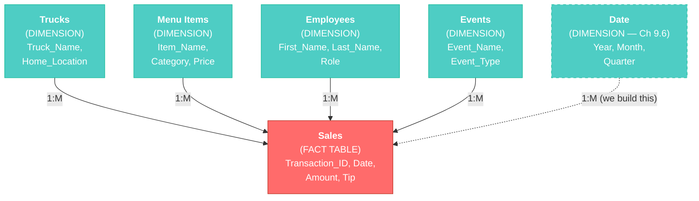
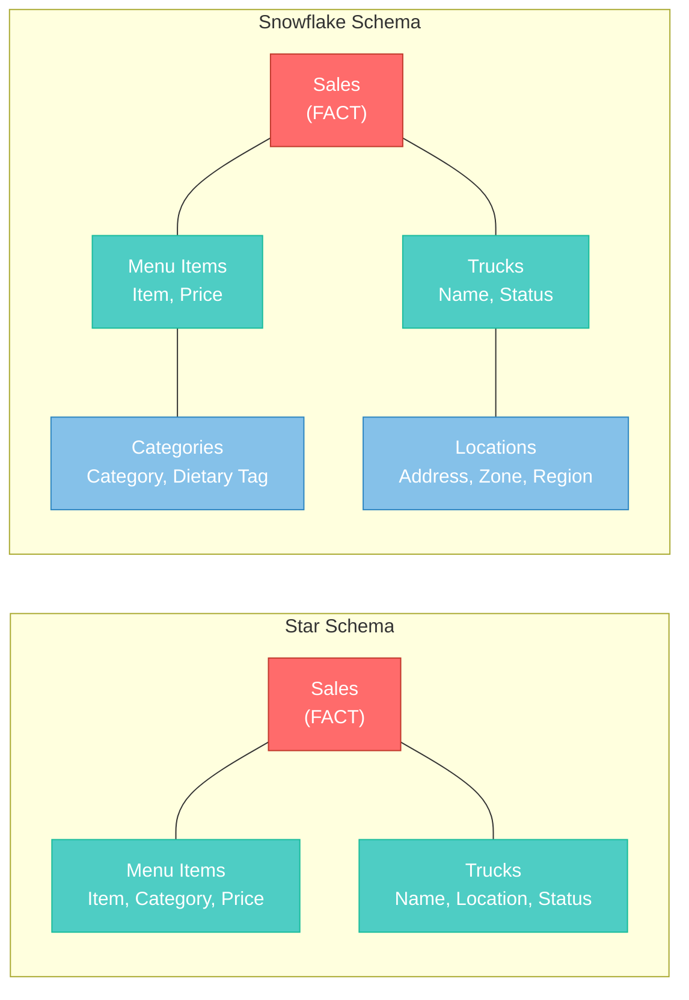
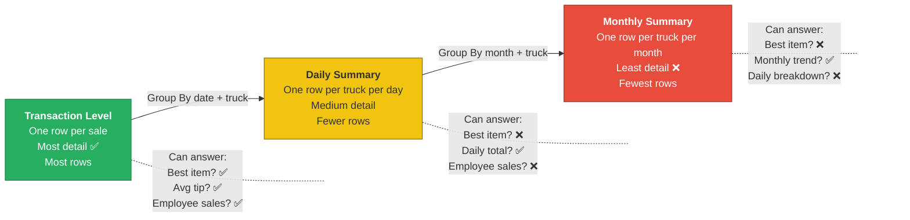
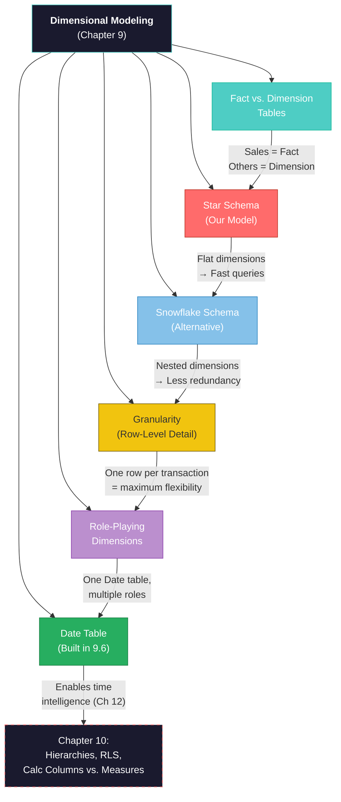

# Chapter 9: Dimensional Modeling: Star and Snowflake Schemas

**Chapter 9 of 12 | Part III: Designing and Building a Data Model**


---

## Learning Objectives

By the end of this chapter, you will be able to:

1. Distinguish between **fact tables** and **dimension tables** in a data model
2. Identify and describe the **star schema** pattern — and explain why your Sabor Miami model already follows it
3. Compare the **star schema** and **snowflake schema** and explain when each is appropriate
4. Define **granularity** and explain how the grain of a table determines what questions you can answer
5. Explain the concept of **role-playing dimensions** and why a single table might serve multiple purposes
6. Build a **Date table** using `CALENDARAUTO()`, add date-related columns, and connect it to your model

---

## Why It Matters

*Section 9.0 of 9.6*

Imagine you are hired as a data analyst at a mid-size company. On your first day, someone hands you a Power BI file with 15 tables and says, "The model needs work. Fix it." You open Model View and see a tangle of boxes and lines — tables connected in every direction, no clear center, no obvious pattern. Where do you even start?

Now imagine a different scenario. You open the file and immediately recognize the structure: one large table in the center (the transactions), surrounded by smaller tables that describe those transactions (products, employees, locations, dates). You know what you are looking at because it has a name — a **star schema**. You know the central table is a **fact table** and the surrounding tables are **dimension tables**. You know how to evaluate whether the tables are at the right level of detail. You even know what table is missing (hint: it is almost always the Date table).

The difference between those two scenarios is vocabulary. Not new Power BI skills — you already built a model in Chapter 8. What you need now are the formal names and frameworks that let you evaluate, communicate about, and improve data models. That is what this chapter provides.

Every major business intelligence platform — Power BI, Tableau, Looker, Amazon QuickSight — expects data to be organized in a star schema. The vocabulary you learn in this chapter is not Power BI-specific. It is the shared language of the analytics industry.

---

## Part 1: Concept Breakdown

### 9.1 Fact Tables vs. Dimension Tables: The Core Distinction

*Section 9.1 of 9.6*

In this section, you will learn the most important classification in data modeling: the difference between fact tables and dimension tables.

Think back to your Sabor Miami model in Chapter 8. You connected five tables with relationships. But not all of those tables play the same role. Let us classify them.

A **fact table** records **events** — things that happened. Each row in a fact table represents one occurrence of something: a sale, a shipment, a booking, a login, a payment. Fact tables are typically the largest tables in a model because events happen frequently. They contain numeric values you want to measure (amounts, quantities, durations) and foreign keys that point to other tables.

In the Sabor Miami model, the **Sales** table is the fact table. Each row is one transaction — one customer buying one item at one truck on one date. It contains the Amount, the Tip, and foreign keys (Truck_ID, Employee_ID, Menu_Item_ID) that point to other tables.

A **dimension table** **describes** the events in the fact table. Dimensions answer the "who, what, where, when" questions about each event. They tend to be smaller, with fewer rows but more descriptive columns. In the Sabor Miami model, **Trucks**, **Menu Items**, **Employees**, and **Events** are all dimension tables. They do not record transactions — they describe the context around each transaction.

Here is a quick test you can apply to any table: **Does this table record events, or does it describe events?**

| Question | If the answer is "events" → | If the answer is "describes" → |
|----------|---------------------------|-------------------------------|
| What does each row represent? | A transaction, measurement, or occurrence | A person, place, product, or time period |
| Does it have numeric values to aggregate? | Yes (amounts, quantities, counts) | Rarely (mostly text and categories) |
| Is it the largest table in the model? | Usually yes | Usually no |
| Does it contain foreign keys to other tables? | Yes — many of them | Usually has a primary key but few foreign keys |
| **Classification** | **Fact table** | **Dimension table** |

<div style="background-color: #D6EAF8; border-left: 5px solid #2E86C1; padding: 15px; margin: 15px 0; border-radius: 4px;">
  <strong style="color: #1A5276;">💡 WHY ARE WE DOING THIS?</strong><br>
  Knowing the difference between fact and dimension tables helps you evaluate any data model you encounter — not only the ones you build yourself. When you start a new analytics job, the first question to ask about any model is: "Which table is the fact table?" Everything else flows from that answer.
</div>

**Cross-tool bridge:** In your database course, you had entity tables (Customers, Products, Orders) and you designed relationships between them. The fact-and-dimension framework is the analytics version of that same idea — but with a specific emphasis on which table holds the *measurable events* and which tables provide *descriptive context*.

**Micro-checkpoint:** Look at your Sabor Miami model in Model View right now. Can you identify which table is the fact table and which are dimensions? What clues helped you decide?

---

Now that you can classify tables as facts or dimensions, let us look at the shape that emerges when you connect them. That shape has a name.

### 9.2 The Star Schema: What You Already Built

*Section 9.2 of 9.6*

In this section, you will learn the formal name for the model pattern you created in Chapter 8 — and why it is the most widely used design in the analytics industry.

Open your Sabor Miami .pbix file and switch to **Model View** (the third icon on the left side of the screen — the one that looks like three connected boxes). If your tables are scattered around the canvas, take a moment to rearrange them: drag the **Sales** table to the center, then position **Trucks**, **Menu Items**, **Employees**, and **Events** around it, with the relationship lines radiating outward.

Look at the shape.

Sales sits in the middle. Four dimension tables surround it, each connected by a single relationship line. The overall pattern looks like a star — one central hub with points radiating outward.

This is called a **star schema**. The fact table is the center of the star, and the dimension tables are the points. It is the most common data model design in business intelligence, and for good reason:

**Why star schemas work well:**
- **They are readable.** Anyone who opens your model can immediately identify the fact table (it is in the center) and understand the dimensions around it.
- **They are fast.** Power BI's engine (VertiPaq) is optimized for star schemas. Queries run faster because the engine knows exactly how to navigate from dimensions to facts.
- **They are predictable.** Every question follows the same pattern: start with a dimension (which truck? which month? which menu item?) and aggregate something from the fact table (total sales, average tip, transaction count).



**Figure 9.1: The Sabor Miami Star Schema** — Sales (the fact table, in coral) sits at the center. Dimension tables (in teal) radiate outward. The dashed Date table is the one you will build later in this chapter.

**Cross-tool bridge:** In your database course, you drew ER diagrams showing tables connected by foreign keys. A star schema in Power BI is the same picture — but designed for analytical speed rather than storage efficiency. ER diagrams optimize for writing data (inserts, updates). Star schemas optimize for reading data (queries, aggregations, reports).

---

**"Abuela Carmen Names the Recipe"**

Sofia was showing Abuela Carmen her Power BI model on the laptop screen — five boxes connected by lines, with Sales in the middle.

Abuela Carmen tilted her head. "Mija, this looks like my recipe card system."

Sofia looked up. "Your what?"

"My recipe cards. I have one card for the *recipe* — the thing I made, when I made it, how much I used. That is the main card, the event. Then I have separate lists." She held up her fingers. "Ingredients list. Suppliers list. Equipment list. The recipe card *references* those lists. I do not write the supplier's phone number on every recipe card — I look it up."

Sofia stared at the screen. The Sales table was the recipe card — the event. Trucks, Menu Items, Employees, Events — those were the reference lists. "Abuela, you literally described fact tables and dimension tables."

Prof. Reyes, who had been listening from across the room, walked over. "She did more than that. The shape of your card system — one central card pointing out to reference lists — that is called a star schema. It is the same thing you built in Power BI, Sofia. And it is the same thing analysts build at companies all over the world."

Abuela Carmen looked at the screen again. "I have been using a star schema for forty years. I want credit."

---

*Technical Connection:* A fact table records events (transactions, orders, batches made). Dimension tables describe those events (who, what, where, when). The star shape emerges naturally when one event table references multiple descriptive tables — whether in Power BI or on recipe cards in a Hialeah kitchen.

**Micro-checkpoint:** If someone asked you to explain a star schema to a coworker, how would you describe it in one sentence? Try it out loud before moving on.

---

Now that you can name the pattern, let us look at an alternative design — one you probably will not use, but should know exists.

### 9.3 The Snowflake Schema: When Normalization Returns

*Section 9.3 of 9.6*

In this section, you will learn about the snowflake schema — an alternative to the star schema that follows the normalization principles from your database course.

In a star schema, each dimension table is flat — it contains all its descriptive information in a single table. The Menu Items table has Item_Name, Category, and Price all in one place. The Trucks table has Truck_Name, Home_Location, and Status all together.

But what if the Category column in Menu Items had its own set of attributes? Imagine each category had a description, a dietary tag (vegetarian, vegan, contains gluten), and a display order. In a star schema, you would add those columns to the Menu Items table. In a **snowflake schema**, you would break them out into a separate **Category** table and connect it to Menu Items.

The result is that dimension tables have their own dimensions — sub-tables branching off of sub-tables. When you draw this on paper, the pattern looks less like a star and more like a snowflake, with branches extending outward from each point.



**Figure 9.2: Star Schema vs. Snowflake Schema** — In a star schema (left), dimensions are flat. In a snowflake schema (right), dimensions branch into sub-dimensions. The star is faster to query; the snowflake reduces data redundancy.

**Cross-tool bridge:** This should feel familiar. In your database course, you learned normalization — breaking tables apart to eliminate redundancy and prevent update anomalies. A snowflake schema follows that same logic. A star schema deliberately *de-normalizes* for query performance. Different goals call for different designs.

**When would you use a snowflake schema?**
- When dimension tables are very large and contain significant redundant data
- When storage space is a primary concern (less common with modern hardware)
- When the organization already has a heavily normalized data warehouse

**When should you use a star schema?**
- Almost always in Power BI. The VertiPaq engine compresses data efficiently, so the storage savings of snowflaking rarely matter. The query performance benefits of a flat star schema almost always outweigh the marginal storage reduction.

For the Sabor Miami model, the star schema is the right choice. Your dimension tables are small, your fact table is manageable, and the flat design is faster and more readable. You will not use a snowflake schema in this course, but you should recognize one when you see it in a professional environment.

<div style="background-color: #FEF9E7; border-left: 5px solid #F1C40F; padding: 15px; margin: 15px 0; border-radius: 4px;">
  <strong style="color: #7D6608;">⚠️ COMMON MISTAKE</strong><br>
  Some students assume that because normalization was "correct" in the database course, a snowflake schema must be "better" than a star schema. That is not how it works. Normalization is the right choice when you are <em>writing</em> data (inserts, updates, deletes) — it prevents anomalies. A star schema is the right choice when you are <em>reading</em> data (reports, dashboards, aggregations) — it maximizes query speed. The "right" design depends on the purpose.
</div>

**Micro-checkpoint:** In your own words, what is the key difference between a star schema and a snowflake schema? When would you choose one over the other?

---

<div style="background-color: #E8DAEF; border-left: 5px solid #8E44AD; padding: 15px; margin: 15px 0; border-radius: 4px;">
  <strong style="color: #6C3483;">💜 TAKE A BREATH</strong><br>
  You have covered the three big vocabulary terms — fact table, dimension table, and star schema. You also know the alternative (snowflake) and why you are not using it. That is a lot of new terminology, even though the underlying concepts are things you already built in Chapter 8. Take a moment. Stretch. The next section asks you to think about your data at a deeper level — the level of detail stored in each row.
</div>

---

Now that you understand the shape of your model, let us examine what is inside the tables — specifically, how much detail each row contains.

### 9.4 Defining the Right Level of Data Granularity

*Section 9.4 of 9.6*

In this section, you will learn one of the most important design concepts in data modeling: **granularity** — the level of detail that each row in your table represents.

Open your Sabor Miami file and switch to **Table View** (the second icon on the left side of the screen — the one that looks like a grid). Select the **Sales** table from the Fields pane on the right.

Look at a single row. What does it represent?

One row = one transaction. A single customer, buying a single item, at a single truck, on a single date, for a single amount. That is the **grain** of the Sales table. The grain is the most atomic level of detail the table captures.

This matters because the grain determines what questions you can and cannot answer.

At the current grain (one row per transaction):
- ✅ "What is our best-selling menu item?" — Yes, because each item sale is a separate row
- ✅ "Which employee made the most sales?" — Yes, because each transaction has an Employee_ID
- ✅ "What is the average tip per transaction?" — Yes, because each tip amount is recorded individually
- ✅ "How many transactions happened at Truck T001 on March 15th?" — Yes, all the detail is there

But what if the Sales table had been designed differently — with one row per truck per day, showing only the daily total? Then:
- ❌ "What is our best-selling menu item?" — No, because individual item sales are not recorded
- ❌ "Which employee made the most sales?" — No, because employee-level detail is aggregated away
- ✅ "What was the total revenue for Truck T001 on March 15th?" — Yes, this is still captured
- ❌ "What is the average tip per transaction?" — No, because individual tips are gone — only the daily sum remains

**The more granular your data, the more questions you can answer.** But more granular also means more rows, which means more storage and potentially slower queries. Choosing the right grain is a design decision.

---

**"Marcus and the Grain"**

Marcus had been pulling shipping data at the Port of Miami all week. His supervisor asked for a quarterly volume report, so Marcus ran the query and opened the results.

The data had one row per container — every individual container that moved through the port over the last three months. Tens of thousands of rows. Container ID, ship name, origin port, destination, weight, arrival date, departure date.

His supervisor glanced at the screen. "I do not need every container. I need daily totals by shipping lane. Miami to San Juan, Miami to Cartagena, Miami to Nassau — how many containers per day on each lane?"

Marcus remembered Chapter 6 — Group By. He could aggregate the data: group by shipping lane and date, count the containers, sum the weights. But the moment he did that, he would lose the ability to answer questions about individual containers. If his supervisor later asked, "What was the heaviest container on the San Juan lane last Tuesday?" — the answer would be gone.

He asked Prof. Reyes during their next class. Prof. Reyes nodded. "That is the grain decision. You are choosing what level of detail to keep. For Sabor Miami, each row in our Sales table is one transaction — one line item. That gives us maximum flexibility. If we had aggregated to daily totals per truck, we would have fewer rows, but we could not answer 'What is our best-selling menu item?' because the item-level detail would be gone."

Marcus thought about it. "So you want the most granular data you can get?"

"Usually, yes — for the fact table. You can always aggregate later in a report. But you cannot disaggregate something that was already summed up."

---

*Technical Connection:* Granularity (grain) is the level of detail each row represents. The grain of the Sabor Miami Sales table is one transaction per row. Choosing the right grain is a design decision that determines which questions your model can answer. A good rule: keep the fact table as granular as your source data allows. You can always summarize in reports — but you cannot recover detail that was aggregated away.

**Cross-tool bridge:** In SQL, changing the grain is the difference between `SELECT * FROM Sales` (one row per transaction — most granular) and `SELECT Truck_ID, SUM(Amount) FROM Sales GROUP BY Truck_ID` (one row per truck — less granular). Same data, different grain. In Power BI, you make this grain decision when you design your model, and then DAX measures (Chapter 11) handle the aggregation at report time.



**Figure 9.3: The Granularity Spectrum** — As you move from left to right, rows decrease but so does the ability to answer detailed questions. The Sabor Miami model uses transaction-level granularity (the most detailed option).

**Micro-checkpoint:** What is the grain of the Sabor Miami Sales table? What question would you *lose* the ability to answer if you changed the grain to daily totals per truck?

---

The grain concept applies to your fact table. But dimensions can also have interesting structural challenges. Let us look at one: what happens when the same dimension table needs to serve two different purposes.

### 9.5 Role-Playing Dimensions: One Table, Multiple Relationships

*Section 9.5 of 9.6*

In this section, you will learn about **role-playing dimensions** — a concept where a single dimension table connects to the fact table through more than one relationship.

The Sabor Miami dataset does not require a role-playing dimension. But you should understand the concept because you will encounter it in professional models — and on the PL-300 certification exam.

Here is the classic example. Imagine a shipping company with an Orders table (fact table) that has two date columns:

- **Order_Date** — the date the order was placed
- **Ship_Date** — the date the order was shipped

Both columns contain dates. Both could benefit from connecting to a Date table for time-based analysis (sales by month of order, shipping delays by quarter, etc.). But you have only **one** Date table.

In Power BI, you can create two relationships between the same two tables — but only one can be **active** at a time. The active relationship is the one Power BI uses by default when you drag fields into a visual. The inactive relationship exists in the model but requires a DAX function called `USERELATIONSHIP` to activate it (you will learn this in Chapter 12).

This is called a **role-playing dimension** because the Date table is "playing two roles" — once as the Order Date dimension and once as the Ship Date dimension.

For the Sabor Miami model, the Sales table has only one date column (Date), so you only need one relationship to your Date table. No role-playing required. But keep this concept in your mental toolkit — it comes up in enterprise models with multiple date fields.

<div style="background-color: #D6EAF8; border-left: 5px solid #2E86C1; padding: 15px; margin: 15px 0; border-radius: 4px;">
  <strong style="color: #1A5276;">💡 WHY ARE WE DOING THIS?</strong><br>
  Role-playing dimensions show up on the PL-300 exam and in enterprise models. Even though you will not build one in this course, understanding the concept prevents confusion when you encounter a model with two relationship lines going to the same table. One line will be solid (active), and one will be dashed (inactive). Now you know what that means.
</div>

**Analogy:** Think of the calendar on the kitchen wall. It tells you the "date made" for Abuela Carmen's sofrito AND the "date served" for when it went out to customers. Same calendar, two different questions. One calendar, two roles.

**Micro-checkpoint:** If a fact table has both a "Hire Date" and a "Termination Date," and both connect to the same Date table, what is that called? Which relationship would be active by default?

---

<div style="background-color: #E8DAEF; border-left: 5px solid #8E44AD; padding: 15px; margin: 15px 0; border-radius: 4px;">
  <strong style="color: #6C3483;">💜 TAKE A BREATH</strong><br>
  You have made it through the conceptual heavy lifting. Fact tables, dimension tables, star schemas, snowflake schemas, granularity, and role-playing dimensions — that is the full vocabulary of dimensional modeling. Now it is time to build something. In the next section, you create the one table that is still missing from your model: the Date table. This is hands-on work, and it will feel good after all the theory.
</div>

---

Now that you have the vocabulary, let us put it to work. Your model has one gap — a missing dimension that almost every Power BI model needs.

### 9.6 Building a Common Date Table

*Section 9.6 of 9.6*

In this section, you will build a **Date table** — a dedicated dimension table containing one row for every date in your data's range, with columns for Year, Month, Month Name, Quarter, and more.

**Why does your model need a Date table?**

The Sales table already has a Date column. You can drag it into a visual and see sales by date. So why build a separate table?

Three reasons:

1. **Time intelligence requires it.** In Chapter 12, you will write DAX measures like "year-to-date sales" and "same period last year." These functions (`TOTALYTD`, `SAMEPERIODLASTYEAR`) **require** a marked Date table to work. Without one, they produce errors.

2. **Grouping by month, quarter, or year requires date attributes.** The Sales[Date] column contains full dates (2024-01-15). If you want to group by "January" or "Q1," you need separate columns for Month Name and Quarter. Those live in the Date table.

3. **Continuous date coverage.** What if no sales happened on a holiday? The Sales table would have no row for that date. A Date table has **every** date — including days with zero sales — which makes charts continuous and time comparisons accurate.

<div style="background-color: #D6EAF8; border-left: 5px solid #2E86C1; padding: 15px; margin: 15px 0; border-radius: 4px;">
  <strong style="color: #1A5276;">💡 WHY ARE WE DOING THIS?</strong><br>
  Almost every Power BI model in the professional world has a Date table. Building one is a standard skill that you will use on every project. Time intelligence measures — which you will learn in Chapter 12 — absolutely require a Date table to function. Think of this as laying the foundation for future calculations.
</div>

**Cross-tool bridge:** You have never built a Date table in SQL — but you have used date functions like `YEAR()`, `MONTH()`, and `DATE_FORMAT()`. A Date table pre-computes all of those into columns you can filter and group by. Instead of writing `YEAR(Sales.Date)` in every query, you have a Year column ready to go.

---

## Part 2: Hands-On Walkthrough

### Building the Date Table Step by Step

**WHERE AM I?** You should be in the main Power BI Desktop window — **not** the Power Query Editor. You will work in both **Table View** and **Model View** during this walkthrough. If you see a green ribbon, you are in Power Query — click **Close & Apply** first.

**Step 1: Create a New Calculated Table**

<div style="background-color: #D5F5E3; border-left: 5px solid #27AE60; padding: 15px; margin: 15px 0; border-radius: 4px;">
  <strong style="color: #1E8449;">✅ DO THIS</strong><br>
  1. <strong>See It:</strong> Look at the ribbon at the top of the Power BI Desktop window. You should see tabs including Home, Insert, Modeling, View, and more.<br>
  2. <strong>Name It:</strong> The button you need is called <strong>New Table</strong>.<br>
  3. <strong>Find It:</strong> Click the <strong>Modeling tab</strong> in the ribbon. In the <strong>Calculations</strong> section (left side of the ribbon), find the <strong>New Table</strong> button.<br>
  4. <strong>Do It:</strong> Click <strong>New Table</strong>. A formula bar appears at the top of the screen with the cursor blinking, ready for you to type.
</div>

**Step 2: Type the CALENDARAUTO Formula**

<div style="background-color: #D5F5E3; border-left: 5px solid #27AE60; padding: 15px; margin: 15px 0; border-radius: 4px;">
  <strong style="color: #1E8449;">✅ DO THIS</strong><br>
  In the formula bar, type the following and press <strong>Enter</strong>:<br><br>
  <code>Date = CALENDARAUTO()</code><br><br>
  This creates a new table called <strong>Date</strong> with a single column also called <strong>Date</strong>, containing one row for every date that Power BI finds across all date columns in your model.
</div>

**What we want to ask:** "Give me a table with every date my data covers."

**In DAX:**
```dax
Date = CALENDARAUTO()
```

**What this does:** `CALENDARAUTO()` scans all the date columns in your model, finds the earliest and latest dates, and generates a complete calendar covering that full range. For Sabor Miami, that means every day in 2024 (and possibly a few days before and after, depending on your data).

<div style="background-color: #FADBD8; border-left: 5px solid #E74C3C; padding: 15px; margin: 15px 0; border-radius: 4px;">
  <strong style="color: #922B21;">🛑 STOP AND CHECK</strong><br>
  After pressing Enter, you should see a new table appear in Table View with a single column called <strong>Date</strong>. The column should contain a list of dates. Check the status bar at the bottom of the screen — it should show the row count. For Sabor Miami, expect approximately <strong>365–730 rows</strong> (one or two years of dates).<br><br>
  <strong>If you see an error:</strong> Make sure you typed the formula exactly as shown, including the equals sign at the beginning. The formula bar should read <code>Date = CALENDARAUTO()</code>.
</div>

**Step 3: Add a Year Column**

Now your Date table has dates, but no way to group by year. Let us add that.

<div style="background-color: #D5F5E3; border-left: 5px solid #27AE60; padding: 15px; margin: 15px 0; border-radius: 4px;">
  <strong style="color: #1E8449;">✅ DO THIS</strong><br>
  1. Make sure the <strong>Date</strong> table is selected in the Fields pane on the right.<br>
  2. Click the <strong>Modeling tab</strong> in the ribbon.<br>
  3. Click <strong>New Column</strong> (in the Calculations section, next to New Table).<br>
  4. In the formula bar, type the following and press <strong>Enter</strong>:<br><br>
  <code>Year = YEAR('Date'[Date])</code>
</div>

**What this does:** The `YEAR()` function extracts the four-digit year from each date. A new column called **Year** appears in the Date table, with values like 2024.

**Step 4: Add Month Number, Month Name, and Quarter Columns**

Repeat the New Column process three more times, using these formulas:

<div style="background-color: #D5F5E3; border-left: 5px solid #27AE60; padding: 15px; margin: 15px 0; border-radius: 4px;">
  <strong style="color: #1E8449;">✅ DO THIS</strong><br>
  For each formula below, click <strong>New Column</strong> on the Modeling tab, type the formula, and press Enter.<br><br>
  <strong>Month Number:</strong><br>
  <code>Month Number = MONTH('Date'[Date])</code><br><br>
  <strong>Month Name:</strong><br>
  <code>Month Name = FORMAT('Date'[Date], "MMMM")</code><br><br>
  <strong>Quarter:</strong><br>
  <code>Quarter = "Q" &amp; QUARTER('Date'[Date])</code>
</div>

**What these do:**
- `MONTH()` returns the month as a number (1–12)
- `FORMAT()` with "MMMM" returns the full month name ("January," "February," etc.)
- `QUARTER()` returns the quarter number (1–4), and the `"Q" &` adds the letter Q in front (producing "Q1," "Q2," etc.)

<div style="background-color: #FADBD8; border-left: 5px solid #E74C3C; padding: 15px; margin: 15px 0; border-radius: 4px;">
  <strong style="color: #922B21;">🛑 STOP AND CHECK</strong><br>
  Your Date table should now have <strong>five columns</strong>: Date, Year, Month Number, Month Name, and Quarter. Scroll through the data to verify:<br>
  - Year shows 2024 (and possibly 2023 or 2025 depending on CALENDARAUTO's range)<br>
  - Month Number shows values 1 through 12<br>
  - Month Name shows full names like "January," "February"<br>
  - Quarter shows "Q1" through "Q4"<br><br>
  <strong>If Month Name shows as numbers instead of names:</strong> Check that you typed <code>"MMMM"</code> (four capital M's) in the FORMAT function, not <code>"MM"</code> (which gives month numbers with leading zeros).
</div>

<div style="background-color: #FEF9E7; border-left: 5px solid #F1C40F; padding: 15px; margin: 15px 0; border-radius: 4px;">
  <strong style="color: #7D6608;">⚠️ COMMON MISTAKE</strong><br>
  <strong>Month Name sorting problem:</strong> When you use Month Name in a visual, Power BI sorts it alphabetically — so "April" comes before "January." That is wrong. To fix this, you need to sort Month Name by Month Number. Here is how:<br><br>
  1. Click on the <strong>Month Name</strong> column header in the Date table<br>
  2. Go to the <strong>Column tools tab</strong> in the ribbon (this tab appears when a column is selected)<br>
  3. Click <strong>Sort by Column</strong><br>
  4. Select <strong>Month Number</strong><br><br>
  Now "January" sorts as 1, "February" as 2, and so on. This is a step that professionals do on every Date table — and forgetting it is one of the most common issues in Power BI reports.
</div>

**Step 5: Mark as Date Table**

This step tells Power BI that your Date table is the official calendar for time-based calculations.

<div style="background-color: #D5F5E3; border-left: 5px solid #27AE60; padding: 15px; margin: 15px 0; border-radius: 4px;">
  <strong style="color: #1E8449;">✅ DO THIS</strong><br>
  1. Make sure the <strong>Date</strong> table is selected in the Fields pane.<br>
  2. Click the <strong>Table tools tab</strong> in the ribbon (this tab appears when a table is selected).<br>
  3. Click <strong>Mark as Date Table</strong>.<br>
  4. In the dialog that appears, select the <strong>Date</strong> column as the date column.<br>
  5. Click <strong>OK</strong>.
</div>

<div style="background-color: #D6EAF8; border-left: 5px solid #2E86C1; padding: 15px; margin: 15px 0; border-radius: 4px;">
  <strong style="color: #1A5276;">💡 WHY ARE WE DOING THIS?</strong><br>
  Marking a table as a Date table does two things. First, it tells Power BI to disable its automatic date hierarchy (which can be confusing). Second, it enables <strong>time intelligence functions</strong> in DAX — functions like TOTALYTD, SAMEPERIODLASTYEAR, and DATEADD that you will use in Chapter 12. Without marking the table, these functions will not work. Think of it as registering your calendar with Power BI: "This is THE calendar. Use this one."
</div>

<div style="background-color: #FADBD8; border-left: 5px solid #E74C3C; padding: 15px; margin: 15px 0; border-radius: 4px;">
  <strong style="color: #922B21;">🛑 STOP AND CHECK</strong><br>
  After marking the table, the Date table icon in the Fields pane should change — it now shows a small calendar symbol. If Power BI reports a validation error, it usually means your Date column has gaps (missing dates) or duplicates. CALENDARAUTO() should not produce either, but if you see an error, check that you typed the formula correctly and that the Date column contains continuous dates with no blanks.
</div>

**Step 6: Create the Relationship to Sales**

<div style="background-color: #D5F5E3; border-left: 5px solid #27AE60; padding: 15px; margin: 15px 0; border-radius: 4px;">
  <strong style="color: #1E8449;">✅ DO THIS</strong><br>
  1. Switch to <strong>Model View</strong> (third icon on the left side of the screen).<br>
  2. Find the new <strong>Date</strong> table box on the canvas. If you do not see it, it may be off-screen — scroll or zoom out.<br>
  3. Drag the <strong>Date</strong> table so it sits near the <strong>Sales</strong> table.<br>
  4. Drag the <strong>Date</strong> column from the <strong>Date</strong> table onto the <strong>Date</strong> column in the <strong>Sales</strong> table.<br>
  5. A relationship line appears. Double-click the line to confirm: Cardinality should be <strong>One to many (1:*)</strong> and Cross-filter direction should be <strong>Single</strong>.
</div>

<div style="background-color: #FADBD8; border-left: 5px solid #E74C3C; padding: 15px; margin: 15px 0; border-radius: 4px;">
  <strong style="color: #922B21;">🛑 STOP AND CHECK</strong><br>
  Your Model View should now show <strong>six tables</strong> — the original five from Chapter 8, plus the new Date table. The Date table should be connected to Sales with a relationship line. The cardinality should be One to many (the Date table is the "one" side — each date appears once — and the Sales table is the "many" side — each date can have multiple transactions).<br><br>
  <strong>Rearrange your tables</strong> so Sales remains in the center and all six dimension tables radiate outward. This is your complete star schema.
</div>

**Step 7: Verify with a Visual**

<div style="background-color: #D5F5E3; border-left: 5px solid #27AE60; padding: 15px; margin: 15px 0; border-radius: 4px;">
  <strong style="color: #1E8449;">✅ DO THIS</strong><br>
  1. Switch to <strong>Report View</strong> (first icon on the left side of the screen).<br>
  2. From the Fields pane, expand the <strong>Date</strong> table.<br>
  3. Drag <strong>Month Name</strong> to the canvas. Power BI creates a table visual.<br>
  4. From the <strong>Sales</strong> table in the Fields pane, drag <strong>Amount</strong> into the same visual.<br>
  5. You should see a table showing Month Name in one column and the sum of Amount in the other.
</div>

<div style="background-color: #FADBD8; border-left: 5px solid #E74C3C; padding: 15px; margin: 15px 0; border-radius: 4px;">
  <strong style="color: #922B21;">🛑 STOP AND CHECK</strong><br>
  Your table visual should show 12 months with different sales amounts for each. If all months show the <em>same</em> number, your relationship between the Date table and Sales is not working — go back to Model View and verify the relationship.<br><br>
  If the months are sorted alphabetically (April, August, December...) instead of chronologically (January, February, March...), go back and complete the <strong>Sort by Column</strong> step from earlier — sort Month Name by Month Number.
</div>

---

## Part 3: Practice Exercise

### Building and Connecting Your Date Table

<div style="background-color: #D5F5E3; border-left: 5px solid #27AE60; padding: 15px; margin: 15px 0; border-radius: 4px;">
  <strong style="color: #1E8449;">🚀 LAUNCH PAD</strong><br><br>
  <strong>What you are building:</strong> A complete Date table connected to your Sabor Miami star schema<br>
  <strong>Tool:</strong> Power BI Desktop → Table View, Model View, and Report View<br>
  <strong>File to open:</strong> Your Sabor Miami .pbix file from Chapter 8 (with all 5 tables and relationships already configured)<br>
  <strong>Data source:</strong> No new files — you are creating a calculated table inside the model<br>
  <strong>Time estimate:</strong> 20–30 minutes<br>
  <strong>Number of steps:</strong> 12 steps across 4 phases<br>
  <strong>What "done" looks like:</strong> A six-table star schema with a Date table containing Year, Month Number, Month Name, Quarter, and Day of Week columns, verified with a Matrix visual showing sales by quarter and month<br>
  <strong>Start here →</strong> Open your Sabor Miami .pbix in Power BI Desktop and switch to Table View
</div>

---

#### Phase 1 of 4: Setup

**Step 1:** Open your Sabor Miami .pbix file in Power BI Desktop. Make sure you are in the **main Power BI window** (not the Power Query Editor). Switch to **Table View** by clicking the second icon on the left side of the screen.

**Step 2:** Verify that your five original tables are present by checking the Fields pane on the right: Sales, Menu Items, Trucks, Employees, and Events. All relationships from Chapter 8 should still be in place.

<div style="background-color: #FADBD8; border-left: 5px solid #E74C3C; padding: 15px; margin: 15px 0; border-radius: 4px;">
  <strong style="color: #922B21;">🛑 STOP AND CHECK</strong><br>
  You should see five tables in the Fields pane. If any are missing, open Model View and check for broken relationships. If your file is not available, use the starter .pbix from Chapter 8's practice exercise on GitHub.
</div>

---

#### Phase 2 of 4: Explore

**Step 3:** Click on the **Sales** table in the Fields pane. Scroll through the **Date** column. Notice the date format and the range of dates. What is the earliest date? What is the latest?

**Step 4:** Think about what columns your Date table needs. At minimum: Date, Year, Month Number, Month Name, and Quarter. For this exercise, you will also add **Day of Week** and **Is Weekend**.

---

#### Phase 3 of 4: Build

**Step 5:** Create the Date table. Go to the **Modeling tab** → click **New Table** → type `Date = CALENDARAUTO()` → press Enter.

<div style="background-color: #FADBD8; border-left: 5px solid #E74C3C; padding: 15px; margin: 15px 0; border-radius: 4px;">
  <strong style="color: #922B21;">🛑 STOP AND CHECK</strong><br>
  A new Date table should appear in the Fields pane and in Table View. It should have one column (Date) with hundreds of rows. If you see an error, check your formula: <code>Date = CALENDARAUTO()</code>.
</div>

**Step 6:** Add calculated columns. With the Date table selected, click **New Column** on the Modeling tab for each of the following:

- `Year = YEAR('Date'[Date])`
- `Month Number = MONTH('Date'[Date])`
- `Month Name = FORMAT('Date'[Date], "MMMM")`
- `Quarter = "Q" & QUARTER('Date'[Date])`
- `Day of Week = FORMAT('Date'[Date], "dddd")`
- `Is Weekend = IF(WEEKDAY('Date'[Date], 2) > 5, "Weekend", "Weekday")`

**Step 7:** Sort Month Name by Month Number. Click the **Month Name** column header → **Column tools tab** → **Sort by Column** → select **Month Number**.

**Step 8:** Sort Day of Week correctly. Click the **Day of Week** column header. To sort this properly, you need a numeric day-of-week column to sort by. Add one more column:

- `Day Number = WEEKDAY('Date'[Date], 2)`

Then click **Day of Week** → **Column tools tab** → **Sort by Column** → select **Day Number**. You can then hide the Day Number column (right-click → **Hide in report view**) since it is only used for sorting.

<div style="background-color: #FADBD8; border-left: 5px solid #E74C3C; padding: 15px; margin: 15px 0; border-radius: 4px;">
  <strong style="color: #922B21;">🛑 STOP AND CHECK</strong><br>
  Your Date table should now have columns: Date, Year, Month Number, Month Name, Quarter, Day of Week, Is Weekend, and Day Number (hidden). Scroll through to verify the values look correct. January should have Month Number 1, Month Name "January," Quarter "Q1."
</div>

**Step 9:** Mark as Date table. Click the **Date** table in the Fields pane → **Table tools tab** → **Mark as Date Table** → select the **Date** column → click **OK**.

**Step 10:** Create the relationship. Switch to **Model View**. Drag the **Date** column from the **Date** table onto the **Date** column in the **Sales** table. Double-click the relationship line to confirm: One to many, Single direction.

<div style="background-color: #FADBD8; border-left: 5px solid #E74C3C; padding: 15px; margin: 15px 0; border-radius: 4px;">
  <strong style="color: #922B21;">🛑 STOP AND CHECK</strong><br>
  Model View should now show <strong>six tables</strong> in a star pattern with Sales in the center. The Date table should be connected to Sales. Rearrange the tables so the star shape is clear — this is your completed Sabor Miami star schema.
</div>

---

#### Phase 4 of 4: Verify

**Step 11:** Switch to **Report View**. Create a **Matrix** visual (found in the Visualizations pane — it looks like a grid icon). Configure it as follows:
- **Rows:** Drag **Quarter** from the Date table, then drag **Month Name** below it (this creates a drill-down hierarchy)
- **Values:** Drag **Amount** from the Sales table

You should see quarterly subtotals with monthly breakdowns underneath.

**Step 12:** Add a second visual — a **Table** — with **Day of Week** (from Date) and **Amount** (from Sales). Verify that weekday and weekend sales show different totals, and that the days are sorted Monday through Sunday (not alphabetically).

<div style="background-color: #FADBD8; border-left: 5px solid #E74C3C; padding: 15px; margin: 15px 0; border-radius: 4px;">
  <strong style="color: #922B21;">🛑 STOP AND CHECK</strong><br>
  <strong>What Success Looks Like:</strong><br>
  ✅ A Matrix visual showing quarterly sales with monthly drill-down — months should be in chronological order, not alphabetical<br>
  ✅ A Table visual showing sales by day of week — days should be in Monday-through-Sunday order<br>
  ✅ Model View shows six tables in a star schema with Sales at the center<br>
  ✅ The Date table icon shows a calendar symbol (confirming it is marked as a Date table)<br><br>
  If months or days appear in alphabetical order, go back and complete the Sort by Column steps.
</div>

---

## Part 4: Checkpoint Quiz

**Directions:** Answer each question based on what you learned in this chapter. There are no trick questions. Choose the best answer.

---

**Question 1:** In the Sabor Miami data model, which table is the fact table?

A) Trucks
B) Menu Items
C) Sales
D) Employees

**Answer:** C) Sales. The fact table records *events* — in this case, individual transactions. The Sales table has one row per transaction and contains the numeric values (Amount, Tip) that you aggregate in reports. Trucks, Menu Items, and Employees are all dimension tables that *describe* the transactions.

---

**Question 2:** A coworker shows you a data model where the Products table connects to a Categories table, which connects to a Departments table. The fact table (Orders) connects to Products. What type of schema is this?

A) Star schema
B) Snowflake schema
C) Flat schema
D) Relational schema

**Answer:** B) Snowflake schema. In a snowflake schema, dimension tables branch into sub-dimensions (Products → Categories → Departments). In a star schema, all descriptive attributes would be in a single flat Products table.

---

**Question 3:** The Sabor Miami Sales table has one row per transaction. What is the term for this level of detail?

A) Cardinality
B) Cross-filter direction
C) Granularity (grain)
D) Normalization

**Answer:** C) Granularity (grain). The grain defines what each row in a table represents. For Sales, the grain is one row per transaction — the most granular option, which allows you to answer the widest range of questions.

---

**Question 4:** Why is a Date table necessary in most Power BI models?

A) Power BI cannot display dates without one
B) It is required for time intelligence DAX functions and provides grouping columns like Month, Quarter, and Year
C) The Sales table cannot store date values
D) It replaces the need for a Calendar visual on the report page

**Answer:** B) A Date table provides columns (Year, Month Name, Quarter) for grouping, ensures continuous date coverage (even for days with no transactions), and is required for time intelligence functions like TOTALYTD and SAMEPERIODLASTYEAR (Chapter 12).

---

**Question 5:** What does the "Mark as Date Table" setting do?

A) Formats the Date column to show dates instead of numbers
B) Tells Power BI which table is the official calendar, enabling time intelligence and disabling the automatic date hierarchy
C) Converts text values to date data types
D) Creates a relationship between the Date table and all other tables automatically

**Answer:** B) Marking a table as a Date table registers it as the official calendar in your model. It enables time intelligence DAX functions and turns off Power BI's automatic date hierarchy, which can be confusing. It does not create relationships — you do that yourself.

---

**Question 6:** A shipping company's Orders table has two date columns: Order_Date and Ship_Date. Both connect to the same Date table. What is this called?

A) Bidirectional filtering
B) A many-to-many relationship
C) A role-playing dimension
D) A snowflake schema

**Answer:** C) A role-playing dimension. The Date table is "playing two roles" — once as the Order Date dimension and once as the Ship Date dimension. In Power BI, only one of these relationships can be active at a time; the other requires a DAX function (`USERELATIONSHIP`) to activate.

---

**Question 7:** If you changed the grain of the Sales table from one row per transaction to one row per truck per day (daily totals), which question could you still answer?

A) What is the best-selling menu item?
B) Which employee made the most sales?
C) What was the total revenue for Truck T001 on March 15th?
D) What is the average tip per individual transaction?

**Answer:** C) Daily totals per truck still capture the total revenue for each truck each day. But item-level detail (A), employee-level detail (B), and individual transaction tips (D) would all be aggregated away and no longer answerable.

---

**Confidence Check:** How confident do you feel about the material in this chapter?

- 🟢 **Very confident** — I can explain fact vs. dimension, star vs. snowflake, and granularity. I built a Date table and it works.
- 🟡 **Somewhat confident** — I understand the main ideas but might need to re-read some sections, especially granularity or role-playing dimensions.
- 🔴 **Need to review** — Several concepts feel unclear. I should re-read the chapter and try the practice exercise again before moving on.

---

## Part 5: Reflection Prompt

Think about a dataset you work with regularly — a bank statement, a grade book, a fitness tracker, or a work schedule. If you were to model that data as a star schema, what would the fact table be? What would the dimensions be? What is the grain of the fact table (what does each row represent)? And would you need a Date table?

*This is ungraded. The purpose is to connect what you learned to your own experience.*

---

## Chapter Glossary

| Term | Definition |
|------|-----------|
| **Fact table** | The central table in a star schema that records events or transactions. Contains numeric values to aggregate (amounts, counts) and foreign keys to dimension tables. In Sabor Miami, this is the Sales table. |
| **Dimension table** | A table that describes the context around events in the fact table — the who, what, where, and when. Smaller than the fact table, with descriptive columns. In Sabor Miami: Trucks, Menu Items, Employees, Events, and Date. |
| **Star schema** | A data model pattern where one fact table sits at the center, connected to flat dimension tables that radiate outward like points of a star. The most common and recommended pattern for Power BI. |
| **Snowflake schema** | A variation of the star schema where dimension tables branch into sub-dimensions (e.g., Products → Categories → Departments). More normalized but slower to query. Rarely used in Power BI. |
| **Granularity (grain)** | The level of detail each row in a table represents. The grain of Sabor Miami's Sales table is one row per transaction. More granular = more detail = more questions answerable, but more rows. |
| **Role-playing dimension** | A single dimension table that connects to a fact table through multiple relationships (e.g., a Date table connecting to both Order_Date and Ship_Date). Only one relationship can be active at a time in Power BI. |
| **Date table** | A dedicated dimension table containing one row for every date in the data's range, with columns for Year, Month, Quarter, Day of Week, and more. Required for time intelligence DAX functions. |
| **CALENDARAUTO()** | A DAX function that creates a Date table by scanning all date columns in the model and generating a continuous calendar covering the full date range. |
| **Mark as Date Table** | A Power BI setting that designates a table as the official calendar for the model. Enables time intelligence functions and disables the automatic date hierarchy. |
| **Sort by Column** | A column property that controls the visual sort order. Used to sort Month Name by Month Number (so January comes before February, not after April). |

---

## Bridge to Chapter 10

Your model now has formal structure — a star schema with a fact table at the center, five dimension tables surrounding it, and a Date table providing the calendar your future DAX calculations will need. You can name every piece of it and explain why it is designed the way it is.

But there are finishing touches that separate a working model from a professional one. In Chapter 10, you will create **hierarchies** that let users drill from year to quarter to month with a single click. You will implement **Row-Level Security (RLS)** so each truck manager sees only their own data. And you will learn the critical distinction between **calculated columns** and **measures** — which sets you up for the DAX work in Chapter 11.

> **Teaser question:** Right now, when a user looks at the Date fields in a report, they see Year, Quarter, Month Name, and Day of Week as separate, unrelated fields. What if they could click on "2024" and automatically see it expand into Q1, Q2, Q3, Q4 — and then click Q1 to see January, February, March? That is a hierarchy, and you will build one in the next chapter.

---



**Figure 9.4: Chapter 9 Concept Map** — Dimensional modeling starts with classifying tables (fact vs. dimension), which reveals the star schema pattern. Understanding granularity and role-playing dimensions refines the design. Building the Date table completes the model and sets up time intelligence in future chapters.

---

> *End of Chapter 9: Dimensional Modeling: Star and Snowflake Schemas*
