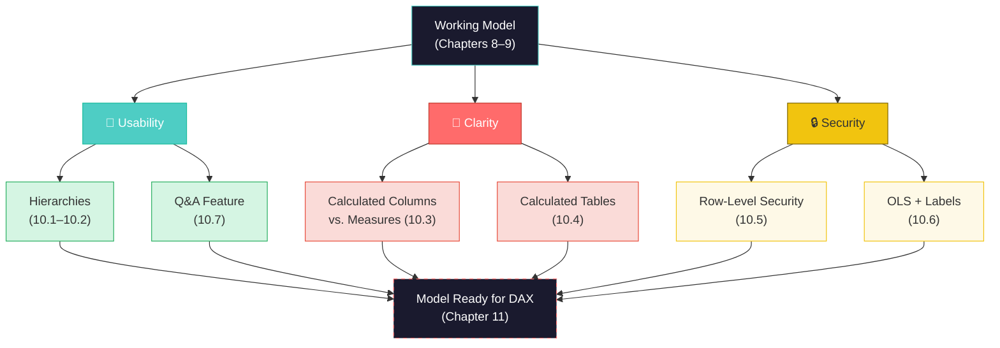
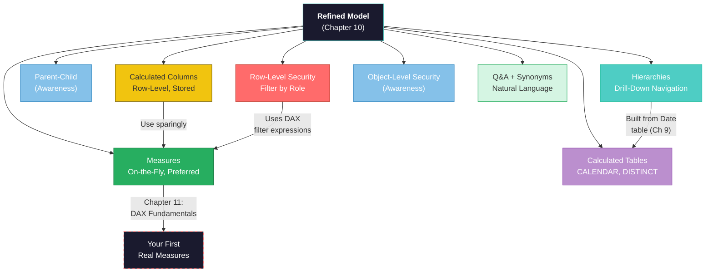

# Chapter 10: Refining the Model: Hierarchies, Calculated Tables, and Security

**Chapter 10 of 12 | Part III: Designing and Building a Data Model**

**Competencies:** C4.2, C4.6, C4.9, C5.2–C5.4 | **PL-300 Domain:** Model the Data — Implement the Model

<!-- NANO BANANA PRO | images/ch10/fig-10-0-refining-model-command-center.png
Subject: A translucent holographic star-schema data model floating in a futuristic control room, with five interconnected table nodes radiating from a central fact table node. One branch extends upward as a glowing hierarchy tree (Year → Quarter → Month labels visible). Two nodes on the right side have translucent amber security shield panels sliding into place around them.

Action/Scene: The hierarchy tree is unfolding upward with a smooth animation feel, the security panels are mid-slide (showing motion), and small floating tags label nodes with icons — a lock icon, a calculator icon, a calendar icon.

Environment: A dark, sleek command center with curved glass panels and ambient teal edge lighting. A panoramic window in the background shows a distant Miami skyline at twilight — recognizable by the Freedom Tower silhouette and Biscayne Bay reflections.

Lighting: Cool teal ambient light from below the holographic display, warm amber glow from the security panels, twilight purple-orange from the skyline window. High contrast between the glowing hologram and the dark room.

Style: Digital illustration, clean vector-influenced aesthetic with subtle gradients. Color palette: deep navy (#1A1A2E), teal (#4ECDC4), coral (#FF6B6B), amber (#F1C40F), soft purple (#BB8FCE). No photorealism — stylized and modern.

Constraints: No people in the image. No readable code or formulas. No Power BI screenshots or UI elements. Text limited to short labels only (Year, Q1, Q2, Month). No corporate logos.
-->

---

## Learning Objectives

By the end of this chapter, you will be able to:

1. Create and manage hierarchies that enable drill-down navigation in reports
2. Explain the difference between calculated columns and measures, and identify when to use each
3. Create calculated tables using DAX functions
4. Implement Row-Level Security (RLS) to restrict data access by role
5. Describe Object-Level Security and sensitivity labels at an awareness level
6. Configure the Q&A feature with synonyms for natural language queries

---

## 10.0 Why It Matters

*Section 10.0 of 10.7*

The Sabor Miami operations manager, Diana, is excited. After weeks of cleaning, combining, and modeling data, she finally has a working Power BI model — a star schema with proper relationships, a Date table, and verified cardinality across all five dimension tables. She hands the .pbix file to the four truck managers so they can check their own numbers.

Within an hour, three problems surface.

First, the manager of Truck T002 messages Diana: "I can see Truck T001's revenue. Why can I see someone else's numbers?" Second, a manager tries to filter a bar chart by month — but the months appear alphabetically (April, August, December...) and there is no way to drill from year to quarter to month. She has to manually filter each level. Third, a truck manager sees a column called "Amount" in the data and a card visual showing "Total Sales" and asks: "Which one is the real number? Are these the same thing?"

These are not data quality problems. The data is clean. These are not relationship problems. The star schema is correct. These are **usability, security, and clarity** problems — and they are what separate a model that *works* from a model that works *for people*.

This chapter solves all three.

---



**Figure 10.1: Chapter 10 Concept Overview** — A working model needs three categories of refinement before it is ready for DAX and reporting: usability features (hierarchies, Q&A), clarity features (understanding the difference between calculated columns and measures), and security features (RLS, OLS). This chapter covers all three.

---

## 10.1 Creating and Managing Hierarchies

*Section 10.1 of 10.7*

In this section, you will learn how to create hierarchies that let report users drill down through levels of detail — like clicking on a year to see its quarters, then clicking a quarter to see its months.

### The Concept: A Staircase, Not an Elevator

Think about navigating a multi-story building. An elevator takes you directly from the lobby to any floor — but you skip everything in between. A staircase lets you go floor by floor, seeing each level as you pass through it. **A hierarchy is a staircase for your data.** It organizes related fields into a sequence of levels, and users navigate from the broadest level (Year) down to the most detailed level (Day) one step at a time.

In Chapter 9, you created a Date table with columns for Year, Quarter, Month Name, and Day of Week. Right now, those columns sit in your Date table as independent, unrelated fields. If a user wants to see sales by year and then by month, they have to manually swap the fields in and out of their visual. A **hierarchy** (an ordered arrangement of columns from broadest to most detailed) bundles those columns into a single navigable structure: Year → Quarter → Month Name.

**Marcus Builds the Drill-Down**

Marcus is building a report for his supervisor at the Port of Miami showing container volume over time. His first attempt shows a bar chart with 365 bars — one for each day of 2024. His supervisor squints at the screen: "I do not need to see every day. Show me the year, then let me click into a quarter if something looks off, then drill into the month." Marcus realizes what he needs is not a different chart — it is a hierarchy that organizes Year → Quarter → Month → Day so users can navigate at the level of detail they want. He builds one for the Date dimension, and suddenly his supervisor can click "Q3" and see July, August, September unfold beneath it.

*Technical Connection:* A hierarchy in Power BI organizes related columns into levels that users can drill through. The most common hierarchy is Date-based (Year → Quarter → Month), but any dimension with natural levels works — like Location (Region → City → Neighborhood).

---

| Power BI Concept | SQL Equivalent | Bridge Sentence |
|-----------------|----------------|-----------------|
| Hierarchy drill-down | Nested GROUP BY queries at different levels | "In SQL, if your manager wanted year-level data then quarter-level, you would write two separate GROUP BY queries. A hierarchy lets users do that interactively, with a click." |

---

### Building the Date Hierarchy

Make sure you are in **Model View** (the view where you see table boxes with relationship lines connecting them — the same view you have been working in since Chapter 8). If you see a canvas with charts and visuals, you are in Report View — click the **Model View** icon on the left sidebar (it looks like three connected boxes).

<div style="background-color: #D5F5E3; border-left: 5px solid #27AE60; padding: 15px; margin: 15px 0; border-radius: 4px;">
  <strong style="color: #1E8449;">✅ DO THIS</strong><br>
  1. In <strong>Model View</strong>, find the <strong>Date</strong> table.<br>
  2. Right-click the <strong>Year</strong> column.<br>
  3. Select <strong>Create hierarchy</strong>.<br>
  4. Power BI creates a new hierarchy item called "Year Hierarchy" (or similar) at the bottom of the Date table's column list.<br>
  5. Right-click the hierarchy and select <strong>Rename</strong>. Type <strong>Date Hierarchy</strong>.<br>
  6. Now drag <strong>Quarter</strong> onto the Date Hierarchy item. It becomes Level 2.<br>
  7. Drag <strong>Month Name</strong> onto the Date Hierarchy item. It becomes Level 3.
</div>

<div style="background-color: #FADBD8; border-left: 5px solid #E74C3C; padding: 15px; margin: 15px 0; border-radius: 4px;">
  <strong style="color: #922B21;">🛑 STOP AND CHECK</strong><br>
  In the Date table, you should see <strong>Date Hierarchy</strong> with three levels listed beneath it: Year (Level 1), Quarter (Level 2), Month Name (Level 3). If the levels are in the wrong order, right-click a level and use <strong>Move Up</strong> or <strong>Move Down</strong> to reorder them.
</div>

Now let us verify this works in a visual.

<div style="background-color: #D5F5E3; border-left: 5px solid #27AE60; padding: 15px; margin: 15px 0; border-radius: 4px;">
  <strong style="color: #1E8449;">✅ DO THIS</strong><br>
  1. Switch to <strong>Report View</strong> (click the Report View icon on the left sidebar — it looks like a chart).<br>
  2. Click on an empty area of the canvas.<br>
  3. In the <strong>Visualizations</strong> pane, click the <strong>Clustered bar chart</strong> icon.<br>
  4. From the <strong>Data</strong> pane on the right, expand the <strong>Date</strong> table.<br>
  5. Drag <strong>Date Hierarchy</strong> to the <strong>Y-axis</strong> (or X-axis, depending on orientation) well.<br>
  6. From the <strong>Sales</strong> table, drag <strong>Amount</strong> to the <strong>X-axis</strong> (or Values) well.
</div>

Your chart initially shows one bar for the year 2024. Look at the top of the visual — you will see small icons with arrows. These are the **drill-down controls**.

<div style="background-color: #D5F5E3; border-left: 5px solid #27AE60; padding: 15px; margin: 15px 0; border-radius: 4px;">
  <strong style="color: #1E8449;">✅ DO THIS</strong><br>
  1. Click the <strong>double-arrow icon</strong> (Expand all down one level) at the top of the chart. The single "2024" bar should split into 4 bars — one for each quarter (Q1, Q2, Q3, Q4).<br>
  2. Click the double-arrow again. The 4 quarter bars should expand into 12 bars — one for each month.
</div>

<div style="background-color: #FADBD8; border-left: 5px solid #E74C3C; padding: 15px; margin: 15px 0; border-radius: 4px;">
  <strong style="color: #922B21;">🛑 STOP AND CHECK</strong><br>
  You should see 12 bars representing the months of 2024. If the months appear in alphabetical order (April, August, December...) instead of calendar order (January, February, March...), you need to set the <strong>Sort by Column</strong> property on your Month Name column. Go to <strong>Table View</strong>, click the <strong>Month Name</strong> column header, then in the <strong>Column tools</strong> tab, click <strong>Sort by Column</strong> and select <strong>Month Number</strong>. This tells Power BI to display Month Name alphabetically but sort it by the underlying Month Number. You set this up in Chapter 9 — if it is already working, you are good.
</div>

**Micro-checkpoint:** What would happen if you added Day of Week as a fourth level to the Date Hierarchy? Would it be useful? Think about whether Day of Week has a natural parent-child relationship with Month Name (hint: it does not — Monday appears in every month, so drilling from "March" to "Monday" would not make logical sense).

---

Now that you can build hierarchies that let users drill down through levels of data, let us look at a special type of hierarchy that requires a different approach — parent-child hierarchies.

---

## 10.2 Flattening Parent-Child Hierarchies

*Section 10.2 of 10.7*

In this section, you will learn what parent-child hierarchies are and why Power BI needs them flattened into separate columns before they can be used.

### The Concept: A Family Tree in a Spreadsheet

Some organizations store hierarchical data in a **parent-child** format — where each row has an ID and a reference to its parent's ID. Think of an organizational chart: each employee has a Manager_ID that points to another employee's row. This creates a tree structure, but it is stored in a flat table with only two columns (Employee_ID and Manager_ID).

**Parent-child hierarchies** (data structures where each record points to its parent record using an ID field, creating a tree that must be flattened into separate level columns before Power BI can use it) are common in:

- Organizational charts (employee → manager → director → VP)
- Chart of accounts in accounting (sub-account → account → category)
- Product categories (sub-category → category → department)

Power BI cannot natively navigate a parent-child column pair the way it navigates the Date Hierarchy you built in Section 10.1. Instead, you need to **flatten** (convert a parent-child structure into separate columns, one per level — like turning a family tree into Level 1, Level 2, Level 3 columns) the hierarchy using DAX functions like `PATH` and `PATHITEM`.

<div style="background-color: #D6EAF8; border-left: 5px solid #2E86C1; padding: 15px; margin: 15px 0; border-radius: 4px;">
  <strong style="color: #1A5276;">💡 WHY ARE WE DOING THIS?</strong><br>
  The Sabor Miami dataset does not include a parent-child hierarchy — our employee table has roles (Driver, Chef, Manager) but no manager-to-employee chain. This section is conceptual awareness for the PL-300 exam and for workplaces where you will encounter org charts or account structures stored this way. You will not build a parent-child hierarchy in this course, but you should recognize the pattern and know that PATH/PATHITEM are the DAX functions used to flatten it.
</div>

Here is what the flattening process looks like conceptually:

**Before (Parent-Child):**

| Employee_ID | Employee_Name | Manager_ID |
|-------------|---------------|------------|
| 1 | Diana | NULL |
| 2 | Carlos | 1 |
| 3 | Sofia | 2 |
| 4 | Marcus | 2 |

**After (Flattened):**

| Employee_ID | Employee_Name | Level 1 | Level 2 | Level 3 |
|-------------|---------------|---------|---------|---------|
| 1 | Diana | Diana | | |
| 2 | Carlos | Diana | Carlos | |
| 3 | Sofia | Diana | Carlos | Sofia |
| 4 | Marcus | Diana | Carlos | Marcus |

The `PATH` function creates a text string showing the full path from root to current node (like "1|2|3"), and `PATHITEM` extracts a specific level from that path. Once flattened, you can build a standard hierarchy from the Level columns — the same way you built the Date Hierarchy.

**Micro-checkpoint:** Look at the "Before" table above. If you wanted to find Sofia's manager, what would you do? (Answer: look at Sofia's Manager_ID, which is 2, then find Employee_ID 2 — that is Carlos.) Now imagine doing this across 5,000 employees with 8 levels of management. That is why flattening matters.

---

You now understand two types of hierarchies — the standard kind you built in 10.1 and the parent-child kind that requires flattening. The next section covers the most important conceptual distinction in this chapter: the difference between calculated columns and measures.

<div style="background-color: #E8DAEF; border-left: 5px solid #8E44AD; padding: 15px; margin: 15px 0; border-radius: 4px;">
  <strong style="color: #6C3483;">💜 TAKE A BREATH</strong><br>
  You have covered hierarchies — both the standard kind and the parent-child kind. That was a mix of hands-on building and conceptual awareness. The next section is the most important conceptual content in this chapter. It introduces the distinction between calculated columns and measures, which is the foundation for everything you will do with DAX in Chapters 11 and 12. Read through it once to get the general idea, then come back and follow the examples. There is no rush.
</div>

---

## 10.3 Calculated Columns vs. Measures: Choosing the Right Tool

*Section 10.3 of 10.7*

In this section, you will learn the critical difference between calculated columns and measures — two types of DAX calculations that look similar but behave very differently.

This is the section where most students need to read it twice. That is completely normal. The distinction between calculated columns and measures is one of the most important concepts in Power BI, and professional developers revisit it regularly. Give yourself permission to feel uncertain the first time through.

### The Concept: Built-In Shelving vs. a Measuring Tape

Imagine you are finishing a room in your house. You have two options for storage:

**Built-in shelving** is fixed — it is part of the wall, always there, always taking up space. You can see it whether or not anyone is in the room. It holds the same items all the time. This is a **calculated column** (a DAX formula that computes a value for every row in a table and stores that value permanently in the model — like adding a new column to an Excel spreadsheet). A calculated column produces a value in every row, and that value is stored in your model's memory. It is always there, whether or not anyone is looking at it.

**A measuring tape** does not take up shelf space. You pull it out when you need it, it gives you a measurement based on what you are measuring right now, and then it goes away. Different rooms give different measurements. This is a **measure** (a DAX formula that computes a value on the fly when it is used in a visual or query — it does not store any data and recalculates based on the current filter context). A measure produces a result only when something asks for it — a visual, a filter, a query. It calculates based on the current context and stores nothing.

---

| | Calculated Column | Measure |
|---|---|---|
| **When it calculates** | Once, when data is loaded or refreshed | Every time it is used in a visual |
| **Where the result lives** | Stored in every row of the table | Not stored — computed on the fly |
| **Memory usage** | Uses memory (one value per row) | Uses no storage memory |
| **Visible in Table View?** | Yes — appears as a column with values | No — only produces results in visuals |
| **Can be used as a filter/slicer?** | Yes | No (with rare exceptions) |
| **Can it respond to filter context?** | No — its values are fixed at refresh time | Yes — it recalculates based on active filters |
| **Button to create it** | **New Column** (Table tools tab) | **New Measure** (Home tab or Table tools tab) |

---

| Power BI Concept | SQL Equivalent | Bridge Sentence |
|-----------------|----------------|-----------------|
| Calculated column | A column added with ALTER TABLE + UPDATE | "A calculated column is like adding a permanent column to a table — it stores a value in every row, computed once." |
| Measure | A SELECT with aggregate function | "A measure is like a SQL aggregate — SUM, COUNT, AVERAGE — that calculates at the moment you ask, not stored in advance." |

---

### Seeing the Difference: A Side-by-Side Demo

Let us create one of each so you can see how they behave differently.

**First, a calculated column:**

<div style="background-color: #D5F5E3; border-left: 5px solid #27AE60; padding: 15px; margin: 15px 0; border-radius: 4px;">
  <strong style="color: #1E8449;">✅ DO THIS</strong><br>
  1. Switch to <strong>Table View</strong> (click the Table View icon on the left sidebar — it looks like a grid).<br>
  2. In the <strong>Data</strong> pane on the right, click the <strong>Sales</strong> table to select it.<br>
  3. Click the <strong>Table tools</strong> tab in the ribbon.<br>
  4. Click <strong>New column</strong>.<br>
  5. In the formula bar at the top of the screen, type:<br>
  <code>Revenue Category = IF(Sales[Amount] > 20, "High", "Standard")</code><br>
  6. Press <strong>Enter</strong>.
</div>

> **What we asked in plain English:** "For every sale, label it 'High' if the amount is over $20, or 'Standard' if it is $20 or less."
>
> **In DAX:**
> ```dax
> Revenue Category = IF(Sales[Amount] > 20, "High", "Standard")
> ```
>
> **What this does:** The IF function checks each row's Amount value. If it is greater than 20, it writes "High" in that row. Otherwise, it writes "Standard."

<div style="background-color: #FADBD8; border-left: 5px solid #E74C3C; padding: 15px; margin: 15px 0; border-radius: 4px;">
  <strong style="color: #922B21;">🛑 STOP AND CHECK</strong><br>
  In Table View, scroll to the right side of the Sales table. You should see a new column called <strong>Revenue Category</strong> with a value in every row — either "High" or "Standard." This column now exists permanently in your model and uses memory to store every value.
</div>

**Now, a measure:**

<div style="background-color: #D5F5E3; border-left: 5px solid #27AE60; padding: 15px; margin: 15px 0; border-radius: 4px;">
  <strong style="color: #1E8449;">✅ DO THIS</strong><br>
  1. Stay in <strong>Table View</strong> with the <strong>Sales</strong> table selected.<br>
  2. Click the <strong>Home</strong> tab in the ribbon.<br>
  3. Click <strong>New measure</strong>.<br>
  4. In the formula bar, type:<br>
  <code>Average Sale = AVERAGE(Sales[Amount])</code><br>
  5. Press <strong>Enter</strong>.
</div>

> **What we asked in plain English:** "What is the average sale amount?"
>
> **In DAX:**
> ```dax
> Average Sale = AVERAGE(Sales[Amount])
> ```
>
> **What this does:** The AVERAGE function calculates the mean of all values in the Amount column — but only when something asks for it.

<div style="background-color: #FADBD8; border-left: 5px solid #E74C3C; padding: 15px; margin: 15px 0; border-radius: 4px;">
  <strong style="color: #922B21;">🛑 STOP AND CHECK</strong><br>
  Look at the Sales table in Table View. Your <strong>Revenue Category</strong> calculated column is visible — every row has a value. But where is <strong>Average Sale</strong>? It should <strong>NOT</strong> appear as a column. If it does, you clicked <strong>New column</strong> instead of <strong>New measure</strong>. Delete it (right-click → Delete) and try again with the <strong>New measure</strong> button.
</div>

Now let us see the measure in action:

<div style="background-color: #D5F5E3; border-left: 5px solid #27AE60; padding: 15px; margin: 15px 0; border-radius: 4px;">
  <strong style="color: #1E8449;">✅ DO THIS</strong><br>
  1. Switch to <strong>Report View</strong>.<br>
  2. Click an empty area of the canvas.<br>
  3. In the Visualizations pane, click the <strong>Card</strong> visual icon.<br>
  4. From the Data pane, drag <strong>Average Sale</strong> (look for the calculator icon next to it — that icon means it is a measure) into the Card visual's <strong>Fields</strong> well.<br>
  5. You should see a single number — the average sale amount across all transactions.
</div>

The measure only produces a result when placed in a visual. And here is the key insight: if you add a slicer for Truck Name and select Truck T001, the Average Sale card will recalculate to show only T001's average. The measure *responds to filters*. The calculated column does not recalculate — "High" and "Standard" were assigned when the data loaded, and they stay the same regardless of what filters are active.

<div style="background-color: #FEF9E7; border-left: 5px solid #F1C40F; padding: 15px; margin: 15px 0; border-radius: 4px;">
  <strong style="color: #7D6608;">⚠️ COMMON MISTAKE</strong><br>
  The <strong>New Column</strong> and <strong>New Measure</strong> buttons are right next to each other on the ribbon. Every semester, students accidentally click New Column when they meant New Measure (or vice versa). The result looks the same in the formula bar — you type a DAX formula either way. The difference is invisible until you check Table View: a calculated column appears as a column with values in every row; a measure does not appear in Table View at all. If your measure is showing up as a column, delete it and recreate it with the correct button.
</div>

<div style="background-color: #D6EAF8; border-left: 5px solid #2E86C1; padding: 15px; margin: 15px 0; border-radius: 4px;">
  <strong style="color: #1A5276;">💡 WHY ARE WE DOING THIS?</strong><br>
  In Chapter 11, you will write your first real measures — Total Sales, Average Ticket, Transaction Count, and more. Understanding NOW that measures are different from calculated columns will save you confusion later. The rule of thumb: <strong>if you are aggregating data (SUM, AVERAGE, COUNT), use a measure. If you need a value in every row for filtering or categorization, use a calculated column.</strong> When in doubt, start with a measure — they are more flexible and use less memory.
</div>

**Micro-checkpoint:** If you wanted to create a "Tip Percentage" that divides total tips by total sales, would that be a calculated column or a measure? (Answer: a measure — because it aggregates data across rows and should respond to filters. If a user filters to Truck T001, the tip percentage should show T001's percentage, not the overall percentage.)

---

You now understand the most important distinction you will carry into Chapters 11 and 12: measures compute on the fly and respond to filters; calculated columns store fixed values in every row. Next, we will look at calculated tables — a related concept where DAX creates an entire new table.

---

## 10.4 Creating Calculated Tables

*Section 10.4 of 10.7*

In this section, you will learn what calculated tables are and when you might use them.

A **calculated table** (a table created entirely by a DAX expression, not imported from a data source) is a table that does not come from an external data source. Instead, it is generated by a DAX formula inside Power BI. You have already seen one example: the Date table you created in Chapter 9 using `CALENDARAUTO()`. That was a calculated table — Power BI generated every row based on the dates it found in your model.

### Common DAX Functions for Calculated Tables

| Function | What It Creates | Example Use |
|----------|----------------|-------------|
| `CALENDAR(start, end)` | A table with one row per date between two specific dates | `DateTable = CALENDAR(DATE(2024,1,1), DATE(2024,12,31))` — creates 366 rows for 2024 |
| `CALENDARAUTO()` | A table covering all dates found in the model | You used this in Chapter 9 |
| `DISTINCT(table[column])` | A table with unique values from a column | `UniqueCategories = DISTINCT(MenuItems[Category])` — creates a table of unique menu categories |
| `VALUES(table[column])` | Similar to DISTINCT but includes blank if present | Useful for testing or reference lookups |

<div style="background-color: #D6EAF8; border-left: 5px solid #2E86C1; padding: 15px; margin: 15px 0; border-radius: 4px;">
  <strong style="color: #1A5276;">💡 WHY ARE WE DOING THIS?</strong><br>
  Most of the time, your tables come from external sources — CSV files, Excel workbooks, databases. Calculated tables are useful when you need a table that does not exist in your source data but is needed for the model to work correctly. The Date table is the most common example. You will not create many calculated tables in this course, but knowing they exist helps you understand the full toolkit available in Power BI.
</div>

<div style="background-color: #D5F5E3; border-left: 5px solid #27AE60; padding: 15px; margin: 15px 0; border-radius: 4px;">
  <strong style="color: #1E8449;">✅ DO THIS (Optional Exploration)</strong><br>
  If you want to see how DISTINCT works:<br>
  1. In <strong>Report View</strong> or <strong>Table View</strong>, click the <strong>Table tools</strong> tab.<br>
  2. Click <strong>New table</strong>.<br>
  3. Type: <code>Unique Categories = DISTINCT('Menu Items'[Category])</code><br>
  4. Press Enter. A new table appears in your Data pane with one row per unique category.<br>
  5. This is for exploration only — you can delete this table afterward by right-clicking it in the Data pane and selecting <strong>Delete</strong>.
</div>

**Micro-checkpoint:** What is the difference between a calculated table and a calculated column? (Answer: a calculated table creates an entire new table from a DAX expression. A calculated column adds a single new column to an existing table. Both use DAX, but they operate at different levels.)

---

You now know that DAX can create entire tables, not only columns and measures. The next two sections shift from clarity to security — making sure the right people see the right data.

---

## 10.5 Implementing Row-Level Security (RLS)

*Section 10.5 of 10.7*

In this section, you will learn how to implement Row-Level Security so that different users see only the data they are authorized to access.

### The Concept: Locks on Specific Rooms

Think about it this way: everyone enters the same house (the same Power BI report), but some rooms have locks on the doors. The key you hold determines which rooms you can enter. **Row-Level Security (RLS)** (a Power BI feature that restricts data access so that different users see different subsets of the same data, based on filter rules defined in the model) works the same way — all users open the same report, but a DAX filter expression controls which rows each user can see.

**Abuela Carmen and the Locked Kitchen**

Abuela Carmen runs the kitchen supply ordering for all four Sabor Miami trucks from her home office. She is the only person who should see costs and supplier pricing across all trucks. But when Sofia — who manages Truck T001's front-of-house operations — opens the same report, she should only see T001's sales data. Not the financials for T002, T003, or T004.

Abuela Carmen frames it the way she runs her kitchen: "When I cook for a party, everyone eats the same food. But the recipe? That stays in my kitchen. Not everyone needs to see how the sausage is made — literally." Sofia rolls her eyes, but the point lands: security is not about distrust. It is about showing people what they need and nothing more.

*Technical Connection:* Row-Level Security in Power BI works like Abuela Carmen's kitchen — the underlying data is the same for everyone, but each user sees only the rows they are authorized to access. An RLS role defines the filter expression that controls who sees what.

---

| Power BI Concept | SQL Equivalent | Bridge Sentence |
|-----------------|----------------|-----------------|
| RLS | SQL views with WHERE clause per user | "RLS is like giving each user a different SQL view of the same table, filtered by a WHERE clause that shows only their rows." |

---

### Building an RLS Role for Truck T001

<div style="background-color: #D5F5E3; border-left: 5px solid #27AE60; padding: 15px; margin: 15px 0; border-radius: 4px;">
  <strong style="color: #1E8449;">✅ DO THIS</strong><br>
  1. Make sure you are in <strong>Report View</strong> (or any main Power BI Desktop view — RLS is managed from the ribbon, not from a specific view).<br>
  2. Click the <strong>Modeling</strong> tab in the ribbon.<br>
  3. Click <strong>Manage roles</strong>.<br>
  4. In the dialog that appears, click <strong>Create</strong> (or the <strong>+ New</strong> button, depending on your Power BI version).<br>
  5. Name the role: <strong>Truck T001 Manager</strong>.<br>
  6. In the table list, find the <strong>Trucks</strong> table and click it.<br>
  7. In the filter expression area, type:<br>
  <code>[Truck_ID] = "T001"</code><br>
  8. Click <strong>Save</strong> (or the checkmark).
</div>

> **What we asked in plain English:** "When someone with this role opens the report, only show them rows where the Truck ID is T001."
>
> **The DAX filter expression:**
> ```dax
> [Truck_ID] = "T001"
> ```
>
> **What this does:** It filters the Trucks table to only include the row where Truck_ID equals "T001." Because of the relationships in your star schema, this filter flows from the Trucks dimension table to the Sales fact table — so the user only sees sales from Truck T001.

<div style="background-color: #D6EAF8; border-left: 5px solid #2E86C1; padding: 15px; margin: 15px 0; border-radius: 4px;">
  <strong style="color: #1A5276;">💡 WHY ARE WE DOING THIS?</strong><br>
  Notice that the RLS filter is on the <strong>Trucks</strong> dimension table, not on the Sales fact table. Because of the one-to-many relationship between Trucks and Sales (one truck has many sales), the filter flows automatically from Trucks to Sales through the relationship line. This is the cross-filter direction at work — the same concept you learned in Chapter 8. You do not need to write a separate filter for Sales. The star schema does the work for you.
</div>

### Testing with View As Roles

You cannot assign RLS roles to actual users in Power BI Desktop — that happens in the Power BI Service (the web version) after you publish. But you can test locally using **View As Roles**.

<div style="background-color: #D5F5E3; border-left: 5px solid #27AE60; padding: 15px; margin: 15px 0; border-radius: 4px;">
  <strong style="color: #1E8449;">✅ DO THIS</strong><br>
  1. Click the <strong>Modeling</strong> tab in the ribbon.<br>
  2. Click <strong>View as</strong>.<br>
  3. In the dialog, check the box next to <strong>Truck T001 Manager</strong>.<br>
  4. Click <strong>OK</strong>.
</div>

<div style="background-color: #FADBD8; border-left: 5px solid #E74C3C; padding: 15px; margin: 15px 0; border-radius: 4px;">
  <strong style="color: #922B21;">🛑 STOP AND CHECK</strong><br>
  A yellow banner appears at the top of the report saying something like "Now viewing report as: Truck T001 Manager." All visuals on the report page should now show only Truck T001's data. If you have a Total Sales card, the number should be significantly smaller than the unfiltered total. If the number has not changed, check that your RLS filter expression is on the <strong>Trucks</strong> table (not the Sales table) and that the relationship between Trucks and Sales is active.
</div>

<div style="background-color: #D5F5E3; border-left: 5px solid #27AE60; padding: 15px; margin: 15px 0; border-radius: 4px;">
  <strong style="color: #1E8449;">✅ DO THIS</strong><br>
  When you are done testing, click <strong>Stop viewing</strong> in the yellow banner to return to the normal (unfiltered) view.
</div>

<div style="background-color: #FEF9E7; border-left: 5px solid #F1C40F; padding: 15px; margin: 15px 0; border-radius: 4px;">
  <strong style="color: #7D6608;">⚠️ COMMON MISTAKE</strong><br>
  Students sometimes put the RLS filter on the <strong>Sales</strong> table instead of the <strong>Trucks</strong> table — writing something like <code>[Truck_ID] = "T001"</code> on Sales. This can work, but it is not best practice. In a star schema, filters should be placed on <strong>dimension tables</strong>, not fact tables. The relationship carries the filter from the dimension to the fact table automatically. Placing the filter on the dimension also makes it easier to manage when you have multiple fact tables later in your career.
</div>

**Micro-checkpoint:** If you wanted to create an RLS role so that a manager at the Wynwood truck (T003) can only see T003's data, what would the filter expression look like, and which table would you put it on? (Answer: `[Truck_ID] = "T003"` on the Trucks table.)

---

<div style="background-color: #E8DAEF; border-left: 5px solid #8E44AD; padding: 15px; margin: 15px 0; border-radius: 4px;">
  <strong style="color: #6C3483;">💜 TAKE A BREATH</strong><br>
  You have covered the two most substantial topics in this chapter — calculated columns vs. measures and Row-Level Security. Both involve writing DAX expressions, which is new territory. If it feels like a lot, that is because it is. In Chapter 11, you will write many more DAX formulas, but you will have the foundation from this chapter: you already know what a measure is, what a calculated column is, and how DAX filter expressions work in RLS. The remaining sections are lighter — awareness-level concepts and a brief hands-on demo of the Q&A feature. You are almost done with this chapter.
</div>

---

Row-Level Security controls which rows users see. The next section covers two additional security layers — Object-Level Security and sensitivity labels — that control which tables and columns users can access.

---

## 10.6 Object-Level Security and Sensitivity Labels

*Section 10.6 of 10.7*

In this section, you will learn about two enterprise security features at an awareness level: Object-Level Security (OLS) and sensitivity labels.

### Object-Level Security (OLS)

Where RLS filters *rows* (which transactions a user can see), **Object-Level Security (OLS)** (a Power BI feature that hides entire tables or columns from specific users — they cannot see the object exists at all, not even its name) hides entire *objects* — tables or columns. A user with OLS restrictions does not see reduced data; they do not see the table or column at all. It is as if it does not exist in the model.

**When OLS matters:** Imagine the Sabor Miami model included an Employees table with salary information. You might want truck managers to see employee names and roles but not their salaries. OLS would hide the Salary column entirely from the truck manager role — they would not even know the column exists.

OLS is configured through external tools like **Tabular Editor** (a third-party application that connects to Power BI models) or **SQL Server Management Studio (SSMS)**. It is not available directly in Power BI Desktop's standard interface. For this course, you need to know what OLS does and when it is appropriate — you will not configure it hands-on.

### Sensitivity Labels

**Sensitivity labels** (Microsoft Purview Information Protection labels applied to Power BI content that classify data as Public, General, Confidential, or Highly Confidential and enforce protection policies like encryption or download restrictions) are part of Microsoft's broader data protection framework. They classify content as Public, General, Confidential, or Highly Confidential and can enforce policies like preventing downloads or requiring encryption.

Sensitivity labels are configured at the organizational level by IT administrators through Microsoft Purview. As a report developer, you may be asked to apply a label to your published report — but you will not set up the label system itself. For the PL-300 exam, know that sensitivity labels exist, they are applied in the Power BI Service, and they integrate with Microsoft's information protection framework.

**Micro-checkpoint:** What is the key difference between RLS and OLS? (Answer: RLS filters which *rows* a user can see within a table. OLS hides entire *tables or columns* — the user does not know they exist.)

---

The last section of this chapter covers a feature that makes your model friendlier for non-technical users — the Q&A natural language feature.

---

## 10.7 Setting Up the Q&A Feature for Natural Language Queries

*Section 10.7 of 10.7*

In this section, you will learn how to configure the Q&A feature so users can ask questions about the data in plain English.

### The Concept: A Smart Speaker for Your Data

Power BI includes a **Q&A** (a Power BI feature that lets users type natural language questions — like "total sales by truck" — and receive automatic visualizations based on the data model) feature that works like a smart speaker for your data model. Users type a question in plain English — like "total sales by truck" or "average tip in March" — and Power BI tries to generate a visual that answers it.

The quality of Q&A results depends entirely on how well your model is set up. Clear table names, clear column names, and **synonyms** (alternative words that Q&A should recognize as referring to a specific table or column — for example, "revenue" as a synonym for the Amount column) all help Q&A understand what users are asking.

<div style="background-color: #D5F5E3; border-left: 5px solid #27AE60; padding: 15px; margin: 15px 0; border-radius: 4px;">
  <strong style="color: #1E8449;">✅ DO THIS</strong><br>
  1. Switch to <strong>Report View</strong>.<br>
  2. In the <strong>Visualizations</strong> pane, click the <strong>Q&A</strong> visual icon (it looks like a text box with a question mark).<br>
  3. A Q&A visual appears on the canvas with a text box that says "Ask a question about your data."<br>
  4. Type: <strong>total sales by truck</strong><br>
  5. Power BI should generate a bar chart or table showing total sales for each truck.
</div>

<div style="background-color: #FADBD8; border-left: 5px solid #E74C3C; padding: 15px; margin: 15px 0; border-radius: 4px;">
  <strong style="color: #922B21;">🛑 STOP AND CHECK</strong><br>
  If Q&A produces a reasonable result (a chart or table with truck names and sales totals), your model's naming conventions are working well. If Q&A shows an error or a confusing result, it may not recognize the words you used. This is where synonyms help.
</div>

### Adding Synonyms

<div style="background-color: #D5F5E3; border-left: 5px solid #27AE60; padding: 15px; margin: 15px 0; border-radius: 4px;">
  <strong style="color: #1E8449;">✅ DO THIS</strong><br>
  1. In <strong>Model View</strong>, click the <strong>Sales</strong> table.<br>
  2. In the <strong>Properties</strong> pane on the right, look for the <strong>Synonyms</strong> field for the Amount column.<br>
  3. Type: <strong>revenue, sales amount, total</strong><br>
  4. Click the <strong>Menu Items</strong> table.<br>
  5. For the Item Name column, add synonyms: <strong>food, dish, menu item, product</strong><br>
  6. For the Category column, add synonyms: <strong>type, food type, kind</strong>
</div>

Now if a user types "show me revenue by food type," Q&A can match "revenue" to Amount and "food type" to Category — even though those are not the actual column names.

<div style="background-color: #D6EAF8; border-left: 5px solid #2E86C1; padding: 15px; margin: 15px 0; border-radius: 4px;">
  <strong style="color: #1A5276;">💡 WHY ARE WE DOING THIS?</strong><br>
  Q&A is most useful for non-technical stakeholders — people like Sabor Miami's operations manager who want to ask questions without learning to build visuals. Good synonyms bridge the gap between how business users talk ("revenue," "dishes," "food type") and how your model is structured (Amount, Item Name, Category). This is a small investment that makes your model significantly more accessible.
</div>

**Micro-checkpoint:** If you were setting up Q&A for a model with a column called "Employee_ID," what synonyms might you add? (Think about what a manager might type when looking for employee information — "staff," "worker," "team member," "employee number" are all reasonable synonyms.)

---

## Practice Exercise: Making the Sabor Miami Model Report-Ready

*Section 10.P*

<div style="background-color: #D5F5E3; border-left: 5px solid #27AE60; padding: 15px; margin: 15px 0; border-radius: 4px;">
<strong style="color: #1E8449;">🚀 LAUNCH PAD</strong><br><br>
<strong>What you are building:</strong> A report-ready model with drill-down hierarchies, a calculated column, a measure, and Row-Level Security.<br>
<strong>Tool:</strong> Power BI Desktop → Model View, Table View, and Report View<br>
<strong>File to open:</strong> Your Sabor Miami .pbix file from Chapter 9 (with the Date table and star schema already built)<br>
<strong>Data source:</strong> All 5 Sabor Miami tables + Date table<br>
<strong>Time estimate:</strong> 25–35 minutes<br>
<strong>Number of steps:</strong> 14<br>
<strong>What "done" looks like:</strong> A model with a Date Hierarchy, one calculated column, one measure, one working RLS role, and (optionally) Q&A synonyms configured<br>
<strong>Start here →</strong> Open your .pbix file and switch to Model View
</div>

---

### Phase 1 of 4: Setup

1. **Open** your Sabor Miami .pbix file from Chapter 9.
2. **Switch** to Model View. Confirm you can see all tables with relationship lines connecting them — the star schema from Chapters 8–9.

<div style="background-color: #FADBD8; border-left: 5px solid #E74C3C; padding: 15px; margin: 15px 0; border-radius: 4px;">
  <strong style="color: #922B21;">🛑 STOP AND CHECK</strong><br>
  You should see your Sales fact table in the center with Trucks, Employees, Menu Items, Events, and Date dimension tables connected to it. If you do not see the Date table, go back to Chapter 9 and create it first — this exercise requires it.
</div>

---

### Phase 2 of 4: Explore

3. **Click** the Date table in Model View. Review its columns — you should see Year, Quarter, Month Name, Month Number, and any other columns you created in Chapter 9.
4. **Switch** to Report View. If you have any existing visuals (like the verification table from Chapter 8), note the current unfiltered Total Sales number — you will compare this to the RLS-filtered number later.

<div style="background-color: #FADBD8; border-left: 5px solid #E74C3C; padding: 15px; margin: 15px 0; border-radius: 4px;">
  <strong style="color: #922B21;">🛑 STOP AND CHECK</strong><br>
  Write down (or mentally note) your unfiltered Total Sales number. You will need this to verify that RLS is working in Phase 4.
</div>

---

### Phase 3 of 4: Build

5. **Create the Date Hierarchy.** In Model View, right-click the Year column in the Date table → Create hierarchy → Rename to "Date Hierarchy" → Drag Quarter and Month Name onto the hierarchy (Year = Level 1, Quarter = Level 2, Month Name = Level 3).

6. **Test the hierarchy.** Switch to Report View. Create a Clustered bar chart with Date Hierarchy on the axis and SUM(Amount) as the value. Use the drill-down arrows to expand from Year → Quarter → Month.

<div style="background-color: #FADBD8; border-left: 5px solid #E74C3C; padding: 15px; margin: 15px 0; border-radius: 4px;">
  <strong style="color: #922B21;">🛑 STOP AND CHECK</strong><br>
  After drilling down twice, you should see 12 monthly bars. If the months are in alphabetical order instead of calendar order, set Sort by Column on Month Name to Month Number (Table View → click Month Name column → Column tools tab → Sort by Column → Month Number).
</div>

7. **Create the Revenue Category calculated column.** In Table View, select the Sales table → Table tools tab → New column → Type: `Revenue Category = IF(Sales[Amount] > 20, "High", "Standard")` → Press Enter.

8. **Verify the calculated column.** Scroll right in the Sales table to see the Revenue Category column — every row should show "High" or "Standard."

9. **Create the Average Sale measure.** With the Sales table still selected → Home tab → New measure → Type: `Average Sale = AVERAGE(Sales[Amount])` → Press Enter.

10. **Verify the measure.** Confirm that Average Sale does NOT appear as a column in Table View. Switch to Report View and place it in a Card visual to see the result.

<div style="background-color: #FADBD8; border-left: 5px solid #E74C3C; padding: 15px; margin: 15px 0; border-radius: 4px;">
  <strong style="color: #922B21;">🛑 STOP AND CHECK</strong><br>
  You should have: (1) A Date Hierarchy with 3 levels visible in Model View, (2) A Revenue Category column with values in every Sales row, (3) An Average Sale measure showing a number in a Card visual but NOT appearing as a column in Table View. If all three are correct, proceed to RLS.
</div>

11. **Create the RLS role.** Modeling tab → Manage roles → Create a new role → Name it "Truck T001 Manager" → Select the Trucks table → Type the filter expression: `[Truck_ID] = "T001"` → Save.

12. **Test the RLS role.** Modeling tab → View as → Check "Truck T001 Manager" → OK.

---

### Phase 4 of 4: Verify

13. **Verify RLS is working.** With the Truck T001 Manager role active (yellow banner visible), check your Total Sales card or the Average Sale card. The number should be different from (smaller than) the unfiltered number you noted in Step 4.

<div style="background-color: #FADBD8; border-left: 5px solid #E74C3C; padding: 15px; margin: 15px 0; border-radius: 4px;">
  <strong style="color: #922B21;">🛑 STOP AND CHECK</strong><br>
  Compare your current Total Sales with the unfiltered number from Step 4. If the number is the same, your RLS filter is not working. Check: (1) Is the filter on the <strong>Trucks</strong> table, not Sales? (2) Does the filter expression use the correct column name and value — <code>[Truck_ID] = "T001"</code>? (3) Is the relationship between Trucks and Sales active?
</div>

14. **Exit RLS testing.** Click "Stop viewing" in the yellow banner. Your report returns to the unfiltered view. **Save** your file.

---

**What Success Looks Like:** Your model now has a Date Hierarchy that enables drill-down from Year to Quarter to Month, a Revenue Category calculated column in the Sales table, an Average Sale measure that responds to filters, and an RLS role that restricts data to Truck T001 when active. The star schema from Chapters 8–9 is now refined and report-ready.

---

## Checkpoint Quiz

**5 scenario-based questions covering Chapter 10 only.**

**Question 1:** A user creates a bar chart showing sales by month, but the months appear in this order: April, August, December, February, January, July, June, March, May, November, October, September. What is the most likely cause?

A) The Date table is missing a Month Name column
B) The Month Name column is not sorted by Month Number using Sort by Column
C) The hierarchy levels are in the wrong order
D) The relationship between Date and Sales is inactive

**Correct answer: B.** When month names display alphabetically instead of chronologically, it means the Month Name column is sorting by its own text values instead of by the underlying Month Number. Fix this by selecting the Month Name column in Table View, then using Column tools → Sort by Column → Month Number. The hierarchy levels (A is wrong because the column exists, C) affect drill-down order but not individual-level sorting, and an inactive relationship (D) would prevent data from appearing at all, not sort it incorrectly.

---

**Question 2:** A student writes a DAX formula using the New Column button: `Total Sales = SUM(Sales[Amount])`. In Table View, every row in the Sales table shows the same large number. What went wrong?

A) The SUM function does not work in Power BI
B) The formula should be created as a measure, not a calculated column
C) The Sales table has a data type error in the Amount column
D) The student needs to add a CALCULATE wrapper around SUM

**Correct answer: B.** When you use an aggregate function like SUM in a calculated column, it evaluates the aggregate for the entire table and writes that same result in every row — because a calculated column has no filter context (it does not know which "row" to scope the SUM to). Creating it as a measure instead (using New Measure) allows it to calculate in the context of a visual, where filters determine which rows are included. SUM works correctly in Power BI (A is wrong), a data type error (C) would produce an error message not a repeated number, and CALCULATE (D) changes filter context but does not fix the fundamental column-vs-measure issue.

---

**Question 3:** You create an RLS role that filters `[Truck_ID] = "T001"` on the **Sales** table. When you test with View As, the Total Sales number does not change. What is the most likely problem?

A) The filter expression has a syntax error
B) RLS filters should be placed on dimension tables, not the fact table, for the star schema filter to flow correctly
C) You need to publish to the Power BI Service before RLS works
D) The Truck_ID column does not exist in the Sales table

**Correct answer: B.** In a star schema, RLS filters are most effective on dimension tables because the cross-filter direction carries the filter to the fact table through the relationship. Placing the filter on the Sales table directly can fail if the filter does not propagate correctly — especially if cross-filter direction is set to "Single" from dimension to fact. While placing RLS on Sales *can* work in some configurations, the best practice (and the one taught in this chapter) is to filter on the Trucks dimension table. A syntax error (A) would produce an error message. You can test RLS locally with View As (C is incorrect). The column exists (D would also produce an error).

---

**Question 4:** What is the key difference between a calculated column and a measure?

A) Calculated columns use DAX; measures use M code
B) Calculated columns store a value in every row; measures compute on the fly when used in a visual
C) Calculated columns are faster than measures
D) Measures cannot be used in card visuals

**Correct answer: B.** Calculated columns compute a value once (at data load/refresh) and store it in every row of the table — visible in Table View. Measures compute only when requested by a visual or query, store nothing, and respond to the current filter context. Both use DAX (A is wrong). Measures are generally more efficient, not slower (C is wrong). Measures are frequently used in card visuals (D is wrong) — that is one of the most common ways to display them.

---

**Question 5:** You want to allow a Q&A user to type "show me revenue by food type" and get results. Which of the following would make this work?

A) Create a new table called Revenue and a new table called Food Type
B) Add "revenue" as a synonym for the Amount column and "food type" as a synonym for the Category column
C) Rename the Amount column to Revenue and the Category column to Food Type
D) Both B and C would work

**Correct answer: D.** Both approaches would allow Q&A to match the user's words to the correct columns. Adding synonyms (B) preserves the original column names while teaching Q&A alternative words. Renaming the columns (C) changes the actual names, which also works but affects all reports and visuals. Creating new tables (A) would not make sense — these are not new data sources, they are alternative names for existing columns. In practice, synonyms are preferred because they do not require changing the underlying model structure.

---

**Confidence check:** How confident do you feel about the concepts in this chapter?

- 🟢 **Very confident** — I can build hierarchies, explain calculated columns vs. measures, implement RLS, and configure Q&A.
- 🟡 **Somewhat confident** — I understand the main ideas but need to review calculated columns vs. measures or RLS filter placement.
- 🔴 **Need to review** — Several concepts are unclear. I should re-read Sections 10.3 and 10.5 before moving to DAX in Chapter 11.

---

## Reflection Prompt

Think about a report you have used — at work, at school, or in daily life. Was there anything you could not see that you wished you could? Was there anything you *could* see that maybe you should not have been able to? How would Row-Level Security or hierarchies have changed that experience?

---

## Chapter 10 Glossary

| Term | Definition |
|------|------------|
| **Hierarchy** | An ordered arrangement of columns from broadest to most detailed (e.g., Year → Quarter → Month) that enables drill-down navigation in visuals. Created in Model View. |
| **Parent-child hierarchy** | A data structure where each record points to its parent record using an ID field, creating a tree (like an org chart). Must be flattened into level columns before Power BI can use it. |
| **Flatten** | The process of converting a parent-child hierarchy into separate Level columns using DAX functions like PATH and PATHITEM. |
| **Calculated column** | A DAX formula that computes a value for every row in a table and stores that value permanently in the model. Created with the New Column button. Visible in Table View. Uses memory. |
| **Calculated table** | A table created entirely by a DAX expression (like CALENDARAUTO or DISTINCT), not imported from an external data source. |
| **Measure** | A DAX formula that computes a value on the fly when used in a visual or query. Created with the New Measure button. Not stored — recalculates based on the current filter context. Not visible as a column in Table View. Preferred over calculated columns for aggregations. |
| **Row-Level Security (RLS)** | A Power BI feature that restricts data access by defining DAX filter expressions per role. Different users see different subsets of the same data based on their assigned role. |
| **Object-Level Security (OLS)** | A Power BI feature that hides entire tables or columns from specific users. Configured through external tools like Tabular Editor, not in Power BI Desktop directly. |
| **Sensitivity label** | A Microsoft Purview classification (Public, General, Confidential, Highly Confidential) applied to Power BI content to enforce data protection policies like encryption or download restrictions. |
| **Q&A** | A Power BI feature that allows users to type natural language questions about the data and receive automatic visualizations as answers. |
| **Synonym** | An alternative word added to a column or table that helps the Q&A feature understand natural language queries. For example, "revenue" as a synonym for the Amount column. |

---

## Bridge to Chapter 11

Your model is complete — structured with a star schema, secured with Row-Level Security, enhanced with hierarchies, and ready for the people who will use it. But right now, the only calculations in your model are the ones Power BI creates automatically when you drag a number field into a visual. You created one measure in this chapter (Average Sale) and one calculated column (Revenue Category), but those were for learning — the real calculation work starts next.

In Chapter 11, you take control. You will write your own **measures** using **DAX** — the calculation language of Power BI. Total Sales, Total Tips, Average Ticket, Tip Percentage, Transaction Count, and more. The distinction you learned in this chapter between calculated columns and measures? That is about to become very practical. Every calculation you write in Chapter 11 will be a measure — and you will understand exactly why.

> **Teaser question:** You know that `Average Sale = AVERAGE(Sales[Amount])` calculates the average of all sales. But what if you wanted the average for only Truck T001 — without using RLS? That is where `CALCULATE` comes in, and it is the most important DAX function you will learn.

---



**Figure 10.5: Chapter 10 Concept Map** — The refined model includes usability features (hierarchies, Q&A), clarity features (understanding when to use calculated columns vs. measures), and security features (RLS, OLS). Measures are the preferred calculation tool and connect directly to Chapter 11, where you will write your first real DAX measures.

---

> *End of Chapter 10: Refining the Model: Hierarchies, Calculated Tables, and Security*
