# Chapter 8: Data Modeling Fundamentals

**Chapter 8 of 12 | Part III: Designing and Building a Data Model**
**Competency:** C4.1, C4.5, C5.1 | **PL-300 Domain:** Model the Data — Design Model
**Sabor Miami Data:** All 5 tables — build the star schema from cleaned and combined tables
**Estimated Reading Time:** 15–20 minutes

---

---

## ⚠️ VIEW TRANSITION — Welcome Back to the Main Window

**For the last four chapters, you worked inside the Power Query Editor** — that separate window with the green ribbon. Starting now, you are back in the **main Power BI Desktop window**. If you still have the Power Query Editor open, click **Close & Apply** on the Home tab to return.

This chapter takes place primarily in **Model View** — a view you may have glimpsed but never used. Here is where it fits:

### 🧭 View Compass — Chapter 8

| View | What You See | What You Do Here | Used In This Chapter? |
|------|-------------|-------------------|-----------------------|
| **Report View** | Canvas with visuals (charts, tables, cards) | Build reports, verify DAX measures visually | Yes — for verification at the end |
| **Table View** | Data rows in a spreadsheet-like grid | Inspect data values, check calculated columns | Yes — to inspect column properties |
| **Model View** | Table boxes with lines showing relationships | Create and manage relationships between tables | **Yes — primary workspace** |
| **DAX Query View** | Code editor for testing DAX | Test and debug DAX measures | No |
| **Power Query Editor** | SEPARATE WINDOW with green ribbon | Clean, transform, and load data | No — you are done here for now |

> **WHERE AM I?** You should be in the **main Power BI Desktop window**. You can tell because the ribbon at the top is **dark blue or gray** (not green). If you see a green ribbon, you are still in the Power Query Editor — click **Close & Apply** to leave it.

---

## Part 1: Why It Matters

*Section 8.1 of 8.5*

You have spent four chapters preparing your data. You profiled it, hunting for problems across all five Sabor Miami tables. You cleaned it — fixing nulls, correcting typos, standardizing formats. You transformed it — splitting columns, creating calculations, grouping rows. You combined it — merging and appending queries so that related data lives in the right place. And you loaded it into the model by clicking Close & Apply.

That work matters. But right now, Power BI sees five separate tables sitting next to each other with no connections between them. It does not know that `Truck_ID` in the Sales table refers to the same trucks listed in the Trucks table. It does not know that `Menu_Item_ID` in a transaction points to a specific empanada or croqueta in the Menu Items table. Without these connections, Power BI cannot answer even basic questions that span more than one table.

Imagine Abuela Carmen asking Sofia: "Which truck sold the most empanadas at the Wynwood Art Walk?" To answer that, you need Sales data connected to Trucks (which truck?), connected to Menu Items (which item is an empanada?), connected to Events (which event was the Art Walk?). Four tables, one question. Without a **data model** (the structure that defines how your tables connect to each other), that question has no answer.

In a real data analyst job, this is where the work shifts from preparation to architecture. You stop asking "Is my data clean?" and start asking "How do my tables relate to each other?" That shift happens in this chapter.

**In this chapter, you will:**

- Understand what a data model is and why Power BI needs one
- Navigate Model View for the first time
- Configure table and column properties
- Create relationships between the Sabor Miami tables
- Learn how cross-filter direction controls the flow of information
- Verify that your model works using a visual test

---

## Part 2: Concept Breakdown

Before opening Power BI, let us build a mental model of what we are about to do. No screenshots in this section — we are thinking first, clicking later.

### What Is a Data Model?

*Section 8.1 of 8.5*

A **data model** is the structure that tells Power BI how your tables connect to each other, which columns carry meaning, and how information should flow when someone asks a question across multiple tables.

Think of it this way. You have spent four chapters gathering building materials — inspecting lumber for defects, cutting boards to the right size, sanding rough edges, and delivering everything to the construction site. But a pile of materials on a lot is not a building. Without an **architect's blueprint** that specifies which walls connect to which rooms, which beams carry weight, and how people move through the structure, you have raw materials and nothing else.

A data model is that blueprint. Each table is a room. The connections between tables are doorways. The properties you configure are the specifications — this room needs plumbing (this column is Currency), that hallway goes one direction (this filter flows from dimension to fact). Without the blueprint, Power BI has rooms full of furniture but no way to walk between them.

**Cross-Tool Bridge:** In your database course, you drew **ER diagrams** (Entity-Relationship diagrams) showing how tables connect with primary keys and foreign keys. A data model in Power BI is the same concept. The difference is that in your database course, you designed the schema on paper and then built it in MySQL. In Power BI, you build it visually — by dragging lines between tables in Model View. Same idea, different tool.

Here is where you are in the overall pipeline — you have completed everything on the left side, and this chapter begins the work on the right:

```mermaid
graph LR
    subgraph PQ ["Part II — Done ✅"]
        Profile["Profile<br/>Ch 4"] --> Clean["Clean<br/>Ch 5"]
        Clean --> Transform["Transform<br/>Ch 6"]
        Transform --> Combine["Combine<br/>Ch 7"]
    end

    Combine -- "Close & Apply" --> Model

    subgraph MV ["Part III — You Are Here 📍"]
        Model["Configure<br/>Tables"] --> Relate["Create<br/>Relationships"]
        Relate --> Verify["Verify with<br/>Visual"]
    end

    style Profile fill:#D5F5E3,stroke:#27AE60,color:#000
    style Clean fill:#D5F5E3,stroke:#27AE60,color:#000
    style Transform fill:#D5F5E3,stroke:#27AE60,color:#000
    style Combine fill:#D5F5E3,stroke:#27AE60,color:#000
    style Model fill:#D6EAF8,stroke:#2E86C1,color:#000
    style Relate fill:#D6EAF8,stroke:#2E86C1,color:#000
    style Verify fill:#D6EAF8,stroke:#2E86C1,color:#000
```

**Figure 8.1: From Power Query to Model View** — The green steps (completed in Chapters 4–7) prepared your data inside the Power Query Editor. Clicking Close & Apply brought the data into the main Power BI window. The blue steps (this chapter) happen in Model View and Report View.

> **Micro-checkpoint:** Before we move on, can you name the five Sabor Miami tables from memory? Which one do you think has the most rows? (Hint: it is the table that records every individual transaction.)

---

Now that we understand what a data model is, let us look at the individual pieces you will configure: tables, columns, and the relationships that connect them.

### Tables, Columns, and Properties

*Section 8.2 of 8.5*

When you open **Model View** (the view that shows your tables as boxes with lines between them), every table you loaded from Power Query appears as a rectangular box. Inside each box, you see the column names.

Each table has **properties** you can configure — like labeling rooms on a blueprint. You can set the table's display name, add a description, and decide which columns are visible to report builders.

Each column also has properties:

- **Data type** determines what kind of values the column holds — Text, Whole Number, Decimal Number, Currency, Date, True/False. You already set most data types in Power Query, but you can adjust them here too.

- **Data category** tells Power BI what the data represents beyond its type. A column of city names is Text, but marking it as the **City** data category lets Power BI automatically use it in map visuals. Other categories include Country/Region, State/Province, Web URL, and Image URL.

- **Default summarization** controls what happens when you drag a numeric column into a visual. By default, Power BI assumes you want to SUM numeric columns. For columns like `Truck_ID` or `Employee_ID`, summing makes no sense — those are identifiers, not quantities. You change their default summarization to **Don't Summarize**.

- **Hidden columns** let you keep a column in the model (where it is needed for relationships) but hide it from the Fields pane so report builders do not accidentally use it in visuals. Think of it as the utility closet in a building — it is there, it serves a purpose, but guests do not need to see it.

**Cross-Tool Bridge (Excel):** In Excel, you format columns as Currency or Date. Power BI does the same thing — but adds the ability to categorize columns for geographic mapping and to hide columns from the report-building experience entirely.

> **Micro-checkpoint:** If you saw a column called `Employee_ID` with a default summarization of "Sum," what would you change it to, and why?

---

### Relationships: How Tables Talk to Each Other

*Section 8.3 of 8.5*

This is the core concept of the chapter. A **relationship** is a connection between two tables based on a shared column — a column that appears in both tables and represents the same thing.

In the Sabor Miami dataset, the Sales table has a column called `Truck_ID`. The Trucks table also has a column called `Truck_ID`. When you create a relationship between these two tables on that shared column, you are telling Power BI: "Every value in Sales[Truck_ID] points to a matching value in Trucks[Truck_ID]. Use this connection to look up truck names, locations, and statuses for each sale."

**Cross-Tool Bridge (SQL):** In your database course, you wrote `FOREIGN KEY (Truck_ID) REFERENCES Trucks(Truck_ID)` to create this exact connection. In Power BI, you drag a line between the two columns in Model View. Same concept, visual interface.

Relationships have a property called **cardinality** (how many items on each side of the connection):

- **One-to-many (1:M)** — The most common type. One truck can appear in many sales transactions. One menu item can appear in many sales. One employee can ring up many sales. The "one" side is the lookup table (Trucks, Menu Items, Employees). The "many" side is the transaction table (Sales). This is the relationship type you will use for almost every connection in this course.

- **Many-to-many (M:M)** — Both sides can have duplicate values. This is less common and can cause unexpected results. We will not use it in Sabor Miami, but you should know it exists.

- **One-to-one (1:1)** — Each value on one side matches exactly one value on the other side. This is rare. It usually means the two tables could have been one table.

Think of cardinality like doorways in the blueprint. A hallway that connects one lobby to many offices is one-to-many. A doorway where each side leads to exactly one room is one-to-one. A convention center with many entrances leading to many rooms is many-to-many — and it is harder to manage because you need to be careful about how people (or data) flow through it.

> **Micro-checkpoint:** In the Sabor Miami dataset, which table do you think is on the "many" side of every relationship? Why?

---

  <strong style="color: #6C3483;">💜 TAKE A BREATH</strong> 
  You have covered three big concepts without touching Power BI yet: what a data model is, how table and column properties work, and how relationships connect tables using shared keys. These are the mental models that make everything else in this chapter click into place. Take a moment — stretch, grab some water, look away from your screen for 30 seconds. When you come back, we open Power BI and start building.

---

### Cross-Filter Direction: Controlling the Flow

*Section 8.4 of 8.5*

This next concept is where most students need to read it twice. That is completely normal. Read through it once to get the general idea, then revisit it after the walkthrough when you can see it in action.

When you create a relationship, Power BI assigns a **cross-filter direction** — the direction in which filters flow between the two connected tables.

- **Single direction** (the default and recommended setting) means that filters flow in one direction only: FROM the "one" side (the lookup table) TO the "many" side (the transaction table). When you select "Fuego Cubano" from a truck name slicer, that filter travels from the Trucks table through the relationship to the Sales table, showing only sales for that truck. The filter does NOT travel backward — selecting a specific sale does not filter the Trucks table.

- **Both** (bidirectional) means filters flow in both directions. This is like a two-way hallway — traffic goes both ways. It sounds more flexible, but it can cause unexpected results and performance issues. Use it rarely and only when you have a specific reason.

Think of it as one-way versus two-way streets. Miami's one-way streets downtown exist for a reason — they keep traffic flowing predictably. Two-way streets work in residential neighborhoods, but on a busy grid, they create confusion. Single-direction cross-filtering keeps your data flowing predictably. Bidirectional filtering can work in specific cases, but default to single.

**Cross-Tool Bridge (SQL):** In SQL, your JOIN determined which table's conditions filtered the results. Cross-filter direction does the same thing in Power BI — it controls which table's selections affect the other.

> **Micro-checkpoint:** If you set the cross-filter direction between Trucks and Sales to "Single," and a user filters by Truck_Name, which table gets filtered — Trucks, Sales, or both?

---

Now that we have the mental models in place, let us open Power BI and build the Sabor Miami data model step by step.

---

## Part 3: Hands-On Walkthrough

**WHERE AM I?** Make sure you are in the **main Power BI Desktop window** (dark blue or gray ribbon at the top). You should have all five Sabor Miami tables loaded from your Chapter 7 work. If you are starting fresh, open the Sabor Miami .pbix file that contains all five cleaned and loaded tables.

### Demo 1: Orienting in Model View

*Section 8.5 of 8.5 — Hands-On Walkthrough*

In this section, you will navigate to Model View for the first time and identify the five Sabor Miami tables.

**Step 1: Switch to Model View**

1. **See It:** Look at the left sidebar of the Power BI Desktop window. You will see a vertical stack of small icons.
2. **Name It:** The third icon from the top is the **Model View** button. It looks like three small connected boxes (a mini schema diagram).
3. **Find It:** Left sidebar → third icon from top (below Report View and Table View icons).
4. **Do It:** Click the **Model View** icon.

[IMAGE: Figure 8.2 — The left sidebar of Power BI Desktop with the Model View icon highlighted. The icon shows three small connected boxes.]

  <strong style="color: #1A5276;">💡 WHY ARE WE DOING THIS?</strong> 
  Model View is where you see every loaded table as a box and create relationships between them. Think of it as the architect's drafting table — this is where you design the blueprint for your data.

**Step 2: Identify your tables**

You should see five rectangular boxes on the canvas, each representing one of your Sabor Miami tables: **Sales**, **MenuItems** (or Menu Items), **Trucks**, **Employees**, and **Events**.

Each box lists the column names inside it. You can drag the boxes around the canvas to arrange them however you want. Power BI may have automatically arranged them, or they might be overlapping — either is normal.

  <strong style="color: #922B21;">🛑 STOP AND CHECK</strong> 
  Count the table boxes on your canvas. You should see <strong>five tables</strong>. If you see fewer, one or more tables may have <strong>Enable Load</strong> turned off in Power Query. To fix this: click <strong>Transform Data</strong> on the Home tab → in the Power Query Editor, right-click the missing table in the Queries pane → make sure <strong>Enable Load</strong> is checked → click <strong>Close & Apply</strong>.

**Step 3: Check for auto-detected relationships**

Power BI sometimes guesses relationships based on matching column names. Look for lines already connecting your table boxes.

1. **See It:** Look for thin gray lines between any table boxes.
2. **Name It:** These are **auto-detected relationships**.
3. **Find It:** The lines connect from a column in one table to a column in another table.
4. **Do It:** If you see any lines, right-click on a line and select **Delete** to remove it. We will build all relationships from scratch so you understand exactly what each connection does.

  <strong style="color: #7D6608;">⚠️ COMMON MISTAKE</strong> 
  Auto-detected relationships are not always correct. Power BI guesses based on column names, but it can match the wrong columns or create relationships you do not want. For learning purposes, delete all auto-detected relationships and build them yourself. In future projects, you can check auto-detected relationships before trusting them.

**Step 4: Arrange your tables**

1. **Do It:** Drag the **Sales** table box to the center of the canvas.
2. **Do It:** Drag the other four tables around the Sales table — **Trucks** to the upper left, **MenuItems** to the upper right, **Employees** to the lower left, **Events** to the lower right.

This arrangement puts the table with the most rows (Sales) in the center, surrounded by the lookup tables. It is not required, but it makes the star-shaped pattern of your model visible — something we will name formally in Chapter 9.

[IMAGE: Figure 8.3 — Model View showing five Sabor Miami tables arranged with Sales in the center and the four dimension tables around it. No relationship lines yet.]

> **Transition:** You can see all five tables in Model View. Now let us configure their properties before connecting them.

---

### Demo 2: Configuring Table and Column Properties

In this section, you will configure data types, data categories, default summarization, and hidden columns.

**Step 1: Open table properties for the Trucks table**

1. **See It:** Look at the **Properties pane** on the right side of the screen. If you do not see it, click on the Trucks table box — the Properties pane should appear on the right.
2. **Name It:** This is the **Properties pane** — it shows the settings for whatever table or column you have selected.
3. **Find It:** Right side of the screen, visible when a table or column is selected in Model View.
4. **Do It:** Click on the **Trucks** table box to select it. The Properties pane should now show the table's name and description fields.

**Step 2: Set default summarization for ID columns**

ID columns like `Truck_ID` are identifiers, not quantities. By default, Power BI may try to SUM them in visuals, which produces meaningless numbers.

1. **Do It:** Click on the column name **Truck_ID** inside the Trucks table box.
2. **See It:** The Properties pane now shows column-level properties, including a **Summarize by** dropdown.
3. **Find It:** Properties pane (right side) → look for the field labeled **Summarize by** (sometimes labeled "Default summarization").
4. **Do It:** Select **Don't Summarize** from the dropdown.

  <strong style="color: #1A5276;">💡 WHY ARE WE DOING THIS?</strong> 
  If someone drags Truck_ID into a visual, Power BI defaults to summing it: T001 + T002 + T003 + T004 = meaningless number. Setting it to "Don't Summarize" prevents this. ID columns identify records — they are not meant to be added together.

**Step 3: Hide ID columns from Report View**

Report builders should see `Truck_Name`, not `Truck_ID`. But `Truck_ID` is still needed for the relationship. Hiding it keeps the Fields pane clean without breaking the model.

1. **Do It:** Right-click on the **Truck_ID** column name inside the Trucks table box.
2. **See It:** A context menu appears with several options.
3. **Find It:** Look for **Hide in report view** in the context menu.
4. **Do It:** Click **Hide in report view**.

The column now appears with a small eye icon with a line through it, indicating it is hidden from report builders but still active in the model.

**Step 4: Repeat for other ID columns**

1. **Do It:** Click on the **Employees** table box.
2. **Do It:** Click on **Employee_ID** → set **Summarize by** to **Don't Summarize** → right-click → **Hide in report view**.
3. **Do It:** Click on the **MenuItems** table box.
4. **Do It:** Click on **Menu_Item_ID** → set **Summarize by** to **Don't Summarize** → right-click → **Hide in report view**.
5. **Do It:** Repeat for **Event_ID** in the Events table.

  <strong style="color: #922B21;">🛑 STOP AND CHECK</strong> 
  Look at all four dimension tables (Trucks, MenuItems, Employees, Events). Each should have its ID column showing the <strong>hidden eye icon</strong> (eye with a line through it). If you do not see the icon, right-click the column name and check that "Hide in report view" is toggled on.

  <strong style="color: #7D6608;">⚠️ COMMON MISTAKE</strong> 
  Hiding a column does NOT delete it. The column is still in the model and still works in relationships. Hiding only removes it from the Fields pane that report builders see. If you need it back, right-click the column and uncheck "Hide in report view."

**Step 5: Set data categories (optional but useful)**

If your Trucks table has a column like `Home_Location` that contains city or neighborhood names, you can set its data category to help Power BI use it in map visuals.

1. **Do It:** Click on the **Home_Location** column in the Trucks table.
2. **Find It:** In the Properties pane, look for **Data category** (it may say "Uncategorized" by default).
3. **Do It:** Select **City** from the dropdown (or **Place** if City is not available, depending on the actual data values).

> **Note:** Data categories are optional at this stage. If your `Home_Location` column contains neighborhood names like "Hialeah" or "Wynwood" rather than formal city names, you may want to leave it uncategorized for now. We will revisit this in Chapter 10.

> **Transition:** Your tables are configured — IDs are hidden, summarization defaults are corrected, and data categories are assigned where appropriate. Now comes the most important part of this chapter: creating the relationships that connect your tables together.

---

### Story 1: "Marcus and the Shipping Manifest"

Marcus is at the Port of Miami reviewing a shipment discrepancy. A container arrived with 200 items, but when he cross-references the manifest with the warehouse inventory system, every item shows the same total weight — as if the system cannot distinguish between containers. His supervisor explains: "The manifest table and the inventory table are not linked. The system treats every row the same because it does not know that Container A is different from Container B."

Marcus remembers this exact problem from his database course — missing foreign keys. "So we need to connect the tables," he says. His supervisor nods. "Same idea, different software."

---

*Technical Connection:* When tables lack relationships, Power BI cannot differentiate or filter across them. Creating a relationship tells Power BI that a value in one table (like Truck_ID in Sales) refers to a matching value in another table (Truck_ID in Trucks). Without that connection, every truck looks the same — there is no way to split results by truck, by menu item, or by employee.

---

### Demo 3: Creating Relationships

In this section, you will create the relationships that connect the Sabor Miami tables.

**Step 1: Create the Sales-to-Trucks relationship**

1. **See It:** In Model View, locate the **Sales** table box (center) and the **Trucks** table box.
2. **Find It:** Find the **Truck_ID** column inside the Sales table box. Also find the **Truck_ID** column inside the Trucks table box.
3. **Do It:** Click on **Truck_ID** in the Sales table and drag it to **Truck_ID** in the Trucks table. Release the mouse button.

A dialog box appears: the **Create Relationship** dialog.

[IMAGE: Figure 8.4 — The Create Relationship dialog showing Sales[Truck_ID] connected to Trucks[Truck_ID], with cardinality set to Many to one (*:1) and Cross filter direction set to Single.]

4. **See It:** The dialog shows the two tables, the matched columns, the **Cardinality** (which should say **Many to one (*:1)**), and the **Cross filter direction** (which should say **Single**).
5. **Do It:** Confirm the settings are correct and click **OK**.

A line now appears between the Sales table and the Trucks table in Model View. This line represents your first relationship.

  <strong style="color: #1A5276;">💡 WHY ARE WE DOING THIS?</strong> 
  This relationship tells Power BI: "Every Truck_ID in the Sales table points to exactly one truck in the Trucks table. One truck can have many sales (one-to-many). When someone filters by truck name, show only that truck's sales." This is exactly the same logic as a <code>FOREIGN KEY</code> constraint in your database course — same concept, visual interface.

  <strong style="color: #922B21;">🛑 STOP AND CHECK</strong> 
  You should see a line between Sales and Trucks in Model View. If you double-click the line, the Edit Relationship dialog opens showing <strong>Truck_ID</strong> on both sides, cardinality <strong>Many to one (*:1)</strong>, and cross filter direction <strong>Single</strong>. If your cardinality says something else, the relationship may be connecting the wrong columns.

**Step 2: Create the Sales-to-MenuItems relationship**

1. **Do It:** Click on **Menu_Item_ID** in the Sales table and drag it to **Menu_Item_ID** in the MenuItems table.
2. **Do It:** In the Create Relationship dialog, confirm **Many to one (*:1)** and **Single** cross filter direction.
3. **Do It:** Click **OK**.

**Step 3: Create the Sales-to-Employees relationship**

1. **Do It:** Click on **Employee_ID** in the Sales table and drag it to **Employee_ID** in the Employees table.
2. **Do It:** Confirm **Many to one (*:1)** and **Single**.
3. **Do It:** Click **OK**.

**Step 4: Evaluate the Events table relationship**

Look at the Sales table and the Events table. Does the Sales table have an `Event_ID` column? If yes, drag `Event_ID` from Sales to `Event_ID` in Events and create the relationship the same way.

If the Sales table does not have a direct Event_ID column, that is okay — not every table has a direct connection to every other table. We will explore how to handle this in Chapter 9 when we refine the model and discuss granularity. For now, connect the tables that share matching key columns.

  <strong style="color: #922B21;">🛑 STOP AND CHECK</strong> 
  Your Model View should now show <strong>at least 3 relationship lines</strong> connecting Sales to Trucks, MenuItems, and Employees. If the Events table also connects, you should see 4 lines. The Sales table should be in the center with lines radiating outward to the dimension tables — like a star. This visual pattern has a name, which you will learn in Chapter 9.

[IMAGE: Figure 8.5 — Model View showing the Sabor Miami star schema with Sales in the center connected to Trucks, MenuItems, and Employees via relationship lines. Each line shows the Many to one cardinality indicator.]

> **Transition:** You have created the relationships. But how do you know they actually work? The line on the screen looks correct, but you need to test it. In the next section, we verify the model with a visual — and you will see your first preview of what DAX measures can do.

---

### Cross-Filter Direction in Practice

Before we verify, let us take a moment to understand the cross-filter direction you set on each relationship. You accepted the default of **Single** for every relationship. Here is what that means in practice:

When a user selects "Fuego Cubano" in a slicer (a filter visual) built from the Trucks table, that selection filters the Sales table — showing only sales from that truck. The filter flows FROM Trucks TO Sales (single direction: from the "one" side to the "many" side).

The filter does NOT flow backward. Selecting a specific sale does not filter the Trucks table. This one-directional flow keeps your model predictable.

Think of Miami's one-way streets downtown. They exist because two-way traffic on a narrow grid creates chaos. Single-direction cross-filtering works the same way — it keeps data flowing predictably through your model. You can change it to **Both** (bidirectional) for specific use cases in advanced scenarios, but the default of Single is correct for the Sabor Miami model and for most models you will build.

```mermaid
graph TD
    subgraph S1 ["Single Direction — Default"]
        T1["Trucks (1)"] -- "Filter flows ↓" --> S1a["Sales (Many)"]
    end
    subgraph S2 ["Both Directions — Use Rarely"]
        T2["Trucks (1)"] <-- "Filters flow ↕" --> S2a["Sales (Many)"]
    end

    style T1 fill:#D6EAF8,stroke:#2E86C1,color:#000
    style S1a fill:#D5F5E3,stroke:#27AE60,color:#000
    style T2 fill:#FEF9E7,stroke:#F1C40F,color:#000
    style S2a fill:#FEF9E7,stroke:#F1C40F,color:#000
```

**Figure 8.6: Cross-Filter Direction** — Single direction (top) keeps filters flowing predictably from the lookup table to the transaction table. Both direction (bottom) allows filters to flow in either direction, which can cause unexpected results if not carefully managed.

---

  <strong style="color: #6C3483;">💜 TAKE A BREATH</strong> 
  You have configured table properties, created relationships, and learned about cross-filter direction. That is a lot of new territory in one chapter. The next section is the payoff — you verify that your model works, and you get a preview of what your data can do when everything is connected. Stretch, take a breath, and come back ready to see results.

---

### DAX Seed: Verifying Your Model with a Visual

This section is a preview — a brief look at what becomes possible once your data model is in place. You are not learning DAX yet (that comes in Chapter 11). You are testing your relationships.

### Story 2: "Sofia's Verification Moment"

Sofia builds her first relationship in Model View — dragging a line between Sales and Trucks on Truck_ID. She is not sure it worked. Prof. Reyes walks over and says, "Do not trust the line. Test it."

He shows her how to drop Truck_Name and a SUM of Amount into a table visual. The numbers differ by truck. "If every truck showed the same total," he says, "your relationship would be broken. Different numbers mean the model is working — Power BI knows which sales belong to which truck."

Sofia exhales. She built something, and it works.

---

*Technical Connection:* A visual test is the fastest way to verify a relationship. If a dimension attribute (Truck_Name) correctly splits a fact measure (SUM of Amount), the relationship is functioning. If every row shows the same total, the relationship is missing or misconfigured.

---

**Step 1: Switch to Report View**

1. **Find It:** Left sidebar → first icon from top (the bar chart icon).
2. **Do It:** Click the **Report View** icon.

**Step 2: Add a Table visual**

1. **Find It:** In the **Visualizations pane** (right side of the screen), find the icon that looks like a small grid or table.
2. **Do It:** Click the **Table** visual icon. An empty table visual appears on the canvas.

**Step 3: Add fields to the visual**

1. **Find It:** In the **Data pane** (previously called the Fields pane, far right side), expand the **Trucks** table.
2. **Do It:** Check the box next to **Truck_Name** (or drag it to the Columns well of the visual).
3. **Find It:** Expand the **Sales** table.
4. **Do It:** Check the box next to **Amount**. Power BI automatically sums the Amount column for each truck.

[IMAGE: Figure 8.7 — A Table visual in Report View showing Truck_Name in the first column and Sum of Amount in the second column, with four rows showing different totals for each truck.]

  <strong style="color: #922B21;">🛑 STOP AND CHECK</strong> 
  Your table visual should show <strong>4 rows</strong> — one for each Sabor Miami truck — with <strong>different sales amounts</strong> for each truck.  
  <strong>If you see 4 rows with different amounts:</strong> Your Sales-to-Trucks relationship is working correctly. 🎉  
  <strong>If you see 1 row with the grand total:</strong> The relationship between Sales and Trucks is missing. Go back to Model View and verify you created a relationship between Sales[Truck_ID] and Trucks[Truck_ID].  
  <strong>If you see 4 rows with the SAME amount in every row:</strong> The relationship may be configured incorrectly. Double-click the relationship line in Model View and check that the correct columns are matched.

**Step 4: Test a second relationship**

1. **Do It:** Click an empty area on the canvas to deselect the first visual.
2. **Do It:** Click the **Table** visual icon again to create a second table visual.
3. **Do It:** From the **MenuItems** table, check **Item_Name**.
4. **Do It:** From the **Sales** table, check **Transaction_ID** — Power BI will count it.

This second visual should show each menu item with a count of how many times it appeared in sales transactions. Different counts per item confirm that the Sales-to-MenuItems relationship is working.

> **What you are seeing here is a preview.** In Chapter 11, you will learn to write your own calculations (called DAX measures) like `Total Sales = SUM(Sales[Amount])`. For now, Power BI is using an **implicit measure** — it automatically sums or counts based on the data type. The important thing is not the calculation — it is that **your model is connecting the tables correctly**.

> **Transition:** You have verified that your data model works. The relationships you created allow Power BI to answer questions that span multiple tables — which truck sold the most, which item sold the most, and eventually, much more complex questions. In Part 4, you will build this model from scratch as a practice exercise.

---

## Concept Map: How Chapter 8's Ideas Connect

**Figure 8.8: Chapter 8 Concept Map** — A data model consists of tables (with configurable properties), relationships (with cardinality and cross-filter direction), and verification through visual testing. The green paths represent the most common and recommended configurations.

---

## The Sabor Miami Star Schema

Here is the model you have been building, shown as a diagram. This pattern — one central table surrounded by connected lookup tables — has a formal name you will learn in Chapter 9. For now, notice the shape: it looks like a star.

```mermaid
graph TD
    Sales["Sales<br/>(Transactions)<br/>─────────<br/>Transaction_ID<br/>Date<br/>Truck_ID<br/>Employee_ID<br/>Menu_Item_ID<br/>Amount<br/>Tip"]

    Trucks["Trucks<br/>─────────<br/>Truck_ID<br/>Truck_Name<br/>Home_Location<br/>Status"]

    MenuItems["Menu Items<br/>─────────<br/>Menu_Item_ID<br/>Item_Name<br/>Category<br/>Price"]

    Employees["Employees<br/>─────────<br/>Employee_ID<br/>First_Name<br/>Last_Name<br/>Role<br/>Truck_ID"]

    Events["Events<br/>─────────<br/>Event_ID<br/>Event_Name<br/>Event_Type<br/>Event_Date"]

    Sales -- "Many:1 on Truck_ID" --> Trucks
    Sales -- "Many:1 on Menu_Item_ID" --> MenuItems
    Sales -- "Many:1 on Employee_ID" --> Employees
    Sales -. "Connection TBD<br/>(Chapter 9)" .-> Events

    style Sales fill:#FADBD8,stroke:#E74C3C,color:#000
    style Trucks fill:#D6EAF8,stroke:#2E86C1,color:#000
    style MenuItems fill:#D5F5E3,stroke:#27AE60,color:#000
    style Employees fill:#FEF9E7,stroke:#F1C40F,color:#000
    style Events fill:#E8DAEF,stroke:#8E44AD,color:#000
```

**Figure 8.9: The Sabor Miami Data Model** — Sales sits at the center, connected to Trucks, Menu Items, and Employees through one-to-many relationships. The Events table connection depends on whether the Sales table has a direct Event_ID column — we will address this in Chapter 9.

---

## Part 4: Practice Exercise

  <strong style="color: #1A5276;">🚀 LAUNCH PAD</strong>  
  <strong>What you are building:</strong> The complete Sabor Miami data model — all table properties configured and all relationships created. 
  <strong>Tool:</strong> Power BI Desktop → Model View (primary), Report View (verification) 
  <strong>File to open:</strong> SaborMiami_Cleaned.pbix (your file from Chapter 7 with all 5 tables loaded) 
  <strong>Data source:</strong> All 5 Sabor Miami tables 
  <strong>Time estimate:</strong> 25–35 minutes 
  <strong>Number of steps:</strong> 16 steps across 4 phases 
  <strong>What "done" looks like:</strong> A star-shaped model in Model View with all relationships created, and two table visuals in Report View confirming the relationships work. 
  <strong>Start here →</strong> Open your SaborMiami_Cleaned.pbix file and switch to Model View.

---

### Phase 1 of 4: Setup

**Step 1:** Open your **SaborMiami_Cleaned.pbix** file in Power BI Desktop. If you are starting from scratch, open the file that has all 5 Sabor Miami tables loaded and cleaned from Chapter 7.

**Step 2:** Click the **Model View** icon in the left sidebar (third icon from top — three connected boxes).

**Step 3:** Delete any auto-detected relationship lines by right-clicking each line and selecting **Delete**. You are building from scratch.

  <strong style="color: #922B21;">🛑 STOP AND CHECK</strong> 
  You should see <strong>5 table boxes</strong> with <strong>no lines between them</strong>. The tables should be: Sales, MenuItems (or Menu Items), Trucks, Employees, and Events. If any table is missing, return to Power Query (Home tab → Transform Data) and verify Enable Load is checked for all tables.

---

### Phase 2 of 4: Explore

**Step 1:** Drag the **Sales** table to the center of the canvas. Drag the other four tables to surround it — Trucks (upper left), MenuItems (upper right), Employees (lower left), Events (lower right).

**Step 2:** Click on each table box and examine its columns in the Properties pane. For each table, identify:
- Which column is the **primary key** (the column with unique values that identifies each row)
- Which columns in the Sales table match key columns in the other tables

**Step 3:** Write down the key column pairs:
- Sales[Truck_ID] ↔ Trucks[Truck_ID]
- Sales[Menu_Item_ID] ↔ MenuItems[Menu_Item_ID]
- Sales[Employee_ID] ↔ Employees[Employee_ID]
- Sales[Event_ID] ↔ Events[Event_ID] (if applicable)

  <strong style="color: #922B21;">🛑 STOP AND CHECK</strong> 
  You should have identified <strong>at least 3 key column pairs</strong> (possibly 4 if Sales has an Event_ID). These are the connections you will create in Phase 3. The Sales table should have more rows than any other table — it records individual transactions, while the other tables are lookup references.

---

### Phase 3 of 4: Build

**Step 1: Configure column properties**

For each dimension table (Trucks, MenuItems, Employees, Events):
- Click the **ID column** (e.g., Truck_ID)
- In the Properties pane, set **Summarize by** to **Don't Summarize**
- Right-click the ID column → select **Hide in report view**

**Step 2: Create the Sales-to-Trucks relationship**

Drag **Truck_ID** from the Sales table to **Truck_ID** in the Trucks table. In the Create Relationship dialog, confirm **Many to one (*:1)** cardinality and **Single** cross-filter direction. Click **OK**.

**Step 3: Create the Sales-to-MenuItems relationship**

Drag **Menu_Item_ID** from Sales to **Menu_Item_ID** in MenuItems. Confirm **Many to one (*:1)** and **Single**. Click **OK**.

**Step 4: Create the Sales-to-Employees relationship**

Drag **Employee_ID** from Sales to **Employee_ID** in Employees. Confirm **Many to one (*:1)** and **Single**. Click **OK**.

**Step 5: Create the Sales-to-Events relationship (if applicable)**

If your Sales table has an **Event_ID** column, drag it to **Event_ID** in the Events table. Confirm settings and click **OK**. If there is no Event_ID in Sales, skip this step — we will address this connection in Chapter 9.

  <strong style="color: #922B21;">🛑 STOP AND CHECK</strong> 
  Your Model View should now show <strong>relationship lines</strong> radiating from the Sales table to each connected dimension table. The pattern should resemble a star — Sales in the center, lookup tables around it. Each line should show a <strong>1</strong> on the dimension side and an <strong>asterisk (*)</strong> on the Sales side, indicating Many-to-one cardinality.

---

### Phase 4 of 4: Verify

**Step 1: Switch to Report View**

Click the **Report View** icon (left sidebar, first icon — bar chart).

**Step 2: Create a table visual to test the Trucks relationship**

Click the **Table** visual in the Visualizations pane. Check **Truck_Name** (from the Trucks table) and **Amount** (from the Sales table).

  <strong style="color: #922B21;">🛑 STOP AND CHECK</strong> 
  Your table should show <strong>4 rows</strong> (one per truck) with <strong>different sales amounts</strong>. If every row shows the same total, your Sales-to-Trucks relationship is missing or misconfigured — return to Model View and check it.

**Step 3: Create a second table visual to test the MenuItems relationship**

Click an empty area on the canvas. Click the **Table** visual icon again. Check **Item_Name** (from MenuItems) and **Amount** (from Sales).

This visual should show each menu item with a different total sales amount. Different totals confirm the relationship is working.

**Step 4: Save your file**

Press **Ctrl + S** to save. You have completed the Sabor Miami data model.

---

### What Success Looks Like

[IMAGE: Figure 8.10 — Two-panel screenshot. Left panel: Model View showing the star schema with Sales at the center connected to all dimension tables. Right panel: Report View showing a Table visual with Truck_Name and different Sum of Amount values for each truck.]

Your finished work should include:
- **Model View:** Five tables in a star arrangement, with at least 3 relationship lines (Sales to Trucks, MenuItems, and Employees). Each relationship shows Many-to-one cardinality and Single cross-filter direction.
- **Report View:** Two table visuals. The first shows Truck_Name with different sales totals per truck. The second shows Item_Name with different sales totals per menu item.

---

## Part 5: Checkpoint Quiz

**Directions:** Select the best answer for each question. Check your answers using the explanations provided.

---

**Question 1.** What is a data model in Power BI?

A) A type of visual that displays data in a chart
B) The structure that defines how tables connect to each other and how information flows between them
C) A programming language for writing calculations
D) The Power Query Editor's step-tracking system

**Answer: B** — A data model defines the connections (relationships) between tables and controls how data flows when users interact with reports. It is not a visual, a language, or part of Power Query.

---

**Question 2.** You drag a column from the Sales table to a column in the Trucks table in Model View, and the Create Relationship dialog shows "Many to one (*:1)" for cardinality. What does this mean?

A) Each sale connects to many trucks at the same time
B) Each truck can only appear in one sale
C) Many sales can connect to one truck — one truck can have many sales transactions
D) The tables have the same number of rows

**Answer: C** — Many-to-one means the Sales table (the "many" side) has multiple rows that reference the same value in the Trucks table (the "one" side). One truck appears in many sales.

---

**Question 3.** After creating a relationship between Sales and Trucks, you build a Table visual with Truck_Name and Sum of Amount. Every truck shows the SAME total. What is the most likely cause?

A) The data types are wrong
B) The cross-filter direction is set to Both
C) The relationship is missing or connected to the wrong columns
D) The Sales table has too many rows

**Answer: C** — If every group shows the same total, Power BI is not filtering Sales by Truck. This typically means the relationship was not created, was deleted, or connects the wrong columns. Double-click the relationship line in Model View to verify.

---

**Question 4.** You set the default summarization for Employee_ID to "Don't Summarize." Why?

A) Employee_ID is a text column and cannot be summed
B) Employee_ID is an identifier — summing IDs produces a meaningless number
C) Power BI does not allow summarization of any ID column
D) Don't Summarize makes the column load faster

**Answer: B** — ID columns identify records. Summing T001 + T002 + T003 produces a number that means nothing. "Don't Summarize" prevents Power BI from automatically summing the column when it is added to a visual.

---

**Question 5.** What is the difference between hiding a column in Report View and deleting it?

A) There is no difference — both remove the column
B) Hiding removes the column from the Fields pane but keeps it in the model for relationships; deleting removes it entirely
C) Hiding removes the column from Model View; deleting removes it from Report View
D) Hiding is temporary; deleting is permanent

**Answer: B** — Hidden columns are still in the model and still work in relationships and calculations. They are hidden from the Fields pane so report builders do not accidentally use them. Deleting a column removes it from the model entirely and breaks any relationships that depend on it.

---

**Question 6.** Cross-filter direction is set to "Single" on a relationship between Trucks and Sales. A user selects "Fuego Cubano" in a Truck_Name slicer. What happens?

A) Only Sales rows for Fuego Cubano are shown; the Trucks table is also filtered
B) Only Sales rows for Fuego Cubano are shown; the Trucks table is NOT filtered by Sales
C) Nothing happens — Single direction means no filtering occurs
D) Both tables are filtered because all relationships filter in both directions

**Answer: B** — Single direction means the filter flows FROM the Trucks table TO the Sales table. Selecting a truck name filters Sales to show only that truck's transactions. The filter does not flow backward to affect the Trucks table.

---

**Question 7.** In the Sabor Miami model, the Sales table sits at the center with Trucks, MenuItems, Employees, and Events connected to it. Which table has the most rows?

A) Trucks (it has the most columns)
B) Sales (it records every individual transaction)
C) Events (there are many events throughout the year)
D) MenuItems (there are many items on the menu)

**Answer: B** — The Sales table records every individual transaction — one row per sale. The other tables are lookup tables with far fewer rows (4 trucks, a few dozen menu items, a handful of employees, and a limited number of events). The table with individual transactions always has the most rows.

---

**Confidence Check:** How confident do you feel about building a data model and creating relationships?

- 🟢 **Very confident** — I could explain this to someone else
- 🟡 **Somewhat confident** — I understand the concepts but might need to revisit the steps
- 🔴 **Need to review** — I should re-read the Concept Breakdown and try the walkthrough again

---

## Part 6: Reflection Prompt

Think about your database course. You drew ER diagrams on paper before building them in MySQL — mapping out tables, primary keys, foreign keys, and relationships before writing a single line of SQL. How did that planning step help you? Now that you have built a data model in Power BI by dragging lines between tables, what feels similar to that experience, and what feels different? If you were starting this model over from scratch, would you change anything about how you approached it?

---

## Chapter 8 Glossary

| Term | Definition |
|------|-----------|
| **Data model** | The structure in Power BI that defines how tables relate to each other and how information flows between them when users ask questions in reports. |
| **Model View** | The view in Power BI Desktop that shows every loaded table as a box and lets you create and manage relationships between tables. Accessed from the left sidebar (third icon). |
| **Relationship** | A connection between two tables based on a shared column (key). Tells Power BI that values in one table correspond to values in another table. |
| **Cardinality** | The "how many on each side" property of a relationship. Describes whether the connection is one-to-many, many-to-many, or one-to-one. |
| **One-to-many (1:M)** | The most common relationship type. One value on the lookup side matches many values on the transaction side (e.g., one truck has many sales). |
| **Many-to-many (M:M)** | A relationship where both sides can have duplicate values in the key column. Less common and requires careful handling. |
| **One-to-one (1:1)** | A relationship where each value appears exactly once on both sides. Rare — often means the two tables could be merged. |
| **Cross-filter direction** | The direction in which filters flow through a relationship. Single (recommended) means filters flow from the "one" side to the "many" side only. Both means filters flow in both directions. |
| **Single (cross-filter)** | The default and recommended cross-filter direction. Filters flow from the lookup table to the transaction table, but not backward. |
| **Both (cross-filter)** | Bidirectional cross-filtering. Filters flow in both directions. Use rarely — can cause unexpected results and performance issues. |
| **Data category** | A column property that tells Power BI what the data represents beyond its data type (e.g., City, Country/Region, Web URL). Enables geographic mapping and other automatic behaviors. |
| **Default summarization** | The calculation Power BI applies when you add a column to a visual. Numeric columns default to Sum. Change ID columns to "Don't Summarize." |
| **Hide in report view** | A column property that removes the column from the Fields pane (so report builders cannot see it) while keeping it active in the model for relationships and calculations. |
| **Implicit measure** | When Power BI automatically aggregates a column (sums, counts, etc.) without you writing a DAX formula. Explicit measures (Chapter 11) give you full control over the calculation. |

---

## Bridge to Chapter 9

You have built a working data model — tables connected by relationships, properties configured, and verification visuals confirming it all works. But is it the **right** model?

In Chapter 9, we give formal names to what you built. The Sales table is a **fact table**. The Trucks, Menu Items, Employees, and Events tables are **dimension tables**. The star-shaped pattern is a **star schema**. You will learn to evaluate whether your model has the right structure and the right level of detail (**granularity**). And you will build the one table that is still missing from your model: the **Date table** — which unlocks time-based calculations like "sales this month vs. last month."

> **Teaser question:** Your Sales table has one row per transaction. What if it had one row per day instead (total daily sales per truck)? What questions could you still answer — and what questions would you lose the ability to answer?

---

> *End of Chapter 8: Data Modeling Fundamentals*
