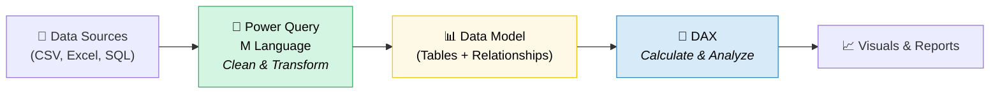
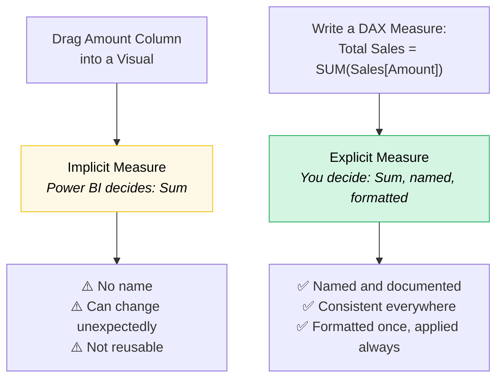
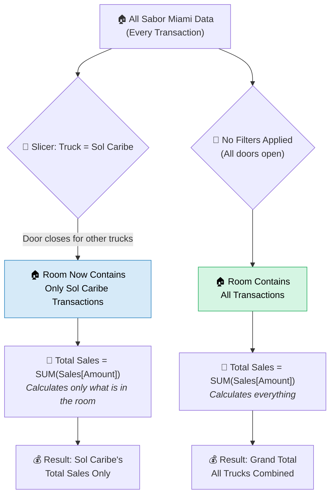
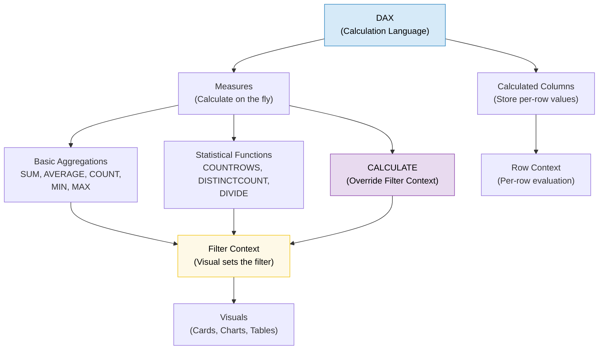

# Chapter 11: DAX Fundamentals: Measures, Functions, and Filter Context

**Chapter 11 of 12 | Part IV: DAX and Model Optimization**

<!-- [CHAPTER OPENING IMAGE] images/ch11/fig-11-0-dax-kitchen-measures.png
Nano Banana Pro Prompt:
Subject: Futuristic food truck kitchen interior with holographic floating numbers and formula annotations
Action: Chef plating a dish on one side while raw ingredients are being prepped on the other, holographic DAX-like formulas floating between both stations
Environment: Inside a modern food truck with Miami skyline visible through the serving window, stainless steel surfaces reflecting holographic light
Lighting: Split lighting — warm amber on the prep side transitioning to cool cyan-teal holographic glow on the calculation side
Style: Digital illustration, clean futuristic aesthetic, vibrant Miami color palette (coral, turquoise, warm gold), high detail
Constraints: No text or readable words in the image, no Power BI screenshots, no identifiable real brand logos
-->

---

> **Where you are in the course:** You have connected to data (Part I), profiled, cleaned, transformed, and combined it (Part II), and built a complete data model with relationships, a star schema, a Date table, hierarchies, and Row-Level Security (Part III). Your Sabor Miami dataset is polished, structured, and ready. Now it is time to make it calculate.

> **What this chapter covers:** DAX — the calculation language of Power BI. You will write measures that answer business questions like "What are total sales?", "What is the average ticket?", and "How did Truck T001 perform compared to the fleet?" By the end of this chapter, you will have a library of nine measures and a clear understanding of how Power BI decides which data each measure uses.

> **A note before we begin:** This chapter introduces DAX — the most abstract content in this course. DAX is where most students feel the biggest jump in difficulty, and that is completely expected. Professional Power BI developers went through this same learning curve. The key is to start with concrete examples, build confidence with small wins, and give yourself permission to re-read sections. You have already used DAX twice — the Average Sale measure and the Revenue Category calculated column in Chapter 10, plus the RLS filter expression. This is not a cold start.

---

## Learning Objectives

By the end of this chapter, you will be able to:

1. Explain the difference between M (Power Query) and DAX and where each operates in the data pipeline
2. Write basic aggregation measures using SUM, AVERAGE, COUNT, COUNTROWS, MIN, and MAX
3. Use Quick Measures to generate DAX automatically and learn from the generated code
4. Explain why explicit measures are preferred over implicit aggregation
5. Write measures using DISTINCTCOUNT and DIVIDE for unique counting and safe division
6. Describe filter context and how it determines what data a measure calculates
7. Use CALCULATE to override filter context and create filtered measures

---

## 🧭 View Compass — Where Are You Working?

This chapter moves you out of Model View (where you have been since Chapter 8) and into **Report View** — the canvas where you build visuals and see your measures come to life. You will also use **Table View** to inspect data, and you will get a brief introduction to **DAX Query View** for testing measures.

| View | What You See | What You Do Here | This Chapter? |
|------|-------------|-------------------|---------------|
| **Report View** | Canvas with visuals (charts, tables, cards) | Write measures, display them in visuals, verify results | ✅ Primary workspace |
| **Table View** | Data rows in a spreadsheet-like grid | Inspect data values, check calculated columns | ✅ Reference |
| **Model View** | Table boxes with relationship lines | Create and manage relationships between tables | Not needed (already built) |
| **DAX Query View** | Code editor for testing DAX expressions | Test and debug DAX measures | ✅ Introduced briefly |
| **Power Query Editor** | Separate window with green ribbon | Clean, transform, and load data | Not needed (already done) |

**WHERE AM I?** You should be in the **main Power BI Desktop window** in **Report View** (the default view when you open Power BI). You should see an empty canvas in the center of the screen, the **Data pane** on the right showing all your Sabor Miami tables, and the **Visualizations pane** above it. If you see the Power Query Editor (green ribbon, Applied Steps pane), click **Home tab → Close & Apply** to return to the main window.

The **formula bar** (a white text area near the top of the screen, below the ribbon) is where you will type all DAX expressions in this chapter. If you do not see the formula bar, go to **View tab → check the box next to Formula Bar**.

---

## Why It Matters

*Section 11.0 of 11.7*

Imagine you run a ventanita — one of those walk-up coffee windows you see across Miami. Every morning, customers line up for cafecito, cortadito, and pastelitos. You keep a tally on a notepad: one mark for every order.

At the end of the day, you count the marks. That is **SUM** — the total of all orders.

You divide the total by the number of hours you were open. That is **AVERAGE** — revenue per hour.

You look at your notepad and count how many different customers came in (some regulars came back twice, but you only count each person once). That is **DISTINCTCOUNT** — unique customers.

Now here is where it gets interesting. Your business partner asks: "How did mornings compare to afternoons?" You do not recount everything. You mentally separate the marks — morning marks on the left, afternoon marks on the right — and total each side separately. That mental separation is **filter context**. You are applying a filter (morning vs. afternoon) and then calculating within that filter.

And when someone asks: "What would morning sales look like even when I am looking at the afternoon page?" — that is **CALCULATE**. You are overriding the current filter to force a different view of the data.

That is DAX in a nutshell. It is the language that lets you ask questions of your data — and Power BI answers them by calculating across your model. Every chart, card, and table in a Power BI report runs on DAX measures, whether you write them yourself or let Power BI create them automatically.

In this chapter, you write them yourself.

---

## Concept Breakdown

### 11.1 — What Is DAX? M vs. DAX — Different Tools for Different Jobs

*Section 11.1 of 11.7*

In this section, you will learn how DAX fits into the data pipeline you have been building all semester — and how it differs from Power Query's M language.

Think of a restaurant kitchen. There are two essential roles: the **prep cook** and the **line cook**. The prep cook works before service begins — washing vegetables, marinating meat, portioning ingredients, organizing the walk-in cooler. The line cook works during service — taking orders, combining prepped ingredients, cooking dishes to order, and plating for the customer.

**M** (the Power Query language) is the prep cook. It works *before* data enters your model — cleaning, transforming, reshaping, and combining tables. You have been using M (without writing it directly) every time you clicked buttons in the Power Query Editor across Chapters 4 through 7.

**DAX** (Data Analysis Expressions) is the line cook. It works *inside* the model — calculating totals, averages, counts, percentages, and filtered results on the fly as users interact with reports. DAX takes the prepped data and creates the answers your audience needs.

Here is the critical distinction:

| | M (Power Query) | DAX |
|---|---|---|
| **Where it runs** | Power Query Editor (separate window) | Main Power BI window (formula bar) |
| **When it runs** | During data refresh (before data enters the model) | When a visual renders (inside the model) |
| **What it does** | Shapes, cleans, combines data | Calculates aggregations, ratios, filtered results |
| **Analogy** | Prep cook (before service) | Line cook (during service) |

**Cross-tool bridge:** If you have used Excel, think of it this way — M is like all the data cleanup you do before building a PivotTable (sorting, removing blanks, reformatting columns). DAX is like the formulas and calculated fields inside the PivotTable itself. If you have written SQL, M is similar to ETL (Extract, Transform, Load) scripts, while DAX is similar to aggregate functions like SUM() and COUNT() with WHERE clauses.



**Figure 11.1: Where M and DAX Live in the Pipeline** — M operates before data enters the model (green zone). DAX operates inside the model to create calculations (blue zone). The data model (yellow zone) is the bridge between them.

You have spent Chapters 4–7 in the green zone. Starting now, you are working in the blue zone.

**Micro-checkpoint:** If someone asked you "Should I use M or DAX to remove blank rows?", what would you say? (Answer: M — because removing rows is data preparation, which happens before the model.)

---

*Now that you know where DAX fits in the pipeline, let us write your first measure. This is the part where you see a number appear on screen — and it is going to happen fast.*

---

### 11.2 — Your First Measures: SUM, AVERAGE, COUNT, MIN, MAX

*Section 11.2 of 11.7*

In this section, you will write five measures and display each one in a visual. By the end of this section, you will have a row of Card visuals showing key Sabor Miami statistics.

Every DAX measure follows the same pattern. Before you write any DAX, you ask the question in plain English. Then you translate it to DAX. Then you read what the DAX does. This is the **English First, DAX Second** pattern, and you will use it for every measure in this course.

Let us start with the most fundamental question a business can ask about its data.

---

#### Measure 1: Total Sales

**What we want to ask:** "What is the total of all sales amounts across every transaction?"

**In DAX:**

```dax
Total Sales = SUM(Sales[Amount])
```

**What this does:** The SUM function adds up every value in the **Amount** column of the **Sales** table. The result is a single number — the grand total of all Sabor Miami sales in 2024.

**Cross-tool bridge:** In Excel, you would write `=SUM(A1:A100)` to add up a range. In DAX, `SUM(Sales[Amount])` adds up an entire column. Same idea — but DAX works on the whole table, not a fixed range of cells. In SQL, this is `SELECT SUM(Amount) FROM Sales`.

Here is how to create this measure in Power BI:

<div style="background-color: #D5F5E3; border-left: 5px solid #27AE60; padding: 15px; margin: 15px 0; border-radius: 4px;">
  <strong style="color: #1E8449;">✅ DO THIS</strong><br>
  <strong>Step 1:</strong> Make sure you are in <strong>Report View</strong> (the default view in the main Power BI window — you should see an empty canvas).<br><br>
  <strong>Step 2:</strong> In the <strong>Data pane</strong> (right side of the screen), click on the <strong>Sales</strong> table name to select it. This tells Power BI which table will "own" your new measure.<br><br>
  <strong>Step 3:</strong> Click the <strong>Home tab</strong> on the ribbon.<br><br>
  <strong>Step 4:</strong> Click the <strong>New Measure</strong> button (in the Calculations section of the ribbon). The <strong>formula bar</strong> (the white text area below the ribbon) will activate with the text <code>Measure =</code> ready for you to type.<br><br>
  <strong>Step 5:</strong> Select all the text in the formula bar and type:<br>
  <code>Total Sales = SUM(Sales[Amount])</code><br><br>
  <strong>Step 6:</strong> Press <strong>Enter</strong> to confirm the measure.
</div>

Now let us display this measure immediately:

<div style="background-color: #D5F5E3; border-left: 5px solid #27AE60; padding: 15px; margin: 15px 0; border-radius: 4px;">
  <strong style="color: #1E8449;">✅ DO THIS</strong><br>
  <strong>Step 1:</strong> In the <strong>Visualizations pane</strong> (right side, above the Data pane), click the <strong>Card</strong> visual icon (it looks like a single large number).<br><br>
  <strong>Step 2:</strong> An empty Card visual appears on the canvas.<br><br>
  <strong>Step 3:</strong> In the <strong>Data pane</strong>, expand the <strong>Sales</strong> table. You will see your new measure — <strong>Total Sales</strong> — with a small calculator icon next to it (this icon tells you it is a measure, not a column).<br><br>
  <strong>Step 4:</strong> Drag <strong>Total Sales</strong> into the Card visual (or check the box next to it while the Card is selected).<br><br>
  A number appears. That is your first measure — the total of every Sabor Miami sale in 2024.
</div>

<div style="background-color: #FADBD8; border-left: 5px solid #E74C3C; padding: 15px; margin: 15px 0; border-radius: 4px;">
  <strong style="color: #922B21;">🛑 STOP AND CHECK</strong><br>
  Your Card visual should display a number. The exact value depends on your Sabor Miami dataset, but it should be a large number (tens or hundreds of thousands of dollars). If you see the word "Total Sales" but no number, make sure you dragged the measure (calculator icon), not the Amount column (sigma icon). If you see an error, check the formula bar — the measure name must be on the left of the equals sign and the formula on the right.
</div>

You wrote a DAX measure. You displayed it in a visual. That is the core workflow for everything else in this chapter — write the measure, put it in a visual, see the result.

---

#### Measures 2–5: Total Tips, Average Ticket, Lowest Sale, Highest Sale

Now apply the same pattern four more times. Each measure follows English First, DAX Second.

**Measure 2 — Total Tips**

**What we want to ask:** "What is the total of all tip amounts?"

```dax
Total Tips = SUM(Sales[Tip])
```

**What this does:** Adds up every value in the Tip column of the Sales table.

<div style="background-color: #D5F5E3; border-left: 5px solid #27AE60; padding: 15px; margin: 15px 0; border-radius: 4px;">
  <strong style="color: #1E8449;">✅ DO THIS</strong><br>
  <strong>Step 1:</strong> Click the <strong>Sales</strong> table in the Data pane.<br>
  <strong>Step 2:</strong> Click <strong>Home tab → New Measure</strong>.<br>
  <strong>Step 3:</strong> Type <code>Total Tips = SUM(Sales[Tip])</code> and press <strong>Enter</strong>.<br>
  <strong>Step 4:</strong> Create a new <strong>Card</strong> visual and drag <strong>Total Tips</strong> into it.
</div>

**Measure 3 — Average Ticket**

**What we want to ask:** "What is the average sale amount per transaction?"

```dax
Average Ticket = AVERAGE(Sales[Amount])
```

**What this does:** The AVERAGE function adds up all values in the Amount column and divides by the number of values. This gives you the typical transaction size.

<div style="background-color: #D5F5E3; border-left: 5px solid #27AE60; padding: 15px; margin: 15px 0; border-radius: 4px;">
  <strong style="color: #1E8449;">✅ DO THIS</strong><br>
  <strong>Step 1:</strong> Click the <strong>Sales</strong> table → <strong>Home tab → New Measure</strong>.<br>
  <strong>Step 2:</strong> Type <code>Average Ticket = AVERAGE(Sales[Amount])</code> and press <strong>Enter</strong>.<br>
  <strong>Step 3:</strong> Create a new <strong>Card</strong> visual and drag <strong>Average Ticket</strong> into it.
</div>

<div style="background-color: #FADBD8; border-left: 5px solid #E74C3C; padding: 15px; margin: 15px 0; border-radius: 4px;">
  <strong style="color: #922B21;">🛑 STOP AND CHECK</strong><br>
  You should now have three Card visuals on your canvas: Total Sales, Total Tips, and Average Ticket. The Average Ticket should be much smaller than Total Sales (it is the average per transaction, not the total). If all three numbers look the same, check that you used AVERAGE for Measure 3, not SUM.
</div>

**Measure 4 — Lowest Sale**

**What we want to ask:** "What is the smallest sale amount in the entire dataset?"

```dax
Lowest Sale = MIN(Sales[Amount])
```

**What this does:** MIN finds the single smallest value in the Amount column.

**Measure 5 — Highest Sale**

**What we want to ask:** "What is the largest sale amount in the entire dataset?"

```dax
Highest Sale = MAX(Sales[Amount])
```

**What this does:** MAX finds the single largest value in the Amount column.

<div style="background-color: #D5F5E3; border-left: 5px solid #27AE60; padding: 15px; margin: 15px 0; border-radius: 4px;">
  <strong style="color: #1E8449;">✅ DO THIS</strong><br>
  <strong>Step 1:</strong> Create <strong>Lowest Sale</strong> and <strong>Highest Sale</strong> as measures using the same workflow (click Sales table → New Measure → type formula → Enter).<br>
  <strong>Step 2:</strong> Create a Card visual for each and drag the measure into it.<br>
  <strong>Step 3:</strong> Arrange all five Card visuals in a row across the top of your canvas.
</div>

<div style="background-color: #FADBD8; border-left: 5px solid #E74C3C; padding: 15px; margin: 15px 0; border-radius: 4px;">
  <strong style="color: #922B21;">🛑 STOP AND CHECK</strong><br>
  You should now have five Card visuals displaying: Total Sales, Total Tips, Average Ticket, Lowest Sale, and Highest Sale. Check that Lowest Sale is smaller than Average Ticket, and Highest Sale is larger. If Lowest Sale is negative, that is the refund transaction in the dataset — that is valid data, not an error.
</div>

Here is a summary of the five DAX functions you have used so far:

| DAX Function | Plain English | What It Returns |
|-------------|--------------|-----------------|
| **SUM** | Add up all the values in a column | A total |
| **AVERAGE** | Find the average value across a column | A mean |
| **MIN** | Find the smallest value in a column | The minimum |
| **MAX** | Find the largest value in a column | The maximum |
| **COUNT** | Count how many non-blank values are in a column | A count (we will use this shortly) |

---

**Marcus and the Port Manifest**

Marcus sat at his desk at the Port of Miami, staring at a shipping manifest spreadsheet. His supervisor leaned over: "Quick — how many containers came through last week? What was the average weight? What was the heaviest single shipment?"

Marcus thought about the questions. Total containers — that was a count. Average weight — divide the total weight by the number of containers. Heaviest shipment — find the maximum.

He had not even opened Power BI yet, but he could already hear the DAX in his head:

```
Total Containers = COUNTROWS(Shipments)
Average Weight = AVERAGE(Shipments[Weight])
Heaviest Shipment = MAX(Shipments[Weight])
```

"The hard part is not the DAX," he told a coworker later. "The hard part is knowing what question you are trying to answer. Once you have the question in plain English, the DAX writes itself."

---

*Technical Connection:* Every DAX measure starts with a business question. If you can state the question in plain English — "How many?", "What is the total?", "What is the average?" — you can write the measure. The English First, DAX Second pattern is not training wheels. It is how professionals think about calculations before they write them.

---

**Micro-checkpoint:** You have written five measures. Without looking at your notes, can you say which function you would use to answer: "What is the total of all tips?" (Answer: SUM — because you are adding up all the values in a column.)

---

*You have five measures on your canvas. You typed every one by hand. In the next section, you will learn that Power BI can write DAX for you — and why that is a useful learning tool, not a shortcut to avoid.*

---

### 11.3 — Quick Measures: Common Calculations Without Writing Code

*Section 11.3 of 11.7*

In this section, you will learn how Quick Measures generate DAX formulas automatically — and how to use them as a learning tool.

Think of Quick Measures as GPS navigation. When you drive to a new neighborhood for the first time, GPS gives you turn-by-turn directions. You follow the route, and along the way you start to learn the streets. Eventually, you know the area well enough to drive without GPS. Quick Measures work the same way — Power BI generates the DAX for you, and you learn by reading what it wrote.

<div style="background-color: #D5F5E3; border-left: 5px solid #27AE60; padding: 15px; margin: 15px 0; border-radius: 4px;">
  <strong style="color: #1E8449;">✅ DO THIS</strong><br>
  <strong>Step 1:</strong> Right-click the <strong>Sales</strong> table in the Data pane.<br>
  <strong>Step 2:</strong> Select <strong>New Quick Measure</strong> from the context menu.<br>
  <strong>Step 3:</strong> In the Quick Measure dialog, select a calculation type (try <strong>Average per Category</strong> or <strong>Division</strong>).<br>
  <strong>Step 4:</strong> Drag the appropriate fields into the dialog and click <strong>OK</strong>.<br>
  <strong>Step 5:</strong> A new measure appears in the Data pane with a generated name. Click on it and look at the <strong>formula bar</strong> — you will see the DAX that Power BI wrote for you.
</div>

<div style="background-color: #D6EAF8; border-left: 5px solid #2E86C1; padding: 15px; margin: 15px 0; border-radius: 4px;">
  <strong style="color: #1A5276;">💡 WHY ARE WE DOING THIS?</strong><br>
  Quick Measures are a learning tool, not a crutch. Read the DAX that Power BI generates. Compare it to the measures you wrote by hand. You will start to recognize patterns — and when you encounter a calculation that Quick Measures cannot handle (many advanced calculations fall outside what Quick Measures offer), you will have the vocabulary to write it yourself.
</div>

**Micro-checkpoint:** Open a Quick Measure you created and read the formula bar. Can you identify which DAX functions it used? Do you recognize SUM, AVERAGE, or DIVIDE from the measures you wrote earlier?

---

*Quick Measures are useful for learning, but there is an important distinction between measures you write and measures Power BI creates for you automatically. In the next section, we explore why writing your own measures — explicit measures — gives you more control than relying on defaults.*

---

### 11.4 — Replacing Numeric Columns with Measures: Why and How

*Section 11.4 of 11.7*

In this section, you will learn the difference between **implicit measures** and **explicit measures** — and why explicit measures are almost always the better choice.

When you drag a numeric column like **Amount** directly into a visual, Power BI automatically aggregates it — usually as a sum. You did not write a measure. You did not name it. Power BI decided what to do. This is an **implicit measure** (a calculation that Power BI creates on the fly without you defining it).

When you write `Total Sales = SUM(Sales[Amount])` and drag that measure into a visual, you have full control. You named it. You chose the aggregation. You can format it, document it, and reuse it across any visual. This is an **explicit measure** (a named calculation that you deliberately create using DAX).

The difference is like ordering food two different ways. Telling a server "bring me whatever" (implicit) might work — but telling them "I want two Cuban sandwiches from the place on 8th Street, pressed, no pickles" (explicit) guarantees you get exactly what you want.



**Figure 11.2: Implicit vs. Explicit Measures** — Implicit measures let Power BI decide. Explicit measures put you in control. In professional work, explicit measures are the standard.

<div style="background-color: #D6EAF8; border-left: 5px solid #2E86C1; padding: 15px; margin: 15px 0; border-radius: 4px;">
  <strong style="color: #1A5276;">💡 WHY ARE WE DOING THIS?</strong><br>
  In professional Power BI development, teams rely on explicit measures exclusively. When five people build visuals on the same model, everyone needs to use the <em>same</em> Total Sales calculation — not five slightly different implicit aggregations. Explicit measures are also more memory-efficient: instead of Power BI recalculating a default aggregation for every visual, a named measure calculates once and is referenced everywhere.
</div>

**Cross-tool bridge:** In Excel, if you drag a number field into a PivotTable, Excel auto-sums it. That is an implicit measure. Creating a named formula in a calculated field is the Excel equivalent of an explicit measure. In SQL, writing `SELECT SUM(Amount) FROM Sales` is explicit — you stated what you want.

**Micro-checkpoint:** Look at your current report page. Are any of your visuals using columns dragged directly in (implicit), or are they all using the named measures you wrote (explicit)? If you dragged the Amount column in earlier, replace it with your Total Sales measure.

---

<div style="background-color: #E8DAEF; border-left: 5px solid #8E44AD; padding: 15px; margin: 15px 0; border-radius: 4px;">
  <strong style="color: #6C3483;">💜 TAKE A BREATH</strong><br>
  You have written five measures, explored Quick Measures, and learned why explicit measures matter. That is a significant amount of new territory in one sitting. Stand up, stretch, or grab some water. When you come back, you will write three more measures that introduce slightly more complex patterns — but the workflow is identical to what you have been doing.
</div>

---

*You now know the basic aggregation functions and why explicit measures are the professional standard. In the next section, you will add two more powerful functions to your toolkit — one for counting unique values, and one for dividing safely.*

---

### 11.5 — Basic Statistical Functions: DISTINCTCOUNT, DIVIDE, and More

*Section 11.5 of 11.7*

In this section, you will write three more measures that introduce counting, unique counting, and safe division.

#### Measure 6: Transaction Count

**What we want to ask:** "How many sales transactions are in the dataset?"

```dax
Transaction Count = COUNTROWS(Sales)
```

**What this does:** **COUNTROWS** counts the number of rows in the Sales table. Every row is one transaction, so this gives you the total number of transactions.

<div style="background-color: #FEF9E7; border-left: 5px solid #F1C40F; padding: 15px; margin: 15px 0; border-radius: 4px;">
  <strong style="color: #7D6608;">⚠️ COMMON MISTAKE</strong><br>
  <strong>COUNTROWS</strong> counts rows in a table. <strong>COUNT</strong> counts non-blank values in a specific column. If every row has a value in that column, they give the same number. But if any values are blank (null), COUNT will be lower than COUNTROWS. When you want "how many transactions?", use COUNTROWS — it counts rows regardless of whether individual columns have blanks.
</div>

#### Measure 7: Unique Items Sold

**What we want to ask:** "How many different menu items were sold — not how many total items, but how many *unique* items?"

```dax
Unique Items Sold = DISTINCTCOUNT(Sales[Menu Item ID])
```

**What this does:** **DISTINCTCOUNT** counts how many distinct (unique) values exist in the Menu Item ID column. If Sabor Miami has 15 menu items but only 12 were sold in 2024, this measure returns 12.

Think of it as counting heads at a family reunion. **COUNTROWS** tells you how many plates were served (including people who came back for seconds). **DISTINCTCOUNT** tells you how many unique people showed up.

**Cross-tool bridge:** DISTINCTCOUNT is the DAX equivalent of `SELECT COUNT(DISTINCT Menu_Item_ID) FROM Sales` in SQL.

#### Measure 8: Tip Percentage

**What we want to ask:** "What percentage of the total sale amount came from tips?"

```dax
Tip Percentage = DIVIDE(SUM(Sales[Tip]), SUM(Sales[Amount]))
```

This is the first measure with a more complex structure — two functions nested inside a third. Let us break it down:

```dax
Tip Percentage =
    DIVIDE(                    ← divide safely (no error if denominator is zero)
        SUM(Sales[Tip]),       ← the numerator: total of all tips
        SUM(Sales[Amount])     ← the denominator: total of all sales amounts
    )
```

**What this does:** **DIVIDE** takes two arguments — a numerator and a denominator — and divides them. The important part: if the denominator is zero, DIVIDE returns a blank instead of an error. This is called **safe division**.

Think of the cafecito tip jar problem. At the end of a slow Tuesday, the tip jar has $12 and zero customers showed up for the last hour. If you try to calculate tips per customer for that hour (12 ÷ 0), a regular calculator shows ERROR. DIVIDE handles this gracefully — it returns blank instead of crashing your report.

**Cross-tool bridge:** In Excel, you would write `=IFERROR(A1/B1, 0)` to handle division by zero. DIVIDE does the same thing in one function. In SQL, you would need a CASE WHEN statement: `CASE WHEN SUM(Amount) = 0 THEN NULL ELSE SUM(Tip) / SUM(Amount) END`.

<div style="background-color: #D5F5E3; border-left: 5px solid #27AE60; padding: 15px; margin: 15px 0; border-radius: 4px;">
  <strong style="color: #1E8449;">✅ DO THIS</strong><br>
  <strong>Step 1:</strong> Create all three measures (Transaction Count, Unique Items Sold, Tip Percentage) using the same workflow: click Sales table → New Measure → type formula → Enter.<br><br>
  <strong>Step 2:</strong> Create a Card visual for each measure.<br><br>
  <strong>Step 3:</strong> For <strong>Tip Percentage</strong>, format it as a percentage: Click the Card visual → in the <strong>Visualizations pane</strong>, go to <strong>Format</strong> (the paint roller icon) → <strong>Callout Value → Values → Format</strong> and look for percentage formatting options. Alternatively, click the measure name in the Data pane, then in the <strong>Measure tools</strong> tab on the ribbon, change the format from <strong>General</strong> to <strong>Percentage</strong>.
</div>

<div style="background-color: #FADBD8; border-left: 5px solid #E74C3C; padding: 15px; margin: 15px 0; border-radius: 4px;">
  <strong style="color: #922B21;">🛑 STOP AND CHECK</strong><br>
  You should now have eight Card visuals on your canvas. Transaction Count should be a whole number (in the thousands). Unique Items Sold should be much smaller (around 15 or fewer — Sabor Miami has a limited menu). Tip Percentage should be a decimal or percentage (somewhere between 5% and 25% is typical for a food service business). If Tip Percentage shows a very large number, check that you formatted it as a percentage — a raw decimal like 0.15 <em>is</em> 15%; it needs formatting to display correctly.
</div>

Here is the updated function reference with the three new additions:

| DAX Function | Plain English | Measure Name |
|-------------|--------------|--------------|
| SUM | Add up all values | Total Sales, Total Tips |
| AVERAGE | Find the average | Average Ticket |
| MIN | Find the smallest value | Lowest Sale |
| MAX | Find the largest value | Highest Sale |
| **COUNTROWS** | Count how many rows are in a table | Transaction Count |
| **DISTINCTCOUNT** | Count unique values only (no duplicates) | Unique Items Sold |
| **DIVIDE** | Divide safely (no error when dividing by zero) | Tip Percentage |

**Micro-checkpoint:** What is the difference between COUNTROWS(Sales) and DISTINCTCOUNT(Sales[Menu Item ID])? (Answer: COUNTROWS counts every row — every transaction. DISTINCTCOUNT counts unique values in one column — unique menu items. The first gives total transactions; the second gives unique items sold.)

---

*You have eight measures. You can total, average, count, find extremes, count unique values, and divide safely. But there is something happening behind the scenes every time you put a measure in a visual — something that determines what data the measure calculates. That something is filter context, and it is the most important concept in this chapter.*

---

### 11.6 — Understanding Filter Context and Row Context

*Section 11.6 of 11.7*

This is the most important section in this chapter — and the most challenging concept in the entire course. Filter context is where most students need to read the section twice, and that is completely normal. Professional Power BI developers struggled with this when they first learned it too. Give yourself permission to be confused the first time through. Read it once to get the general idea, then come back and follow the examples.

#### What Is Filter Context?

When you put your Total Sales measure in a Card visual with no filters applied, it calculates the total of *all* sales in the entire dataset. But what happens when you put that same measure in a bar chart where each bar represents a different truck?

Each bar shows a *different* number — even though you only wrote one measure. You did not write "Total Sales for Truck T001" and "Total Sales for Truck T002" separately. You wrote one measure: `Total Sales = SUM(Sales[Amount])`. Power BI automatically filtered the data for each bar.

That automatic filtering is **filter context** — the set of filters that are active when a measure calculates. Filter context determines which rows of data a measure can "see."

#### The Room-and-Doors Metaphor

Imagine all your Sabor Miami data is in a large room. Every single transaction, every truck, every employee, every menu item — it is all in the room.

Now imagine the room has doors. Each door can be open or closed:

- When you add a **slicer** to your report (for example, a slicer for Truck Name), selecting "Sol Caribe" closes the doors that let in data for the other three trucks. Only Sol Caribe transactions remain visible in the room.
- When you put Truck Name as a **row header** in a table or as the **axis** in a bar chart, Power BI creates a separate "room" for each truck. Each room only contains that truck's data.
- When you add a **date filter**, the doors close for dates outside your range.

Your measure calculates using *only the data still visible in the room*. Total Sales does not know or care that there is other data behind the closed doors. It adds up whatever is in the room.



**Figure 11.3: Filter Context — The Room and Doors** — The same measure (Total Sales) produces different numbers depending on which filters are active. When no filters are applied, all data is in the room. When a slicer or visual header filters the data, some doors close, and the measure calculates only what remains visible.

<div style="background-color: #D6EAF8; border-left: 5px solid #2E86C1; padding: 15px; margin: 15px 0; border-radius: 4px;">
  <strong style="color: #1A5276;">💡 WHY ARE WE DOING THIS?</strong><br>
  Filter context is what makes measures powerful. You write <strong>one</strong> measure — Total Sales — and it automatically gives you the right answer in every context: total for the whole company in a Card, total per truck in a bar chart, total per month in a line chart, total for a specific event in a filtered table. You do not write separate measures for each scenario. The visual's filter context handles it.
</div>

**Cross-tool bridge:** Filter context is like a WHERE clause in SQL that is always running. When you write `SELECT SUM(Amount) FROM Sales WHERE Truck_ID = 'T001'`, you are manually setting the filter. In Power BI, the visual sets the filter for you. You can also think of it like the filter dropdown in an Excel PivotTable — when you filter the PivotTable by region, the SUM only includes that region's data.

#### Let Us See Filter Context in Action

<div style="background-color: #D5F5E3; border-left: 5px solid #27AE60; padding: 15px; margin: 15px 0; border-radius: 4px;">
  <strong style="color: #1E8449;">✅ DO THIS</strong><br>
  <strong>Step 1:</strong> Create a <strong>Clustered Bar Chart</strong> visual on your canvas (click the bar chart icon in the Visualizations pane).<br><br>
  <strong>Step 2:</strong> Drag <strong>Truck Name</strong> from the Trucks table into the <strong>Y-axis</strong> (or Axis) field well.<br><br>
  <strong>Step 3:</strong> Drag your <strong>Total Sales</strong> measure into the <strong>X-axis</strong> (or Values) field well.<br><br>
  <strong>Step 4:</strong> Look at the chart. Each bar shows a different number — the total sales for that specific truck.
</div>

<div style="background-color: #FADBD8; border-left: 5px solid #E74C3C; padding: 15px; margin: 15px 0; border-radius: 4px;">
  <strong style="color: #922B21;">🛑 STOP AND CHECK</strong><br>
  Your bar chart should show four bars (one per truck), each with a different value. Now look at your Total Sales Card visual — it should still show the grand total (all trucks combined). The <strong>same measure</strong> produces different numbers in different visuals because each visual has a different filter context. The Card has no filters (all doors open). Each bar in the chart filters to one truck (one door open per bar).
</div>

Now add a slicer to see filter context change in real time:

<div style="background-color: #D5F5E3; border-left: 5px solid #27AE60; padding: 15px; margin: 15px 0; border-radius: 4px;">
  <strong style="color: #1E8449;">✅ DO THIS</strong><br>
  <strong>Step 1:</strong> Create a <strong>Slicer</strong> visual on your canvas (click the slicer icon — it looks like a funnel with lines).<br><br>
  <strong>Step 2:</strong> Drag <strong>Truck Name</strong> from the Trucks table into the slicer.<br><br>
  <strong>Step 3:</strong> Click on one truck name in the slicer. Watch what happens to your Total Sales Card — the number changes. Watch the bar chart — it now shows only the selected truck.<br><br>
  <strong>Step 4:</strong> Click a different truck. The numbers change again.<br><br>
  <strong>Step 5:</strong> Clear the slicer (click the eraser icon in the top-right corner of the slicer) to return to the unfiltered state.
</div>

That is filter context. Every time you click a slicer, you are opening and closing doors. Your measures respond automatically.

#### What About Row Context?

There is a second type of context called **row context** — and it works differently. Row context applies when Power BI evaluates a **calculated column** (which you created in Chapter 10). When Power BI creates a calculated column, it walks through the table row by row, evaluating the formula for each individual row. It "knows" which row it is on.

Think of it as walking through a guest list and writing a note next to each name. For each row, Power BI says: "For THIS row, what is the value?"

The Revenue Category calculated column you created in Chapter 10 used row context — it checked each row's Amount value and assigned "High," "Medium," or "Low."

**The key distinction:** Filter context applies to measures (what data is visible in the room). Row context applies to calculated columns (what row am I currently looking at). In this chapter, we focus on filter context because we are writing measures.

**Micro-checkpoint:** If you put Total Sales in a Table visual with Month Name on the rows, what determines the number shown for "January"? (Answer: Filter context. The "January" row creates a filter that only includes January transactions, and Total Sales calculates the sum of amounts for those transactions only.)

---

**Sofia and the Saturday Problem**

Sofia was building a report for her father's Sabor Miami business. She dragged Total Sales into a bar chart with Truck Name on the axis and stared at the result.

"Wait," she said to Prof. Reyes. "I only wrote *one* measure. How does Power BI know to show different numbers for each truck? I did not write four separate measures."

Prof. Reyes smiled. "Think of it this way. Each bar in your chart is a room — and each room has a door that only lets in data for one truck. Your measure walks into each room and calculates whatever data is there. In Sol Caribe's room, it finds Sol Caribe's transactions. In Fuego Criollo's room, it finds Fuego Criollo's."

Sofia nodded slowly. "So the visual creates the filter, not my measure."

"Exactly. Your measure does not know or care which truck's data it is calculating. It adds up whatever is in the room. The visual sets the filter context — which doors are open."

Sofia paused. "But what if I wanted to *force* a specific room — show Sol Caribe's sales even when I am looking at Fuego Criollo's bar?"

Prof. Reyes leaned forward. "Now you are asking for CALCULATE."

---

*Technical Connection:* Filter context is not something you write in your measure — it is something the visual creates around your measure. Every slicer, row header, column header, and filter pane entry contributes to the filter context. Your measure responds to all of them automatically. But sometimes you need to override the automatic filtering — and that is what CALCULATE does.

---

<div style="background-color: #E8DAEF; border-left: 5px solid #8E44AD; padding: 15px; margin: 15px 0; border-radius: 4px;">
  <strong style="color: #6C3483;">💜 TAKE A BREATH</strong><br>
  Filter context is the single hardest concept in this course. If you understood the room-and-doors metaphor and saw the numbers change when you clicked the slicer, you are in a good place. If parts of it still feel fuzzy, that is normal — it will become clearer as you use it more. The next section introduces CALCULATE, which builds directly on filter context. Take a moment before continuing. Stand up, look away from your screen, take a few breaths. You have earned it.
</div>

---

*You now understand that every visual creates a filter context, and your measures calculate within that context. But what if you want to override the context — calculate total sales for a specific truck regardless of what the slicer says? That is CALCULATE, and it is the most important DAX function you will learn.*

---

## Hands-On Walkthrough

### 11.7 — CALCULATE: The Most Important DAX Function

*Section 11.7 of 11.7*

In this section, you will learn to use **CALCULATE** — the DAX function that lets you override filter context. This is where DAX becomes truly powerful.

Every measure you have written so far respects the filter context automatically. Total Sales shows the grand total when no filters are applied, and the filtered total when a slicer or visual header narrows the data. That is useful — but sometimes you need to force a specific filter, regardless of what the visual is doing.

#### English First, DAX Second

**What we want to ask:** "What is the total sales for Truck T001 — no matter what other filters are active?"

**In DAX:**

```dax
Truck T001 Sales = CALCULATE(SUM(Sales[Amount]), Sales[Truck ID] = "T001")
```

**What this does in plain English:** "Take the SUM of Sales[Amount], but *override* the current filter context so that only rows where Truck ID equals T001 are included."

Let us break this down with a Query Anatomy callout:

```dax
Truck T001 Sales =
    CALCULATE(                         ← take this calculation...
        SUM(Sales[Amount]),            ← (the sum of all sales amounts)
        Sales[Truck ID] = "T001"       ← ...and apply THIS filter instead
    )
```

**CALCULATE takes two things:**
1. **The calculation** — what you want to compute (here, the sum of amounts)
2. **The filter override** — what filter to apply (here, only Truck T001)

**Cross-tool bridge:** CALCULATE is like adding a WHERE clause to a SUM in SQL:

```sql
SELECT SUM(Amount) FROM Sales WHERE Truck_ID = 'T001'
```

The SQL version permanently filters. The DAX version overrides the visual's filter context temporarily — only for this one measure.

<div style="background-color: #D5F5E3; border-left: 5px solid #27AE60; padding: 15px; margin: 15px 0; border-radius: 4px;">
  <strong style="color: #1E8449;">✅ DO THIS</strong><br>
  <strong>Step 1:</strong> Click the <strong>Sales</strong> table in the Data pane.<br>
  <strong>Step 2:</strong> Click <strong>Home tab → New Measure</strong>.<br>
  <strong>Step 3:</strong> Type <code>Truck T001 Sales = CALCULATE(SUM(Sales[Amount]), Sales[Truck ID] = "T001")</code> and press <strong>Enter</strong>.<br>
  <strong>Step 4:</strong> Create a new <strong>Card</strong> visual and drag <strong>Truck T001 Sales</strong> into it.
</div>

<div style="background-color: #FADBD8; border-left: 5px solid #E74C3C; padding: 15px; margin: 15px 0; border-radius: 4px;">
  <strong style="color: #922B21;">🛑 STOP AND CHECK</strong><br>
  Compare the <strong>Truck T001 Sales</strong> Card to the <strong>Total Sales</strong> Card. Truck T001 Sales should be smaller — it only includes one truck's transactions. Now click a truck in your slicer. Notice that Total Sales changes (it respects the slicer's filter context), but <strong>Truck T001 Sales stays the same</strong> — CALCULATE overrides the slicer's filter for the Truck ID column. That is the power of CALCULATE.
</div>

Now let us see this in a more revealing context:

<div style="background-color: #D5F5E3; border-left: 5px solid #27AE60; padding: 15px; margin: 15px 0; border-radius: 4px;">
  <strong style="color: #1E8449;">✅ DO THIS</strong><br>
  <strong>Step 1:</strong> Create a <strong>Table</strong> visual on your canvas.<br>
  <strong>Step 2:</strong> Drag <strong>Truck Name</strong> from the Trucks table into the table visual.<br>
  <strong>Step 3:</strong> Drag both <strong>Total Sales</strong> and <strong>Truck T001 Sales</strong> into the table visual.<br>
  <strong>Step 4:</strong> Look at the results.
</div>

<div style="background-color: #FADBD8; border-left: 5px solid #E74C3C; padding: 15px; margin: 15px 0; border-radius: 4px;">
  <strong style="color: #922B21;">🛑 STOP AND CHECK</strong><br>
  In the table visual, <strong>Total Sales</strong> should show a different number for each truck row (filter context — each row filters to that truck). <strong>Truck T001 Sales</strong> should show the <strong>same number</strong> in every row — because CALCULATE forces the filter to T001 regardless of which truck's row the visual is displaying. This is the difference between a measure that respects filter context (Total Sales) and a measure that overrides it (Truck T001 Sales).
</div>

<div style="background-color: #D6EAF8; border-left: 5px solid #2E86C1; padding: 15px; margin: 15px 0; border-radius: 4px;">
  <strong style="color: #1A5276;">💡 WHY ARE WE DOING THIS?</strong><br>
  CALCULATE is the foundation of almost every advanced DAX pattern. Time intelligence functions like TOTALYTD (which you will learn in Chapter 12) use CALCULATE under the hood. Any time you need to answer a question like "Show me this number, but only for [specific subset]" or "Compare this truck to the fleet total," CALCULATE is the tool. It is the single most important DAX function.
</div>

#### Common DAX Errors

When you start writing measures, you will encounter error messages. These are not failures — they are clues. Here are the most common ones and what they mean:

<div style="background-color: #FEF9E7; border-left: 5px solid #F1C40F; padding: 15px; margin: 15px 0; border-radius: 4px;">
  <strong style="color: #7D6608;">⚠️ COMMON MISTAKE</strong><br>
  <strong>Error:</strong> "A single value for column 'Amount' in table 'Sales' cannot be determined."<br>
  <strong>What it means:</strong> You pointed to a column but did not tell DAX what to do with it. You wrote <code>Sales[Amount]</code> when you needed <code>SUM(Sales[Amount])</code>.<br>
  <strong>Fix:</strong> Wrap the column reference in an aggregation function (SUM, AVERAGE, COUNT, etc.).<br><br>
  <strong>Error:</strong> "Column 'Total Sales' already exists in the table."<br>
  <strong>What it means:</strong> You tried to name a measure the same thing as a column that already exists in the table.<br>
  <strong>Fix:</strong> Use a different name. Convention: measure names are descriptive phrases ("Total Sales"), not column names ("Amount").<br><br>
  <strong>Error:</strong> Measure shows blank instead of a number.<br>
  <strong>What it means:</strong> The formula is correct, but the current filter context eliminated all data. There are no rows left in the "room."<br>
  <strong>Fix:</strong> Check your slicers and filters. Clear all filters and see if a number appears. If it does, a filter is hiding the data.
</div>

**Micro-checkpoint:** In your own words, what does CALCULATE do? (Answer: CALCULATE takes a calculation and applies a different filter, overriding the filter context that the visual would normally create.)

---

## Practice Exercise

### 11.P — Build Your Measure Library

*Practice Exercise | Chapter 11*

```
┌─────────────────────────────────────────────┐
│ 🚀 LAUNCH PAD                              │
│                                             │
│ What you are building: A library of 8 DAX   │
│   measures displayed in Card and Table      │
│   visuals                                   │
│ Tool: Power BI Desktop → Report View        │
│ File to open: Your Sabor Miami .pbix file   │
│   (with completed model from Ch 10)         │
│ Data source: All 5 Sabor Miami tables       │
│   (cleaned, combined, modeled)              │
│ Time estimate: 30–40 minutes                │
│ Number of steps: 16 across 4 phases         │
│ What "done" looks like: 8 measures in the   │
│   Data pane, each displayed in a visual on  │
│   a report page titled "Measure Library"    │
│ Start here → Open your .pbix file and go    │
│   to Report View                            │
└─────────────────────────────────────────────┘
```

---

#### Phase 1 of 4: Setup

**Step 1.** Open your Sabor Miami .pbix file (the file you have been building since Chapter 5, with all cleaning, combining, relationships, and model refinements applied).

**Step 2.** Confirm you are in **Report View** (the default view — you should see the canvas and the Data pane on the right).

**Step 3.** Create a new report page: Right-click on the existing page tab at the bottom of the canvas and select **Add Page**. Rename the new page to **Measure Library** by double-clicking the tab name.

<div style="background-color: #FADBD8; border-left: 5px solid #E74C3C; padding: 15px; margin: 15px 0; border-radius: 4px;">
  <strong style="color: #922B21;">🛑 STOP AND CHECK</strong><br>
  You should have a blank report page named "Measure Library" and you should see all your Sabor Miami tables in the Data pane (Sales, Menu Items, Trucks, Employees, Events, Date). If any table is missing, check Model View to confirm all relationships are intact.
</div>

---

#### Phase 2 of 4: Explore

**Step 1.** In the Data pane, expand the **Sales** table. Review the columns available: Transaction ID, Date, Truck ID, Employee ID, Menu Item ID, Amount, Tip, and any calculated columns from Chapter 10.

**Step 2.** Check for any existing measures (look for the calculator icon ⚙️ next to field names). You may already have the **Average Sale** measure from Chapter 10. Note which measures exist and which you still need to create.

<div style="background-color: #FADBD8; border-left: 5px solid #E74C3C; padding: 15px; margin: 15px 0; border-radius: 4px;">
  <strong style="color: #922B21;">🛑 STOP AND CHECK</strong><br>
  You should see the columns in the Sales table and know which measures (if any) already exist. If you have an Average Sale measure from Chapter 10, you can keep it — it is similar to but separate from the Average Ticket measure you will create below.
</div>

---

#### Phase 3 of 4: Build

Create the following 8 measures. For each measure: click the **Sales** table → **Home tab → New Measure** → type the formula → press **Enter** → create a **Card** visual → drag the measure into the Card.

**Step 1.** Create **Total Sales**:

```dax
Total Sales = SUM(Sales[Amount])
```

**Step 2.** Create **Total Tips**:

```dax
Total Tips = SUM(Sales[Tip])
```

<div style="background-color: #FADBD8; border-left: 5px solid #E74C3C; padding: 15px; margin: 15px 0; border-radius: 4px;">
  <strong style="color: #922B21;">🛑 STOP AND CHECK</strong><br>
  You should have two Card visuals — Total Sales (a large number) and Total Tips (a smaller number). Both should display numeric values, not errors.
</div>

**Step 3.** Create **Average Ticket**:

```dax
Average Ticket = AVERAGE(Sales[Amount])
```

**Step 4.** Create **Tip Percentage**:

```dax
Tip Percentage = DIVIDE(SUM(Sales[Tip]), SUM(Sales[Amount]))
```

Format Tip Percentage as a percentage: click the measure in the Data pane → **Measure tools tab** on the ribbon → change format from **General** to **Percentage**.

<div style="background-color: #FADBD8; border-left: 5px solid #E74C3C; padding: 15px; margin: 15px 0; border-radius: 4px;">
  <strong style="color: #922B21;">🛑 STOP AND CHECK</strong><br>
  Four Card visuals. Average Ticket should be much smaller than Total Sales. Tip Percentage should display as a percentage (e.g., 15.2%), not a raw decimal.
</div>

**Step 5.** Create the remaining four measures:

```dax
Transaction Count = COUNTROWS(Sales)
```

```dax
Unique Items Sold = DISTINCTCOUNT(Sales[Menu Item ID])
```

```dax
Truck T001 Sales = CALCULATE(SUM(Sales[Amount]), Sales[Truck ID] = "T001")
```

For Measure 8, create **one measure of your choice**. Here are some ideas:
- `Entrée Sales = CALCULATE(SUM(Sales[Amount]), 'Menu Items'[Category] = "Entrée")` — total sales for entrées only
- `Cash Transactions = CALCULATE(COUNTROWS(Sales), Sales[Payment Method] = "Cash")` — count of cash-only transactions
- `Average Tip = AVERAGE(Sales[Tip])` — average tip amount
- Or any other measure that interests you. Use the English First, DAX Second pattern: state your question in plain English first, then write the DAX.

Create a Card visual for each of the four remaining measures.

<div style="background-color: #FADBD8; border-left: 5px solid #E74C3C; padding: 15px; margin: 15px 0; border-radius: 4px;">
  <strong style="color: #922B21;">🛑 STOP AND CHECK</strong><br>
  You should have eight Card visuals arranged on your Measure Library page. Every Card should display a number (no blanks, no errors). Transaction Count should be a large whole number. Unique Items Sold should be small (under 20). Truck T001 Sales should be less than Total Sales.
</div>

---

#### Phase 4 of 4: Verify

**Step 1.** Add a **Slicer** visual with **Truck Name** from the Trucks table. Click on one truck and watch which Card visuals change and which stay the same.

**Step 2.** Confirm that **Truck T001 Sales** stays the same regardless of slicer selection (CALCULATE overrides the filter). Confirm that all other measures change (they respect filter context).

**Step 3.** Create one **Table** visual with **Truck Name** on the rows and both **Total Sales** and **Truck T001 Sales** as values. Verify that Total Sales shows different numbers per truck while Truck T001 Sales shows the same number on every row.

**Step 4.** Clear all slicer selections (click the eraser icon on the slicer).

**Step 5.** Save your file.

<div style="background-color: #FADBD8; border-left: 5px solid #E74C3C; padding: 15px; margin: 15px 0; border-radius: 4px;">
  <strong style="color: #922B21;">🛑 STOP AND CHECK — What Success Looks Like</strong><br>
  Your Measure Library page has:<br>
  • 8 Card visuals, each displaying a number<br>
  • 1 Slicer with Truck Name<br>
  • 1 Table visual comparing Total Sales and Truck T001 Sales by truck<br>
  • All 8 measures visible in the Data pane with calculator icons<br>
  • Total Sales, Total Tips, Average Ticket, Tip Percentage, Transaction Count, and Unique Items Sold all change when you click the slicer<br>
  • Truck T001 Sales does NOT change when you click the slicer<br><br>
  If everything matches, congratulations — you have built a measure library. Save your file.
</div>

---

## Checkpoint Quiz

### Chapter 11 Checkpoint

*6 questions — covers this chapter only. No tricks. Take your time.*

**Question 1.** You write the measure `Total Tips = SUM(Sales[Tip])` and place it in a Card visual. Then you add a slicer for Truck Name and select "Sol Caribe." What value does the Card show?

a) The sum of all tips across all trucks
b) The sum of tips for Sol Caribe only
c) An error because the measure does not reference the Trucks table
d) Zero

**Answer: b)** When you select Sol Caribe in the slicer, the filter context changes. The measure now calculates using only the rows where the truck is Sol Caribe. The measure does not need to reference the Trucks table directly — filter context flows through the relationships in your model.

---

**Question 2.** What is the difference between an implicit measure and an explicit measure?

a) Implicit measures are faster; explicit measures are slower
b) Implicit measures are created when you drag a column into a visual; explicit measures are named formulas you write using DAX
c) Implicit measures use CALCULATE; explicit measures do not
d) There is no difference — they are the same thing

**Answer: b)** Implicit measures happen automatically when you drag a numeric column into a visual (Power BI decides the aggregation). Explicit measures are DAX formulas you write and name deliberately. Explicit measures are preferred because they are reusable, documented, and consistent.

---

**Question 3.** You want to count how many unique employees made sales. Which DAX function should you use?

a) COUNT(Sales[Employee ID])
b) COUNTROWS(Sales)
c) DISTINCTCOUNT(Sales[Employee ID])
d) SUM(Sales[Employee ID])

**Answer: c)** DISTINCTCOUNT counts unique (distinct) values in a column. COUNT counts non-blank values (which may include duplicates). COUNTROWS counts rows. SUM adds up numeric values, which does not apply here.

---

**Question 4.** You write `Tip Percentage = DIVIDE(SUM(Sales[Tip]), SUM(Sales[Amount]))`. What happens if there is a time period in the data where Amount is zero?

a) Power BI shows an error in the visual
b) The measure returns blank for that period
c) The measure returns zero for that period
d) Power BI crashes

**Answer: b)** The DIVIDE function handles division by zero gracefully by returning blank (instead of an error). This is why we use DIVIDE instead of the standard division operator (/). You can optionally add a third argument to DIVIDE to return a specific value (like 0) instead of blank.

---

**Question 5.** You write `Entrée Sales = CALCULATE(SUM(Sales[Amount]), 'Menu Items'[Category] = "Entrée")` and place it in a table visual with Truck Name on the rows. What do the numbers show?

a) Total sales for all categories, broken down by truck
b) Total entrée sales for each truck
c) The same number on every row — total entrée sales across all trucks
d) An error because CALCULATE cannot filter on a different table

**Answer: b)** CALCULATE overrides the filter for Category (forcing it to "Entrée"), but it does not override the filter context created by the Truck Name rows. So the visual's row-level filter (per truck) still applies, AND the CALCULATE filter (entrées only) also applies. The result is entrée sales per truck.

---

**Question 6.** Which statement best describes filter context?

a) Filter context is a setting you configure in the Power Query Editor
b) Filter context is the set of filters automatically applied by a visual when a measure calculates
c) Filter context only applies when you use the CALCULATE function
d) Filter context is the order in which Power BI evaluates measures

**Answer: b)** Filter context is created by the visual — every slicer, row header, column header, and report-level filter contributes to it. Measures calculate using only the data that passes through these filters. CALCULATE can override filter context, but filter context exists whether you use CALCULATE or not.

---

**Confidence Check:** How confident do you feel about writing DAX measures?
- 🟢 Very confident — I can write measures and understand filter context
- 🟡 Somewhat confident — I can write basic measures but filter context is still fuzzy
- 🔴 Need to review — I should re-read Sections 11.6 and 11.7

---

## Reflection Prompt

Think about your own work, a hobby, or a daily routine. What "measures" do you already calculate in your head? Maybe it is your average commute time, total monthly spending, how many times you went to the gym this month, or your win rate in a game. Now think about filter context: how would those numbers change if you filtered by weekday vs. weekend, by category of spending, or by morning vs. evening? Write 2–3 sentences connecting the idea of measures and filters to something in your own life.

---

## Chapter Glossary

| Term | Definition |
|------|-----------|
| **DAX** | Data Analysis Expressions — the formula language used inside the Power BI data model to create calculations |
| **Measure** | A named DAX formula that calculates a value on the fly based on filter context. Measures are not stored row by row — they calculate when a visual requests them. |
| **Formula bar** | The text input area below the ribbon in Report View and Table View where you type DAX expressions |
| **SUM** | A DAX function that adds up all values in a column |
| **AVERAGE** | A DAX function that calculates the mean of all values in a column |
| **COUNT** | A DAX function that counts non-blank values in a column |
| **COUNTROWS** | A DAX function that counts the number of rows in a table |
| **MIN** | A DAX function that returns the smallest value in a column |
| **MAX** | A DAX function that returns the largest value in a column |
| **DISTINCTCOUNT** | A DAX function that counts the number of unique (distinct) values in a column |
| **DIVIDE** | A DAX function that performs division safely — returns blank instead of an error when the denominator is zero |
| **Quick Measure** | A Power BI feature that generates DAX formulas automatically from a dialog, useful as a learning tool |
| **Filter context** | The set of filters that are active when a measure calculates, determined by slicers, visual headers, and report filters |
| **Row context** | The current row being evaluated when Power BI calculates a calculated column, moving through the table row by row |
| **CALCULATE** | The most important DAX function — it evaluates an expression with modified filter context, allowing you to override the filters that a visual applies |
| **Implicit measure** | An automatic aggregation Power BI creates when you drag a numeric column into a visual (Power BI decides the aggregation) |
| **Explicit measure** | A named DAX formula you deliberately create, giving you full control over naming, formatting, and calculation logic |

---

## Bridge to Chapter 12

You now have a library of measures that can answer questions about your Sabor Miami data: totals, averages, counts, percentages, and filtered calculations. These measures respond to filter context — they calculate differently depending on which truck, which month, or which category the visual is showing.

But all of your measures calculate across the *entire* time period in the dataset. What if you need to know:

- Total sales from January 1 through today (year-to-date)?
- How does this month compare to the same month last year?
- What is the running total as the year progresses?

These questions require **time intelligence** — DAX functions that understand dates, periods, and time-based comparisons. And they all build on CALCULATE, which you now know how to use.

**Teaser question:** You know that `CALCULATE(SUM(Sales[Amount]), Sales[Truck ID] = "T001")` overrides the truck filter. What if, instead of filtering by truck, you could filter by *time period* — calculating only the sales that happened between January 1 and the current date? That is `TOTALYTD`, and it is the first function you will learn in Chapter 12.

---



**Figure 11.4: Chapter 11 Concept Map** — DAX creates both measures and calculated columns. Measures calculate using filter context (set by visuals). CALCULATE overrides filter context. Calculated columns use row context. All paths lead to visuals that display results.

---

> **Chapter 11 of 12 complete.** Next up: Chapter 12 — Time Intelligence, Advanced Measures, and Performance.
